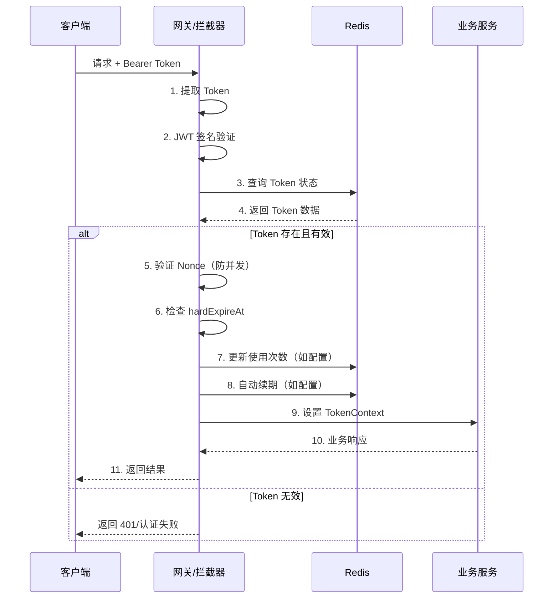

← [返回 README](./README.md)

## 高级特性

### 互斥登录

通过 `key` 配置实现互斥登录：

```yaml
# 单设备登录
policies:
  login:
    key: [uid]  # 同一用户的新 Token 会踢掉旧 Token
```

```java
// 用户 A 在设备1登录
String token1 = tokenGenerator.generateToken("login", claimsOfA);

// 用户 A 在设备2登录
String token2 = tokenGenerator.generateToken("login", claimsOfA);

// 此时 token1 失效，token2 生效
// 使用 token1 访问会返回：账号已在别处登录 (10205)
```

### 限次消费

适用于临时凭证、优惠券等场景：

```yaml
policies:
  coupon:
    key: [couponCode]  # 优惠券码
    expireTime: 86400  # 24小时
    maxUsage: 1  # 仅能使用1次
```

```java
// 使用优惠券
@RequiresToken("coupon")
@PostMapping("/use-coupon")
public ApiResponse<Void> useCoupon(@RequestParam String orderId) {
    // Token 验证通过，且使用次数未超限
    // 每次验证后，使用次数会自动累加
    couponService.applyCoupon(orderId);
    return ApiResponse.success();
}
```

### 限时激活

适用于邀请码、验证码等需要首次激活的场景：

```yaml
policies:
  inviteCode:
    key: [code]  # 邀请码
    expireTime: 604800  # 7天有效期
    activationTimeLimit: 300  # 生成后5分钟内必须首次使用
```

**工作流程：**
1. 生成 Token 后，Redis TTL 设置为 `activationTimeLimit`（5分钟）
2. 首次验证通过后，TTL 延长到 `expireTime`（7天）
3. 超过激活时间未使用，Token 自动失效

### 自动续期

提供流畅的用户体验：

```yaml
policies:
  mobileApp:
    key: [uid]  # 用户ID
    expireTime: 7200  # 2小时
    autoRenew: true  # 启用自动续期
    renewIncrement: 1800  # 每次续期30分钟
```

**续期策略：**
- 每次 Token 验证通过后，自动延长 TTL
- 延长时间为 `renewIncrement` 指定的秒数
- 有 `hardExpireAt` 硬截止时间，防止永生

---

## 架构原理

### Token 结构

AccessToken 使用标准的 JWT 格式，但 Payload 只包含必要信息：

```
Header.Payload.Signature
```

**Header（固定）：**
```json
{
  "alg": "HS256",
  "typ": "JWT"
}
```

**Payload（精简）：**
```json
{
  "type": "login",        // Token 类型
  "nonce": "uuid-string", // 防并发标识
  "hash": "md5-hash",     // Redis Key 后缀
  "ts": 1700000000000     // 生成时间戳
}
```

**设计优势：**
- JWT 仅用于签名验证，不包含敏感信息
- 实际数据存储在 Redis，支持即时失效
- Payload 小巧，减少网络传输

### Redis 存储结构

```
Key: {appName}:accesstoken:{tokenType}:{hash}
TTL: {expireTime} 秒
Value: JSON 结构
```

**Value 示例：**
```json
{
  "type": "login",
  "nonce": "550e8400-e29b-41d4-a716-446655440000",
  "issuedAt": 1700000000000,
  "hardExpireAt": 1700086400000,
  "claims": {
    "uid": 1001,
    "username": "zhangsan",
    "role": "user",
    "permissions": ["read", "write"]
  },
  "policySnapshot": {
    "key": ["uid"],
    "expireTime": 7200,
    "autoRenew": true,
    "renewIncrement": 1800
  }
}
```

**统计信息（可选）：**
```
Key: {appName}:accesstoken:{tokenType}:{hash}:stats:usage
Value: 使用次数（整数）
TTL: 与主 Key 相同
```

### 验证流程



---

