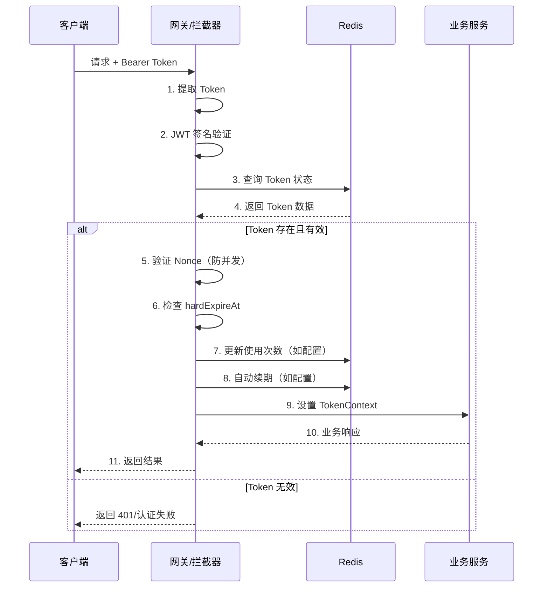

# LDX2T Commons AccessToken 用户指南

> **JWT + Redis 双重验证 | 分布式令牌管理 | 企业级访问控制**

## 📚 目录

- [核心特性](#核心特性)
- [快速开始](#快速开始)
  - [环境要求](#环境要求)
  - [三步接入](#三步接入)
- [配置详解](#配置详解)
  - [基础配置](#基础配置)
  - [策略配置](#策略配置)
  - [配置示例](#配置示例)
- [使用指南](#使用指南)
  - [生成 Token](#1-生成-token)
  - [验证 Token](#2-验证-token)
  - [Token 注销](#3-token-注销)
  - [Token 刷新](#4-token-刷新)
  - [获取 Token 信息](#5-获取-token-信息)
- [高级特性](#高级特性)
  - [互斥登录](#互斥登录)
  - [限次消费](#限次消费)
  - [限时激活](#限时激活)
  - [自动续期](#自动续期)
- [架构原理](#架构原理)
  - [Token 结构](#token-结构)
  - [Redis 存储结构](#redis-存储结构)
  - [验证流程](#验证流程)
- [最佳实践](#最佳实践)
- [常见问题](#常见问题)
- [错误码](#错误码)
- [性能监控](#性能监控)

---

## 核心特性

| 特性 | 说明 | 优势 |
|------|------|------|
| **JWT + Redis 双重验证** | JWT 签名校验 + Redis 状态管理 | 高性能 + 强一致性 |
| **灵活策略配置** | 支持多种 Token 类型，独立策略 | 满足不同业务场景 |
| **互斥登录支持** | 基于 key 字段的单点登录控制 | 防止多设备重复登录 |
| **自动续期机制** | 可配置的 Token 自动延期 | 提升用户体验 |
| **限次消费功能** | Token 最大使用次数限制 | 临时凭证、优惠券场景 |
| **限时激活功能** | 生成后指定时间内必须使用 | 邀请码、验证码场景 |
| **线程安全上下文** | ThreadLocal 存储，支持异步传递 | 业务代码便捷访问 |
| **注解式验证** | `@RequiresToken` 声明式鉴权 | 简化开发，减少样板代码 |

---

## 快速开始

### 环境要求

| 组件 | 版本要求 | 说明 |
|------|---------|------|
| JDK | 17+ | 必需 |
| Spring Boot | 3.2+ | 必需，使用 Jakarta 命名空间 |
| Redis | 6+ | 必需，用于 Token 状态存储 |
| Spring Application Name | 必填 | 用于 Redis Key 前缀 |

### 三步接入

**步骤 1：添加依赖**

```xml
<dependency>
    <groupId>com.ldx2t</groupId>
    <artifactId>ldx2t-commons-all</artifactId>
    <version>1.0.0-SNAPSHOT</version>
</dependency>
```

**步骤 2：配置文件**

```yaml
spring:
  application:
    name: my-app  # 必填，用于生成 Redis Key 前缀

ldx2t:
  commons:
    access-token:
      enabled: true
      secretKey: your-secret-key-change-me  # 必填，JWT 签名密钥
      hashSalt: optional-salt  # 可选，Redis Key 加密盐值
      expireTime: 86400  # 全局默认过期时间（秒）
      redisDatasource: stringRedisTemplate  # 可选，指定 Redis Bean 名称

      policies:
        login:  # 用户登录 Token
          key: [uid]  # 互斥键，支持单个字段或数组
          expireTime: 7200  # 2小时
          autoRenew: true  # 自动续期
          renewIncrement: 1800  # 每次续期30分钟
```

**步骤 3：使用注解**

```java
// ===== 必需的 import 语句 =====
import com.ldx2t.commons.accesstoken.annotation.RequiresToken;
import com.ldx2t.commons.accesstoken.context.TokenContext;
import com.ldx2t.commons.accesstoken.core.AccessTokenGenerator;
import com.ldx2t.commons.api.ApiResponse;  // 来自 ldx2t-commons-api

import org.springframework.web.bind.annotation.*;
import org.springframework.beans.factory.annotation.Autowired;
import org.springframework.stereotype.Service;

import java.util.Map;
import java.util.HashMap;

// ===== Controller 层 =====
@RestController
@RequestMapping("/api")
public class UserController {

    @Autowired
    private UserService userService;

    // 方法级别验证
    @RequiresToken("login")
    @GetMapping("/profile")
    public ApiResponse<UserProfile> getProfile() {
        // 从上下文获取 Token 信息
        Long uid = TokenContext.getClaim("uid", Long.class);
        String username = TokenContext.getClaim("username", String.class);

        UserProfile profile = userService.getProfile(uid);
        return ApiResponse.success(profile);
    }
}

// ===== Service 层 =====
@Service
public class AuthService {

    @Autowired
    private AccessTokenGenerator tokenGenerator;

    @Autowired
    private UserService userService;

    public String login(String username, String password) {
        // 1. 验证用户名密码
        User user = authenticate(username, password);

        // 2. 构建 Claims
        Map<String, Object> claims = new HashMap<>();
        claims.put("uid", user.getId());
        claims.put("username", user.getUsername());
        claims.put("role", user.getRole());

        // 3. 生成 Token
        return tokenGenerator.generateToken("login", claims);
    }

    private User authenticate(String username, String password) {
        // 实际的用户认证逻辑
        return userService.authenticate(username, password);
    }
}
```

---

## 配置详解

### 基础配置

| 配置项 | 类型 | 必填 | 默认值 | 说明 |
|--------|------|------|--------|------|
| `enabled` | boolean | 是 | `false` | 是否启用 AccessToken 功能 |
| `secretKey` | String | 是 | - | JWT 签名密钥，建议复杂且定期更换 |
| `hashSalt` | String | 否 | `""` | Redis Key 哈希盐值，增强安全性 |
| `expireTime` | long | 否 | `86400` | 全局默认过期时间（秒） |
| `redisDatasource` | String | 否 | `stringRedisTemplate` | 指定使用的 Redis Bean 名称 |

### 策略配置

每个 Token 类型（Policy）支持以下参数：

| 参数 | 类型 | 必填 | 默认值 | 说明 |
|------|------|------|--------|------|
| `key` | List<String> | 是 | - | 互斥键字段列表，支持联合主键 |
| `expireTime` | Long | 否 | 继承全局 | 过期时间（秒） |
| `maxUsage` | Integer | 否 | 无限制 | 最大使用次数 |
| `autoRenew` | Boolean | 否 | `false` | 是否自动续期 |
| `renewIncrement` | Long | 否 | - | 续期延长时间（秒） |
| `activationTimeLimit` | Long | 否 | 无限制 | 激活时限（秒） |

### 配置示例

#### 示例 1：用户登录 Token（互斥登录）
```yaml
policies:
  login:
    key: [uid]  # 同一用户只能有一个有效 Token
    expireTime: 7200  # 2小时
    autoRenew: true  # 自动续期
    renewIncrement: 1800  # 每次使用延长30分钟
```

#### 示例 2：管理员 Token（联合主键）
```yaml
policies:
  admin:
    key: [uid, roleId]  # 用户ID + 角色ID联合唯一
    expireTime: 3600  # 1小时
    maxUsage: 100  # 最多使用100次
```

#### 示例 3：API Key（长期有效）
```yaml
policies:
  api:
    key: [appId]  # 应用ID唯一
    expireTime: 31536000  # 1年
```

#### 示例 4：邀请码（限时激活）
```yaml
policies:
  invite:
    key: [inviteCode]  # 邀请码唯一
    expireTime: 604800  # 7天有效期
    activationTimeLimit: 300  # 生成后5分钟内必须激活
    maxUsage: 1  # 仅能使用一次
```

#### 示例 5：多设备登录（允许不同设备）
```yaml
policies:
  multiDevice:
    key: [uid, deviceId]  # 用户ID + 设备ID
    expireTime: 86400  # 24小时
    autoRenew: true
```

---

## 使用指南

### 1. 生成 Token

```java
// ===== 必需的 import 语句 =====
import com.ldx2t.commons.accesstoken.core.AccessTokenGenerator;
import org.springframework.beans.factory.annotation.Autowired;
import org.springframework.stereotype.Service;

import java.util.Map;
import java.util.HashMap;
import java.util.List;

@Service
public class AuthService {

    @Autowired
    private AccessTokenGenerator tokenGenerator;

    public String generateUserToken(User user) {
        // 构建业务数据
        Map<String, Object> claims = new HashMap<>();
        claims.put("uid", user.getId());
        claims.put("username", user.getUsername());
        claims.put("role", user.getRole());
        claims.put("permissions", user.getPermissions());

        // 生成 Token
        return tokenGenerator.generateToken("login", claims);
    }

    public String generateApiKey(String appId, String appSecret) {
        Map<String, Object> claims = Map.of(
            "appId", appId,
            "permissions", getApiPermissions(appId)
        );

        return tokenGenerator.generateToken("api", claims);
    }

    private List<String> getApiPermissions(String appId) {
        // 获取 API 权限列表的逻辑
        return permissionService.getApiPermissions(appId);
    }
}
```

### 2. 验证 Token

#### 注解式验证（推荐）
```java
// ===== 必需的 import 语句 =====
import com.ldx2t.commons.accesstoken.annotation.RequiresToken;
import com.ldx2t.commons.accesstoken.context.TokenContext;
import com.ldx2t.commons.api.ApiResponse;  // 来自 ldx2t-commons-api

import org.springframework.web.bind.annotation.*;
import org.springframework.beans.factory.annotation.Autowired;

import java.util.List;

// ===== Controller 1：方法级别验证 =====
@RestController
@RequestMapping("/api/orders")
public class OrderController {

    @Autowired
    private OrderService orderService;

    // 方法级别验证
    @RequiresToken("login")
    @PostMapping
    public ApiResponse<Long> createOrder(@RequestBody CreateOrderDTO dto) {
        // Token 已通过验证，可直接获取用户信息
        Long uid = TokenContext.getClaim("uid", Long.class);
        String role = TokenContext.getClaim("role", String.class);

        // 业务逻辑
        Long orderId = orderService.createOrder(uid, dto);
        return ApiResponse.success(orderId);
    }

    @RequiresToken("login")
    @GetMapping("/{orderId}")
    public ApiResponse<OrderVO> getOrder(@PathVariable Long orderId) {
        Long uid = TokenContext.getClaim("uid", Long.class);
        OrderVO order = orderService.getOrder(orderId, uid);
        return ApiResponse.success(order);
    }
}

// ===== Controller 2：类级别验证 =====
@RestController
@RequestMapping("/api/admin")
@RequiresToken("admin")  // 类级别，所有方法都需要 admin Token
public class AdminController {

    @Autowired
    private UserService userService;

    @GetMapping("/users")
    public ApiResponse<List<User>> listUsers() {
        // 自动验证 admin Token
        return ApiResponse.success(userService.listAll());
    }

    @DeleteMapping("/users/{userId}")
    public ApiResponse<Void> deleteUser(@PathVariable Long userId) {
        userService.deleteUser(userId);
        return ApiResponse.success();
    }
}
```

#### 手动验证
```java
// ===== 必需的 import 语句 =====
import com.ldx2t.commons.accesstoken.core.AccessTokenGenerator;
import com.ldx2t.commons.accesstoken.util.TokenUtils;
import com.ldx2t.commons.accesstoken.config.AccessTokenProperties;

import org.springframework.beans.factory.annotation.Autowired;
import org.springframework.data.redis.core.StringRedisTemplate;
import org.springframework.stereotype.Service;

@Service
public class ExternalApiService {

    @Autowired
    private AccessTokenGenerator tokenGenerator;

    @Autowired
    private StringRedisTemplate redisTemplate;

    @Autowired
    private AccessTokenProperties properties;

    public boolean validateToken(String token) {
        try {
            // 1. 解析 JWT，获取 type 和 hash
            Map<String, Object> payload = TokenUtils.parseToken(token, properties.getSecretKey());
            String type = (String) payload.get("type");
            String hash = (String) payload.get("hash");

            // 2. 构建 Redis Key
            String redisKey = tokenGenerator.buildRedisKey(type, hash);

            // 3. 查询 Redis
            String redisValue = redisTemplate.opsForValue().get(redisKey);

            return redisValue != null;
        } catch (Exception e) {
            return false;
        }
    }
}
```

### 3. Token 注销

```java
// ===== 必需的 import 语句 =====
import com.ldx2t.commons.accesstoken.annotation.RequiresToken;
import com.ldx2t.commons.accesstoken.context.TokenContext;
import com.ldx2t.commons.accesstoken.core.AccessTokenGenerator;
import com.ldx2t.commons.api.ApiResponse;  // 来自 ldx2t-commons-api

import org.springframework.web.bind.annotation.*;
import org.springframework.beans.factory.annotation.Autowired;
import org.springframework.stereotype.Controller;

@RestController
@RequestMapping("/api/auth")
public class AuthController {

    @Autowired
    private AccessTokenGenerator tokenGenerator;

    @Autowired
    private AuthService authService;

    @PostMapping("/logout")
    @RequiresToken("login")
    public ApiResponse<Void> logout(@RequestHeader("Authorization") String authHeader) {
        // 提取 Token
        String token = authHeader.substring(7);

        // 注销 Token（从 Redis 删除）
        tokenGenerator.revokeToken(token);

        return ApiResponse.success();
    }

    @PostMapping("/logout/all")
    @RequiresToken("login")
    public ApiResponse<Void> logoutAllDevices() {
        // 获取当前用户信息
        Long uid = TokenContext.getClaim("uid", Long.class);

        // 通过业务逻辑注销该用户的所有 Token
        // （需要自行实现，因为 SDK 只能操作单个 Token）
        authService.logoutAllUserTokens(uid);

        return ApiResponse.success();
    }
}
```

### 4. Token 刷新

```java
// ===== 必需的 import 语句 =====
import com.ldx2t.commons.accesstoken.core.AccessTokenGenerator;
import com.ldx2t.commons.accesstoken.util.TokenUtils;
import com.ldx2t.commons.accesstoken.config.AccessTokenProperties;
import com.ldx2t.commons.api.ApiResponse;  // 来自 ldx2t-commons-api

import org.springframework.web.bind.annotation.*;
import org.springframework.beans.factory.annotation.Autowired;
import org.springframework.data.redis.core.StringRedisTemplate;

import java.util.Map;

// FastJSON2 解析
import com.alibaba.fastjson2.JSON;
import com.alibaba.fastjson2.JSONObject;

@RestController
@RequestMapping("/api/token")
public class TokenController {

    @Autowired
    private AccessTokenGenerator tokenGenerator;

    @Autowired
    private AccessTokenProperties properties;

    @Autowired
    private StringRedisTemplate redisTemplate;

    @PostMapping("/refresh")
    public ApiResponse<String> refreshToken(@RequestHeader("Authorization") String authHeader) {
        String token = authHeader.substring(7);

        // 解析当前 Token（仅获取 type 和 hash）
        Map<String, Object> payload = TokenUtils.parseToken(token, properties.getSecretKey());
        String type = (String) payload.get("type");
        String hash = (String) payload.get("hash");

        // 从 Redis 获取完整 Claims
        String redisKey = tokenGenerator.buildRedisKey(type, hash);
        String redisValue = redisTemplate.opsForValue().get(redisKey);

        if (redisValue == null) {
            return ApiResponse.error(10201, "Token 已过期，请重新登录");
        }

        JSONObject redisData = JSON.parseObject(redisValue);
        Map<String, Object> claims = redisData.getObject("claims", Map.class);

        // 生成新 Token（旧 Token 会自动失效）
        String newToken = tokenGenerator.generateToken(type, claims);

        return ApiResponse.success(newToken);
    }
}
```

### 5. 获取 Token 信息

```java
// ===== 必需的 import 语句 =====
import com.ldx2t.commons.accesstoken.context.TokenContext;
import com.ldx2t.commons.accesstoken.context.TokenContext.ContextData;

import org.springframework.stereotype.Service;
import org.springframework.scheduling.annotation.Async;

import java.util.List;
import java.util.Map;
import java.util.concurrent.CompletableFuture;

import lombok.extern.slf4j.Slf4j;

@Slf4j
@Service
public class BusinessService {

    public void processOrder() {
        // 获取当前 Token 类型
        String tokenType = TokenContext.getTokenType();

        // 获取单个 Claim
        Long uid = TokenContext.getClaim("uid", Long.class);
        String username = TokenContext.getClaim("username", String.class);
        List<String> permissions = TokenContext.getClaim("permissions", List.class);

        // 获取所有 Claims
        Map<String, Object> allClaims = TokenContext.getClaims();

        // 业务逻辑
        log.info("用户 {} ({}) 正在处理订单", username, uid);
    }

    // ===== 异步线程中使用 TokenContext =====
    @Async
    public void asyncProcess() {
        // 获取主线程的上下文
        TokenContext.ContextData context = TokenContext.getContext();

        // 在异步线程中设置
        CompletableFuture.runAsync(() -> {
            TokenContext.setContext(context);

            // 现在可以安全使用 TokenContext
            Long uid = TokenContext.getClaim("uid", Long.class);
            // ... 异步业务逻辑

            // 清理上下文
            TokenContext.clear();
        });
    }
}
```

---

## 高级特性

### 互斥登录

通过 `key` 配置实现互斥登录：

```yaml
# 单设备登录
policies:
  login:
    key: [uid]  # 同一用户的新 Token 会踢掉旧 Token
```

```java
// 用户 A 在设备1登录
String token1 = tokenGenerator.generateToken("login", claimsOfA);

// 用户 A 在设备2登录
String token2 = tokenGenerator.generateToken("login", claimsOfA);

// 此时 token1 失效，token2 生效
// 使用 token1 访问会返回：账号已在别处登录 (10205)
```

### 限次消费

适用于临时凭证、优惠券等场景：

```yaml
policies:
  coupon:
    key: [couponCode]  # 优惠券码
    expireTime: 86400  # 24小时
    maxUsage: 1  # 仅能使用1次
```

```java
// 使用优惠券
@RequiresToken("coupon")
@PostMapping("/use-coupon")
public ApiResponse<Void> useCoupon(@RequestParam String orderId) {
    // Token 验证通过，且使用次数未超限
    // 每次验证后，使用次数会自动累加
    couponService.applyCoupon(orderId);
    return ApiResponse.success();
}
```

### 限时激活

适用于邀请码、验证码等需要首次激活的场景：

```yaml
policies:
  inviteCode:
    key: [code]  # 邀请码
    expireTime: 604800  # 7天有效期
    activationTimeLimit: 300  # 生成后5分钟内必须首次使用
```

**工作流程：**
1. 生成 Token 后，Redis TTL 设置为 `activationTimeLimit`（5分钟）
2. 首次验证通过后，TTL 延长到 `expireTime`（7天）
3. 超过激活时间未使用，Token 自动失效

### 自动续期

提供流畅的用户体验：

```yaml
policies:
  mobileApp:
    key: [uid]  # 用户ID
    expireTime: 7200  # 2小时
    autoRenew: true  # 启用自动续期
    renewIncrement: 1800  # 每次续期30分钟
```

**续期策略：**
- 每次 Token 验证通过后，自动延长 TTL
- 延长时间为 `renewIncrement` 指定的秒数
- 有 `hardExpireAt` 硬截止时间，防止永生

---

## 架构原理

### Token 结构

AccessToken 使用标准的 JWT 格式，但 Payload 只包含必要信息：

```
Header.Payload.Signature
```

**Header（固定）：**
```json
{
  "alg": "HS256",
  "typ": "JWT"
}
```

**Payload（精简）：**
```json
{
  "type": "login",        // Token 类型
  "nonce": "uuid-string", // 防并发标识
  "hash": "md5-hash",     // Redis Key 后缀
  "ts": 1700000000000     // 生成时间戳
}
```

**设计优势：**
- JWT 仅用于签名验证，不包含敏感信息
- 实际数据存储在 Redis，支持即时失效
- Payload 小巧，减少网络传输

### Redis 存储结构

```
Key: {appName}:accesstoken:{tokenType}:{hash}
TTL: {expireTime} 秒
Value: JSON 结构
```

**Value 示例：**
```json
{
  "type": "login",
  "nonce": "550e8400-e29b-41d4-a716-446655440000",
  "issuedAt": 1700000000000,
  "hardExpireAt": 1700086400000,
  "claims": {
    "uid": 1001,
    "username": "zhangsan",
    "role": "user",
    "permissions": ["read", "write"]
  },
  "policySnapshot": {
    "key": ["uid"],
    "expireTime": 7200,
    "autoRenew": true,
    "renewIncrement": 1800
  }
}
```

**统计信息（可选）：**
```
Key: {appName}:accesstoken:{tokenType}:{hash}:stats:usage
Value: 使用次数（整数）
TTL: 与主 Key 相同
```

### 验证流程



---

## 最佳实践

### 1. 密钥管理

```yaml
# 生产环境配置
ldx2t:
  commons:
    access-token:
      secretKey: ${TOKEN_SECRET}  # 从环境变量读取
      hashSalt: ${TOKEN_SALT:default-salt}  # 支持默认值
```

**安全建议：**
- 使用配置中心管理密钥，支持动态更新
- 密钥长度至少 32 字符，包含大小写字母、数字、特殊字符
- 定期轮换密钥，但要做好兼容处理
- 不同环境使用不同密钥

### 2. 错误处理

```java
@RestControllerAdvice
public class GlobalExceptionHandler {

    @ExceptionHandler(AuthException.class)
    public ApiResponse<Void> handleAuthException(AuthException e) {
        int code = e.getCode();
        String message = e.getMessage();

        // 根据错误码特殊处理
        switch (code) {
            case 10201: // Token 过期
                return ApiResponse.error(code, "登录已过期，请重新登录");
            case 10202: // Token 无效
            case 10205: // 账号异地登录
                return ApiResponse.error(code, "登录状态失效，请重新登录");
            default:
                return ApiResponse.error(code, message);
        }
    }
}
```

### 3. 权限设计

```java
// ===== 必需的 import 语句 =====
import com.ldx2t.commons.accesstoken.annotation.RequiresToken;
import com.ldx2t.commons.accesstoken.context.TokenContext;
import com.ldx2t.commons.api.ApiResponse;  // 来自 ldx2t-commons-api
import com.ldx2t.commons.api.ApiException;  // 来自 ldx2t-commons-api

import org.springframework.web.bind.annotation.*;
import org.springframework.beans.factory.annotation.Autowired;
import org.springframework.stereotype.Service;
import org.springframework.security.access.prepost.PreAuthorize;

import java.util.List;

// ===== Controller 层：细粒度权限控制 =====
@RestController
@RequestMapping("/api/admin")
public class AdminController {

    @Autowired
    private UserService userService;

    @RequiresToken("login")
    @GetMapping("/users")
    @PreAuthorize("hasRole('ADMIN') or hasPermission('user:read')")
    public ApiResponse<List<User>> listUsers() {
        return ApiResponse.success(userService.listAll());
    }
}

// ===== Service 层：业务权限检查 =====
@Service
public class OrderService {

    @Autowired
    private OrderMapper orderMapper;

    public void cancelOrder(Long orderId) {
        Long uid = TokenContext.getClaim("uid", Long.class);
        List<String> permissions = TokenContext.getClaim("permissions", List.class);

        Order order = orderMapper.selectById(orderId);

        // 检查是否是订单所有者
        if (!order.getUserId().equals(uid)) {
            // 或检查是否有管理员权限
            if (!permissions.contains("order:manage")) {
                throw new ApiException(10403, "无权操作此订单");
            }
        }

        // 执行取消逻辑
        orderMapper.updateStatus(orderId, CANCELLED);
    }
}
```

### 4. 性能优化

```yaml
# Redis 连接池优化
spring:
  redis:
    lettuce:
      pool:
        max-active: 20  # 根据并发量调整
        max-idle: 10
        min-idle: 5
        time-between-eviction-runs: 30000
```

```java
// ===== 必需的 import 语句 =====
import com.ldx2t.commons.accesstoken.core.AccessTokenGenerator;
import com.ldx2t.commons.accesstoken.util.TokenUtils;
import com.ldx2t.commons.accesstoken.config.AccessTokenProperties;

import org.springframework.beans.factory.annotation.Autowired;
import org.springframework.data.redis.core.StringRedisTemplate;
import org.springframework.data.redis.core.RedisCallback;
import org.springframework.stereotype.Service;

import java.util.List;
import java.util.Map;
import java.util.HashMap;
import java.util.stream.Collectors;

// ===== 批量验证优化 =====
@Service
public class BatchValidationService {

    @Autowired
    private AccessTokenGenerator tokenGenerator;

    @Autowired
    private AccessTokenProperties properties;

    @Autowired
    private StringRedisTemplate redisTemplate;

    /**
     * 使用 Pipeline 批量验证 Token
     */
    public Map<String, Boolean> batchValidateTokens(List<String> tokens) {
        // 1. 构建 Redis keys
        List<String> redisKeys = tokens.stream()
            .map(token -> {
                try {
                    Map<String, Object> payload = TokenUtils.parseToken(token, properties.getSecretKey());
                    String type = (String) payload.get("type");
                    String hash = (String) payload.get("hash");
                    return tokenGenerator.buildRedisKey(type, hash);
                } catch (Exception e) {
                    return null;  // 无效 Token
                }
            })
            .filter(key -> key != null)
            .collect(Collectors.toList());

        // 2. 使用 pipeline 批量查询
        List<Object> results = redisTemplate.executePipeluted((RedisCallback<Object>) connection -> {
            return redisKeys.stream()
                .map(key -> connection.get(key.getBytes()))
                .collect(Collectors.toList());
        });

        // 3. 处理结果
        Map<String, Boolean> validationResults = new HashMap<>();
        for (int i = 0; i < tokens.size(); i++) {
            validationResults.put(tokens.get(i), results.get(i) != null);
        }

        return validationResults;
    }
}
```

### 5. 监控告警

```yaml
# 监控配置
management:
  endpoints:
    web:
      exposure:
        include: health,metrics,prometheus
  metrics:
    export:
      prometheus:
        enabled: true
```

**关键监控指标：**
- Token 生成速率
- Token 验证失败率
- Redis 连接数
- Token 平均生命周期
- 并发登录用户数

---

## 常见问题

### Q1: Token 验证失败（10202）
**原因：**
- JWT 签名错误（secretKey 不匹配）
- Token 格式错误
- Token 被篡改

**解决方案：**
1. 检查各服务的 `secretKey` 配置是否一致
2. 确认 Token 传输过程中没有被截断或修改
3. 使用 `TokenUtils.parseToken()` 调试验证

```java
// 调试 Token 解析
import com.ldx2t.commons.accesstoken.util.TokenUtils;
try {
    Map<String, Object> payload = TokenUtils.parseToken(token, secretKey);
    log.info("Token 解析成功: {}", payload);
} catch (AuthException e) {
    log.error("Token 解析失败: {}", e.getMessage());
}
```

### Q2: Token 过期（10203）
**原因：**
- 超过 `expireTime` 时间
- 超过 `hardExpireAt` 硬截止时间
- 未及时续期

**解决方案：**
1. 检查过期时间配置是否合理
2. 启用 `autoRenew` 自动续期
3. 前端实现 Token 刷新机制

### Q3: 账号异地登录（10205）
**原因：**
- 同一用户在其他设备登录
- Nonce 不匹配

**解决方案：**
1. 这是正常的安全机制，提示用户重新登录
2. 如需多设备登录，修改 key 配置包含 deviceId

```yaml
# 多设备登录配置
policies:
  multiDevice:
    key: [uid, deviceId]  # 包含设备ID
    expireTime: 86400
```

### Q4: Redis 连接失败
**原因：**
- Redis 服务器不可用
- 连接池配置不当
- 网络问题

**解决方案：**
1. 检查 Redis 服务状态
2. 验证连接配置（host、port、password）
3. 调整连接池参数

```yaml
# Redis 连接检查
spring:
  redis:
    host: ${REDIS_HOST:localhost}
    port: ${REDIS_PORT:6379}
    password: ${REDIS_PASSWORD:}
    timeout: 5000ms
    lettuce:
      pool:
        max-active: 20
        max-idle: 10
        min-idle: 5
```

### Q5: ThreadLocal 内存泄漏
**原因：**
- 异步线程未清理 TokenContext
- 长时间运行的线程未清理

**解决方案：**

```java
// ===== 必需的 import 语句 =====
import com.ldx2t.commons.accesstoken.context.TokenContext;
import org.springframework.scheduling.annotation.Async;
import org.springframework.context.annotation.Configuration;
import org.springframework.scheduling.annotation.AsyncConfigurer;
import org.springframework.scheduling.annotation.EnableAsync;
import org.springframework.core.task.TaskDecorator;
import org.springframework.scheduling.concurrent.ThreadPoolTaskExecutor;

import java.util.concurrent.Executor;

// ===== 正确的异步处理 =====
@Service
public class AsyncService {

    @Async
    public void asyncMethod() {
        try {
            // 异步业务逻辑
            Long uid = TokenContext.getClaim("uid", Long.class);
            // ...
        } finally {
            // 确保清理
            TokenContext.clear();
        }
    }
}

// ===== 使用拦截器自动清理 =====
@Configuration
@EnableAsync
public class AsyncConfig implements AsyncConfigurer {

    @Override
    public Executor getAsyncExecutor() {
        ThreadPoolTaskExecutor executor = new ThreadPoolTaskExecutor();
        executor.setCorePoolSize(10);
        executor.setMaxPoolSize(50);
        executor.setQueueCapacity(100);
        executor.setThreadNamePrefix("async-");

        // 设置任务装饰器，自动清理 TokenContext
        executor.setTaskDecorator(new TokenContextCleanupDecorator());

        executor.initialize();
        return executor;
    }

    // TokenContext 清理装饰器
    private static class TokenContextCleanupDecorator implements TaskDecorator {
        @Override
        public Runnable decorate(Runnable runnable) {
            return () -> {
                try {
                    runnable.run();
                } finally {
                    TokenContext.clear();
                }
            };
        }
    }
}
```

---

## 错误码

| 错误码 | 说明 | HTTP 状态 | 处理建议 |
|--------|------|-----------|---------|
| 10200 | Token 缺失或无效 | 200 | 跳转登录页 |
| 10201 | Token 过期或不存在 | 200 | 刷新 Token 或重新登录 |
| 10202 | Token 签名错误 | 200 | 重新登录（可能是密钥不匹配） |
| 10203 | Token 格式错误 | 200 | 检查 Token 传输格式 |
| 10204 | Token 使用次数超限 | 200 | 提示用户重新获取 |
| 10205 | 账号异地登录 | 200 | 提示用户并重新登录 |
| 10300 | Token 类型不匹配 | 200 | 检查 @RequiresToken 配置 |
| 10500 | 系统内部错误 | 200 | 记录日志，联系运维 |

---

## 性能监控

### 关键指标

使用 Micrometer 和 Actuator 监控：

```java
// ===== 必需的 import 语句 =====
import io.micrometer.core.instrument.Counter;
import io.micrometer.core.instrument.MeterRegistry;
import io.micrometer.core.instrument.Tags;
import io.micrometer.core.instrument.Timer;

import org.springframework.stereotype.Component;

// ===== 自定义监控指标 =====
@Component
public class TokenMetrics {

    private final MeterRegistry meterRegistry;
    private final Counter tokenGenerateCounter;
    private final Counter tokenValidateCounter;
    private final Timer tokenValidateTimer;

    public TokenMetrics(MeterRegistry meterRegistry) {
        this.meterRegistry = meterRegistry;
        this.tokenGenerateCounter = Counter.builder("accesstoken.generate.total")
            .description("Total number of tokens generated")
            .register(meterRegistry);
        this.tokenValidateCounter = Counter.builder("accesstoken.validate.total")
            .description("Total number of token validations")
            .register(meterRegistry);
        this.tokenValidateTimer = Timer.builder("accesstoken.validate.duration")
            .description("Token validation duration")
            .register(meterRegistry);
    }

    public void recordTokenGenerate(String tokenType) {
        tokenGenerateCounter.increment(Tags.of("type", tokenType));
    }

    public void recordTokenValidation(String result) {
        tokenValidateCounter.increment(Tags.of("result", result));
    }

    public Timer.Sample startValidationTimer() {
        return Timer.start(meterRegistry);
    }
}
```

### Prometheus 监控规则

```yaml
# prometheus.yml 规则示例
groups:
  - name: accesstoken
    rules:
      - alert: TokenValidationFailureRate
        expr: rate(accesstoken_validate_total{result="failure"}[5m]) > 0.1
        for: 2m
        labels:
          severity: warning
        annotations:
          summary: "Token validation failure rate is high"

      - alert: TokenGenerationSpike
        expr: rate(accesstoken_generate_total[5m]) > 100
        for: 1m
        labels:
          severity: info
        annotations:
          summary: "Token generation rate spike detected"
```

### 日志配置

```xml
<!-- logback-spring.xml -->
<configuration>
    <!-- AccessToken 相关日志 -->
    <logger name="com.ldx2t.commons.accesstoken" level="INFO"/>

    <!-- 开启详细日志（生产环境建议设为 WARN） -->
    <logger name="com.ldx2t.commons.accesstoken.interceptor.TokenInterceptor" level="DEBUG"/>

    <!-- 审计日志 -->
    <appender name="AUDIT" class="ch.qos.logback.core.rolling.RollingFileAppender">
        <file>logs/accesstoken-audit.log</file>
        <rollingPolicy class="ch.qos.logback.core.rolling.TimeBasedRollingPolicy">
            <fileNamePattern>logs/accesstoken-audit.%d{yyyy-MM-dd}.log</fileNamePattern>
            <maxHistory>30</maxHistory>
        </rollingPolicy>
        <encoder>
            <pattern>%d{yyyy-MM-dd HH:mm:ss} [%X{traceId}] %-5level %logger{36} - %msg%n</pattern>
        </encoder>
    </appender>

    <logger name="com.ldx2t.commons.accesstoken" level="INFO" additivity="false">
        <appender-ref ref="AUDIT"/>
    </logger>
</configuration>
```

**关键日志示例：**
```
2024-01-01 10:00:00 [abc123] INFO  TokenInterceptor - Token验证成功: type=login, uid=1001
2024-01-01 10:01:00 [def456] WARN  TokenInterceptor - Token验证失败: type=login, error=账号已在别处登录
2024-01-01 10:02:00 [ghi789] INFO  AccessTokenGenerator - Token生成成功: type=api, appId=app001
```

---

## 技术支持

- **文档仓库**: `ldx2t-commons-sdk`
- **问题反馈**: GitHub Issues
- **版本要求**: Spring Boot 3.2+, Java 17+

---

**快速导航：**
- [快速开始](#快速开始) | [配置详解](#配置详解) | [使用指南](#使用指南)
- [高级特性](#高级特性) | [架构原理](#架构原理) | [最佳实践](#最佳实践)
- [常见问题](#常见问题) | [错误码](#错误码) | [性能监控](#性能监控)