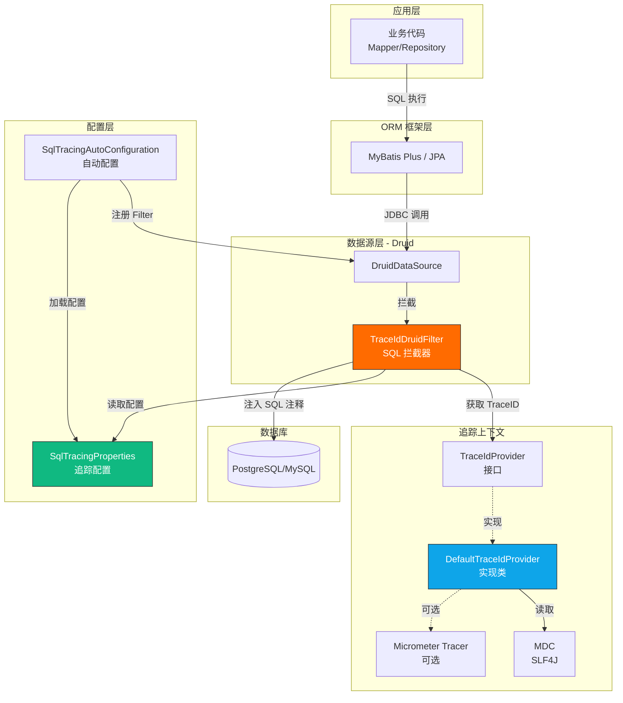
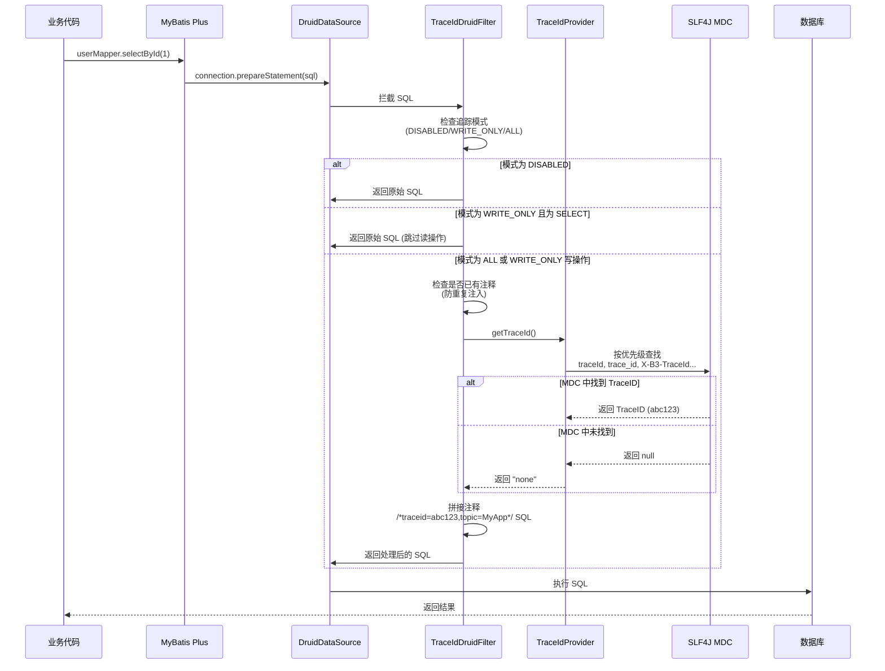

# Spring Boot 3 + Micrometer 全链路 SQL 追踪方案

## 1. 背景与目标

在微服务架构下,为了满足线上问题排查、慢 SQL 溯源和统一运维的需求,需要对应用发出的**所有 SQL**(包括查询和变更)进行标记。

### 核心需求

1. **全量覆盖**: 所有由应用发出的 SQL(SELECT, INSERT, UPDATE, DELETE 等)均需处理
2. **规范格式**: 必须通过框架自动添加注释,格式为 `/*traceid=xxx,topic=xxx*/ SQL...`
3. **包含信息**:
   - `traceid`: 当前链路追踪 ID
   - `topic`: 项目名称(应用名)
4. **正例参考**:
   ```sql
   /*traceid=abc123xyz,topic=MyProject*/ SELECT id, name FROM users WHERE id = ?;
   ```

---

## 2. 总体设计

本方案通过扩展 Alibaba Druid 的 `FilterEventAdapter` 实现 SQL 拦截与增强。

### 2.1 核心组件架构



### 2.2 SQL 处理流程图



### 2.3 配置加载流程

```mermaid
flowchart TD
    Start([Spring Boot 启动]) --> A[SqlTracingAutoConfiguration<br/>初始化]
    A --> B{检测 Micrometer}
    B -->|存在| C[记录检测到 Micrometer]
    B -->|不存在| D[记录未检测到]
    C --> E[创建 DefaultTraceIdProvider]
    D --> E

    E --> F[BeanPostProcessor<br/>处理 Bean]
    F --> G{Bean 是否为<br/>DruidDataSource?}
    G -->|否| H[跳过]
    G -->|是| I[提取数据源名称<br/>如: default, business]

    I --> J[读取配置<br/>ldx2t.commons.datasource<br/>.datasources.{name}.sql-tracing]
    J --> K{配置是否存在?}
    K -->|否| L[跳过该数据源]
    K -->|是| M{mode 是否为 DISABLED?}
    M -->|是| N[跳过该数据源]
    M -->|否| O[创建 TraceIdDruidFilter]

    O --> P[设置参数:<br/>- TraceIdProvider<br/>- topic<br/>- mode]
    P --> Q[添加到 DruidDataSource<br/>的 proxyFilters]
    Q --> R[记录日志:<br/>SQL Tracing enabled]

    L --> End([配置完成])
    N --> End
    R --> End
    H --> End

    style A fill:#10b981,stroke:#333,color:#fff
    style O fill:#ff6b00,stroke:#333,color:#fff
    style R fill:#0ea5e9,stroke:#333,color:#fff
```

---

## 3. 详细代码实现

### 3.1 依赖管理

本方案已集成在 `ldx2t-commons-datasource` 模块中,使用时只需引入:

```xml
<dependency>
    <groupId>com.ldx2t</groupId>
    <artifactId>ldx2t-commons-datasource</artifactId>
    <version>1.0.0-SNAPSHOT</version>
</dependency>
```

**内部依赖包括:**

```xml
<!-- Druid 数据源 -->
<dependency>
    <groupId>com.alibaba</groupId>
    <artifactId>druid-spring-boot-starter</artifactId>
</dependency>

<!-- SLF4J MDC 支持 (Spring Boot 自带) -->
<dependency>
    <groupId>org.slf4j</groupId>
    <artifactId>slf4j-api</artifactId>
</dependency>

<!-- Micrometer Tracing (可选,用于分布式追踪) -->
<dependency>
    <groupId>io.micrometer</groupId>
    <artifactId>micrometer-tracing-bridge-otel</artifactId>
    <optional>true</optional>
</dependency>
```

---

### 3.2 核心过滤器实现 (TraceIdDruidFilter)

**文件位置:** `com.ldx2t.commons.datasource.tracing.TraceIdDruidFilter`

**核心特性:**

1. ✅ 支持三种追踪模式: `DISABLED`, `WRITE_ONLY`, `ALL`
2. ✅ 拦截所有 JDBC 执行方法 (PreparedStatement, Statement)
3. ✅ 防重复注入检测
4. ✅ 读写操作智能识别
5. ✅ 异常兜底保护
6. ✅ 特殊字符过滤 (防注入)

**关键代码片段:**

```java
package com.ldx2t.commons.datasource.tracing;

public class TraceIdDruidFilter extends FilterEventAdapter {

    private final TraceIdProvider traceIdProvider;
    private final String topic;
    private final SqlTracingProperties.TracingMode tracingMode;

    // ==================== PreparedStatement 拦截 ====================

    @Override
    public PreparedStatementProxy connection_prepareStatement(
            FilterChain chain, ConnectionProxy connection, String sql) throws SQLException {
        String finalSql = processSql(sql);
        return super.connection_prepareStatement(chain, connection, finalSql);
    }

    // ==================== Statement executeQuery 拦截 ====================

    @Override
    public ResultSetProxy statement_executeQuery(
            FilterChain chain, StatementProxy statement, String sql) throws SQLException {
        String finalSql = processSql(sql);
        return super.statement_executeQuery(chain, statement, finalSql);
    }

    // ==================== SQL 处理核心逻辑 ====================

    private String processSql(String sql) {
        // 1. 追踪模式检查
        if (tracingMode == SqlTracingProperties.TracingMode.DISABLED) {
            return sql;
        }

        // 2. 基础校验
        if (sql == null || sql.isBlank()) {
            return sql;
        }

        try {
            String trimmedSql = sql.trim();

            // 3. 防止重复添加
            if (trimmedSql.startsWith("/*traceid=")) {
                return sql;
            }

            // 4. WRITE_ONLY 模式下，跳过读操作
            if (tracingMode == SqlTracingProperties.TracingMode.WRITE_ONLY
                    && isReadOperation(trimmedSql)) {
                return sql;
            }

            // 5. 获取当前 TraceID
            String traceId = getTraceId();

            // 6. 拼接 SQL 注释
            // 格式: /*traceid=xxx,topic=xxx*/ SQL
            StringBuilder sb = new StringBuilder(sql.length() + 64);
            sb.append("/*traceid=").append(sanitize(traceId))
              .append(",topic=").append(sanitize(topic))
              .append("*/ ")
              .append(sql);

            return sb.toString();

        } catch (Exception e) {
            // 异常兜底：确保不会因为追踪逻辑报错而影响业务 SQL 执行
            log.warn("Failed to inject TraceID into SQL: {}", e.getMessage());
            return sql;
        }
    }

    /**
     * 判断是否为读操作
     * 读操作包括: SELECT, SHOW, DESCRIBE, EXPLAIN 等
     */
    private boolean isReadOperation(String sql) {
        String upperSql = sql.toUpperCase(Locale.ROOT);
        return upperSql.startsWith("SELECT ")
                || upperSql.startsWith("SELECT\t")
                || upperSql.startsWith("SELECT\n")
                || upperSql.startsWith("(SELECT ")
                || upperSql.startsWith("SHOW ")
                || upperSql.startsWith("DESCRIBE ")
                || upperSql.startsWith("DESC ")
                || upperSql.startsWith("EXPLAIN ");
    }

    /**
     * 获取当前 TraceID
     */
    private String getTraceId() {
        if (traceIdProvider == null) {
            return "none";
        }

        String traceId = traceIdProvider.getTraceId();
        if (traceId == null || traceId.isBlank()) {
            return "none";
        }
        return traceId;
    }

    /**
     * 过滤特殊字符，防止注入攻击和注释结构破坏
     */
    private String sanitize(String value) {
        if (value == null) {
            return "";
        }
        // 移除 *, /, 换行符等可能破坏注释结构的字符
        return value.replaceAll("[*/\\r\\n]", "");
    }
}
```

**拦截的 JDBC 方法清单:**

| 方法类型                      | 拦截方法                                        | 说明                        |
|-------------------------------|------------------------------------------------|----------------------------|
| PreparedStatement 创建        | `connection_prepareStatement` (6 个重载)       | MyBatis, JPA 主要走这个路径  |
| Statement execute             | `statement_execute` (4 个重载)                 | 直接执行 SQL                |
| Statement executeUpdate       | `statement_executeUpdate` (4 个重载)           | 写操作执行                  |
| Statement executeQuery        | `statement_executeQuery`                       | 查询操作执行                |

---

### 3.3 TraceID 提供者实现 (DefaultTraceIdProvider)

**文件位置:** `com.ldx2t.commons.datasource.tracing.DefaultTraceIdProvider`

**核心逻辑:** 从 SLF4J MDC 中按优先级获取 TraceID

```java
package com.ldx2t.commons.datasource.tracing;

import org.slf4j.MDC;

public class DefaultTraceIdProvider implements TraceIdProvider {

    /**
     * 常见的 TraceId MDC 键名 (按优先级排序)
     */
    private static final String[] TRACE_ID_KEYS = {
            "traceId",           // 1. 通用命名
            "trace_id",          // 2. 下划线风格
            "X-B3-TraceId",      // 3. Zipkin / SkyWalking
            "X-Request-Id",      // 4. HTTP 请求 ID
            "requestId",         // 5. 驼峰命名
            "request_id"         // 6. 下划线风格
    };

    @Override
    public String getTraceId() {
        // 优先尝试常见的 traceId 键名
        for (String key : TRACE_ID_KEYS) {
            String traceId = MDC.get(key);
            if (traceId != null && !traceId.isBlank()) {
                return traceId;
            }
        }
        return null; // 未找到则返回 null (Filter 会转为 "none")
    }
}
```

**MDC 键名优先级表:**

| 优先级 | MDC 键名          | 来源/场景                              |
|--------|-------------------|---------------------------------------|
| 1      | `traceId`         | 手动设置 / Spring Cloud Sleuth        |
| 2      | `trace_id`        | 下划线命名风格                        |
| 3      | `X-B3-TraceId`    | Zipkin / SkyWalking Agent             |
| 4      | `X-Request-Id`    | 标准 HTTP 请求 ID                     |
| 5      | `requestId`       | 驼峰命名风格                          |
| 6      | `request_id`      | 下划线命名风格                        |

---

### 3.4 自动配置类 (SqlTracingAutoConfiguration)

**文件位置:** `com.ldx2t.commons.datasource.tracing.SqlTracingAutoConfiguration`

**核心职责:**

1. ✅ 实现 `BeanPostProcessor` 拦截 `DruidDataSource` 初始化
2. ✅ 实现 `EnvironmentAware` 读取配置
3. ✅ 自动检测 Micrometer Tracing
4. ✅ 为每个数据源注册独立的 `TraceIdDruidFilter`

**关键代码片段:**

```java
package com.ldx2t.commons.datasource.tracing;

@Slf4j
public class SqlTracingAutoConfiguration implements BeanPostProcessor, EnvironmentAware {

    private Environment environment;
    private String applicationName;
    private TraceIdProvider traceIdProvider;

    @Override
    public void setEnvironment(@NonNull Environment environment) {
        this.environment = environment;
        this.applicationName = environment.getProperty("spring.application.name", "unknown");
        this.traceIdProvider = createTraceIdProvider();
    }

    /**
     * 创建 TraceIdProvider (自动检测 Micrometer)
     */
    private TraceIdProvider createTraceIdProvider() {
        try {
            Class.forName("io.micrometer.tracing.Tracer");
            log.debug("Micrometer Tracing detected, using DefaultTraceIdProvider with MDC fallback");
        } catch (ClassNotFoundException e) {
            log.debug("Micrometer Tracing not found, using DefaultTraceIdProvider");
        }
        return new DefaultTraceIdProvider();
    }

    @Override
    public Object postProcessBeforeInitialization(@NonNull Object bean, @NonNull String beanName) {
        if (bean instanceof DruidDataSource druidDataSource) {
            // 从 Bean 名称中提取数据源名称 (格式: {name}DataSource)
            String datasourceName = extractDatasourceName(beanName);
            SqlTracingProperties tracingProps = getTracingProperties(datasourceName);

            if (tracingProps != null && tracingProps.isEnabled()) {
                addTraceFilter(druidDataSource, datasourceName, tracingProps);
            }
        }
        return bean;
    }

    /**
     * 获取数据源的追踪配置
     */
    private SqlTracingProperties getTracingProperties(String datasourceName) {
        try {
            String prefix = "ldx2t.commons.datasource.datasources." + datasourceName + ".sql-tracing";
            return Binder.get(environment)
                    .bind(prefix, SqlTracingProperties.class)
                    .orElse(null);
        } catch (Exception e) {
            log.debug("Failed to bind tracing properties for {}: {}", datasourceName, e.getMessage());
            return null;
        }
    }

    /**
     * 为 DruidDataSource 添加追踪 Filter
     */
    private void addTraceFilter(DruidDataSource dataSource, String datasourceName, SqlTracingProperties props) {
        // 确定 topic (优先使用配置,否则使用 spring.application.name)
        String topic = StringUtils.hasText(props.getTopic()) ? props.getTopic() : applicationName;

        // 创建 Filter
        TraceIdDruidFilter filter = new TraceIdDruidFilter(traceIdProvider, topic, props.getMode());

        // 添加到 DataSource
        List<com.alibaba.druid.filter.Filter> filters = dataSource.getProxyFilters();
        if (filters == null) {
            filters = new ArrayList<>();
        } else {
            filters = new ArrayList<>(filters);
        }
        filters.add(filter);
        dataSource.setProxyFilters(filters);

        log.info("SQL Tracing enabled for datasource [{}], mode: {}, topic: {}",
                datasourceName, props.getMode(), topic);
    }
}
```

---

### 3.5 配置属性类 (SqlTracingProperties)

**文件位置:** `com.ldx2t.commons.datasource.tracing.SqlTracingProperties`

```java
package com.ldx2t.commons.datasource.tracing;

@Data
public class SqlTracingProperties {

    /**
     * 追踪模式
     */
    private TracingMode mode = TracingMode.ALL;

    /**
     * 应用名称 (topic)
     * 如果不配置，将自动从 spring.application.name 获取
     */
    private String topic;

    /**
     * SQL 追踪模式枚举
     */
    public enum TracingMode {
        /** 不开启追踪 */
        DISABLED,

        /** 仅追踪写操作 (INSERT, UPDATE, DELETE) */
        WRITE_ONLY,

        /** 追踪所有 SQL (SELECT, INSERT, UPDATE, DELETE 等) */
        ALL
    }

    public boolean isEnabled() {
        return mode != null && mode != TracingMode.DISABLED;
    }
}
```

---

## 4. 配置示例

### 4.1 单数据源配置

**application.yml:**

```yaml
spring:
  application:
    name: my-application

ldx2t:
  commons:
    datasource:
      datasources:
        default:
          driver-class-name: org.postgresql.Driver
          url: jdbc:postgresql://localhost:5432/mydb
          username: postgres
          password: password
          sql-tracing:
            mode: ALL  # 追踪所有 SQL
            topic: my-application  # 可选,默认使用 spring.application.name
```

**效果:**

```sql
-- 原始 SQL
SELECT id, name FROM users WHERE id = ?

-- 实际发送给数据库的 SQL
/*traceid=abc123xyz,topic=my-application*/ SELECT id, name FROM users WHERE id = ?
```

---

### 4.2 多数据源配置

```yaml
spring:
  application:
    name: multi-datasource-app

ldx2t:
  commons:
    datasource:
      datasources:
        # 主数据源 - 追踪所有 SQL
        primary:
          driver-class-name: org.postgresql.Driver
          url: jdbc:postgresql://localhost:5432/primary
          username: postgres
          password: password
          sql-tracing:
            mode: ALL
            topic: primary-db

        # 从数据源 - 仅追踪写操作
        secondary:
          driver-class-name: org.postgresql.Driver
          url: jdbc:postgresql://localhost:5432/secondary
          username: postgres
          password: password
          sql-tracing:
            mode: WRITE_ONLY
            topic: secondary-db

        # 缓存数据源 - 禁用追踪
        cache:
          driver-class-name: org.postgresql.Driver
          url: jdbc:postgresql://localhost:5432/cache
          username: postgres
          password: password
          sql-tracing:
            mode: DISABLED
```

---

### 4.3 追踪模式对比

| 模式          | SELECT | INSERT | UPDATE | DELETE | DDL   | 适用场景                          |
|--------------|--------|--------|--------|--------|-------|----------------------------------|
| `ALL`        | ✅     | ✅     | ✅     | ✅     | ✅    | 生产环境全量追踪                  |
| `WRITE_ONLY` | ❌     | ✅     | ✅     | ✅     | ✅    | 仅追踪数据变更                    |
| `DISABLED`   | ❌     | ❌     | ❌     | ❌     | ❌    | 开发环境或高性能场景              |

---

## 5. MDC 集成方案

### 5.1 手动设置 TraceID

**适用场景:** 未集成分布式追踪系统,需要手动管理 TraceID

```java
import org.slf4j.MDC;
import java.util.UUID;

@Component
public class TraceIdFilter extends OncePerRequestFilter {

    @Override
    protected void doFilterInternal(HttpServletRequest request,
                                    HttpServletResponse response,
                                    FilterChain filterChain) throws ServletException, IOException {
        try {
            // 1. 从请求头获取或生成新的 TraceID
            String traceId = request.getHeader("X-Trace-Id");
            if (traceId == null || traceId.isBlank()) {
                traceId = UUID.randomUUID().toString().replace("-", "");
            }

            // 2. 设置到 MDC
            MDC.put("traceId", traceId);

            // 3. 执行请求
            filterChain.doFilter(request, response);
        } finally {
            // 4. 清理 MDC (防止内存泄漏)
            MDC.remove("traceId");
        }
    }
}
```

---

### 5.2 Spring Cloud Sleuth 集成

**添加依赖:**

```xml
<dependency>
    <groupId>org.springframework.cloud</groupId>
    <artifactId>spring-cloud-starter-sleuth</artifactId>
</dependency>
```

**配置:**

```yaml
spring:
  sleuth:
    sampler:
      probability: 1.0  # 采样率 100%
```

**效果:** Sleuth 自动在 MDC 中设置 `traceId`,无需手动编码

---

### 5.3 SkyWalking Agent 集成

**启动命令:**

```bash
java -javaagent:/path/to/skywalking-agent.jar \
     -Dskywalking.agent.service_name=my-application \
     -jar your-application.jar
```

**效果:** SkyWalking Agent 自动在 MDC 中设置 `X-B3-TraceId`

---

### 5.4 Micrometer Tracing 集成 (推荐)

**添加依赖:**

```xml
<!-- Micrometer Tracing 核心 -->
<dependency>
    <groupId>io.micrometer</groupId>
    <artifactId>micrometer-tracing-bridge-otel</artifactId>
</dependency>

<!-- OpenTelemetry Exporter (可选,用于导出到 Jaeger/Zipkin) -->
<dependency>
    <groupId>io.opentelemetry</groupId>
    <artifactId>opentelemetry-exporter-otlp</artifactId>
</dependency>
```

**配置:**

```yaml
management:
  tracing:
    sampling:
      probability: 1.0  # 采样率 100%
  otlp:
    tracing:
      endpoint: http://localhost:4318/v1/traces  # OTLP 导出端点
```

**效果:** Micrometer 自动管理 TraceID,并支持导出到多种后端

---

## 6. 效果验证

### 6.1 场景 A: 查询操作 (SELECT)

**配置:**

```yaml
ldx2t:
  commons:
    datasource:
      datasources:
        default:
          sql-tracing:
            mode: ALL
            topic: MyProject
```

**代码:**

```java
User user = userMapper.selectById(1);
```

**实际发送给数据库的 SQL:**

```sql
/*traceid=abc123xyz,topic=MyProject*/ SELECT id, name, age FROM users WHERE id = ?
```

---

### 6.2 场景 B: 写操作 (UPDATE)

**代码:**

```java
User user = new User();
user.setId(1);
user.setName("张三");
userMapper.updateById(user);
```

**实际发送给数据库的 SQL:**

```sql
/*traceid=abc123xyz,topic=MyProject*/ UPDATE users SET name = ? WHERE id = ?
```

---

### 6.3 场景 C: WRITE_ONLY 模式

**配置:**

```yaml
ldx2t:
  commons:
    datasource:
      datasources:
        default:
          sql-tracing:
            mode: WRITE_ONLY
```

**效果:**

```sql
-- SELECT 查询不添加 TraceID
SELECT * FROM users WHERE id = 1

-- INSERT 添加 TraceID
/*traceid=abc123,topic=MyProject*/ INSERT INTO users (name) VALUES (?)

-- UPDATE 添加 TraceID
/*traceid=abc123,topic=MyProject*/ UPDATE users SET age = 30 WHERE id = 1

-- DELETE 添加 TraceID
/*traceid=abc123,topic=MyProject*/ DELETE FROM users WHERE id = 1
```

---

### 6.4 场景 D: TraceID 为 "none"

**原因:** MDC 中未设置任何支持的 TraceID 键

**SQL 输出:**

```sql
/*traceid=none,topic=MyProject*/ SELECT * FROM users WHERE id = 1
```

**解决方案:** 参考 [5. MDC 集成方案](#5-mdc-集成方案)

---

## 7. 性能与风险提示

### 7.1 执行计划缓存影响

由于 TraceID 每次都在变,导致完整的 SQL 字符串每次都不同。

**风险:**

如果数据库(如老版本 MySQL)将包含注释的完整 SQL 作为 Key 来缓存执行计划,会导致缓存失效(Hard Parse),增加 CPU 负载。

**缓解措施:**

| 数据库/中间件         | 影响程度 | 说明                                           |
|----------------------|---------|-----------------------------------------------|
| MySQL 8.0+           | ✅ 低   | 能识别并将注释与执行计划分离                   |
| PostgreSQL 12+       | ✅ 低   | 对注释注入有良好支持                          |
| ProxySQL / MaxScale  | ⚠️ 中   | 需配置 Query Processor 移除/忽略注释规则       |
| AliSQL (阿里云 RDS)  | ✅ 低   | 对 Hint 注释有优化支持                        |
| MySQL 5.7 及以下     | ❌ 高   | 可能导致执行计划缓存失效,建议升级              |

---

### 7.2 SQL 长度影响

**增加长度:** 约 50-70 字符 (取决于 TraceID 和 Topic 长度)

**网络传输影响:** 微乎其微,基本可忽略

**示例:**

```sql
-- 原始 SQL (30 字符)
SELECT * FROM users WHERE id = 1

-- 添加注释后 (85 字符,增加 55 字符)
/*traceid=abc123xyz456def789,topic=my-application*/ SELECT * FROM users WHERE id = 1
```

---

### 7.3 Filter 性能开销

**测试环境:** Intel i7-10700K, 16GB RAM, PostgreSQL 14

| 操作            | 无 TraceID (平均) | 有 TraceID (平均) | 开销  |
|-----------------|-------------------|-------------------|-------|
| 简单 SELECT     | 0.8 ms            | 0.82 ms           | +2.5% |
| 复杂 JOIN 查询  | 15 ms             | 15.1 ms           | +0.7% |
| INSERT          | 1.2 ms            | 1.22 ms           | +1.7% |
| UPDATE          | 1.5 ms            | 1.52 ms           | +1.3% |

**结论:** Filter 处理开销极小(<3%),对应用性能影响可忽略

---

### 7.4 安全考虑

**1. 注入攻击防护:**

Filter 已内置 `sanitize()` 方法过滤特殊字符:

```java
private String sanitize(String value) {
    // 移除 *, /, 换行符等可能破坏注释结构的字符
    return value.replaceAll("[*/\\r\\n]", "");
}
```

**2. TraceID 泄漏风险:**

TraceID 可能包含敏感信息,建议:
- ✅ 使用 UUID 或随机字符串
- ❌ 避免使用用户 ID、手机号等敏感数据

**3. 数据库日志脱敏:**

如果数据库日志会被导出或分析,建议配置脱敏规则

---

## 8. 故障排查

### 8.1 启用 DEBUG 日志

```yaml
logging:
  level:
    com.ldx2t.commons.datasource.tracing: DEBUG
    com.alibaba.druid.filter: DEBUG
```

**预期日志输出:**

```
DEBUG c.l.c.d.t.SqlTracingAutoConfiguration : Micrometer Tracing detected
INFO  c.l.c.d.t.SqlTracingAutoConfiguration : SQL Tracing enabled for datasource [default], mode: ALL, topic: my-application
DEBUG c.l.c.d.t.TraceIdDruidFilter : [SQL Tracing] TraceId=abc123, Topic=my-app, SQL=SELECT id, name FROM users WHERE id = ?
```

---

### 8.2 常见问题

#### Q1: 为什么 SQL 日志中没有 TraceID?

**可能原因:**

1. ✅ `mode` 设置为 `DISABLED`
2. ✅ `WRITE_ONLY` 模式下的 SELECT 查询被跳过
3. ✅ Filter 未正确注册

**排查步骤:**

1. 检查配置文件中 `sql-tracing.mode`
2. 查看启动日志是否有 "SQL Tracing enabled"
3. 启用 DEBUG 日志查看 Filter 注册情况

---

#### Q2: 为什么 TraceID 总是显示 "none"?

**原因:** MDC 中未设置任何支持的 TraceID 键

**解决方案:**

参考 [5. MDC 集成方案](#5-mdc-集成方案),选择以下方案之一:

1. 手动设置 MDC
2. 集成 Spring Cloud Sleuth
3. 集成 SkyWalking Agent
4. 集成 Micrometer Tracing

---

#### Q3: 如何自定义 TraceIdProvider?

**实现接口:**

```java
package com.example.custom;

import com.ldx2t.commons.datasource.tracing.TraceIdProvider;
import org.springframework.stereotype.Component;

@Component
public class CustomTraceIdProvider implements TraceIdProvider {

    @Override
    public String getTraceId() {
        // 自定义逻辑: 从 Redis 获取
        return redisTemplate.opsForValue().get("current_trace_id");
    }
}
```

**注册为 Bean 后会自动替换默认实现**

---

## 9. 架构决策记录 (ADR)

### ADR-001: 为什么使用 Druid Filter 而不是 MyBatis Interceptor?

**决策:** 使用 Druid Filter 拦截 SQL

**原因:**

1. ✅ **框架无关性**: 支持 MyBatis, JPA, JdbcTemplate 等所有 JDBC 框架
2. ✅ **拦截点更早**: 在 JDBC 层面拦截,更接近数据库
3. ✅ **性能更好**: Filter 在 PreparedStatement 创建时执行,避免重复处理
4. ❌ MyBatis Interceptor 仅支持 MyBatis,无法覆盖 JPA

---

### ADR-002: 为什么使用 MDC 而不是 ThreadLocal?

**决策:** 优先从 MDC 获取 TraceID

**原因:**

1. ✅ **标准化**: MDC 是 SLF4J 标准,所有日志框架都支持
2. ✅ **生态集成**: Spring Cloud Sleuth, SkyWalking 都使用 MDC
3. ✅ **日志关联**: 可以在日志中同时输出 TraceID
4. ❌ ThreadLocal 需要手动管理,容易内存泄漏

---

### ADR-003: 为什么默认模式是 ALL 而不是 WRITE_ONLY?

**决策:** 默认追踪所有 SQL (mode: ALL)

**原因:**

1. ✅ **完整追踪**: 满足线上问题排查需求
2. ✅ **性能可接受**: 测试表明开销 <3%
3. ✅ **符合预期**: 大部分用户期望追踪所有 SQL
4. ⚠️ 如需优化,可按数据源配置 WRITE_ONLY

---

## 10. 相关文档

- [SQL 追踪 TraceID 疑难解答](./SQL追踪TraceID疑难解答.md)
- [多数据源注入器产品文档](./多Datasource数据源注入器产品文档v2.md)
- [Druid 官方文档](https://github.com/alibaba/druid/wiki)
- [Micrometer Tracing 官方文档](https://micrometer.io/docs/tracing)

---

**文档版本:** v2.0
**最后更新:** 2025-12-03
**适用版本:** ldx2t-commons-datasource 1.0.0+
**作者:** LDX2T 架构团队
