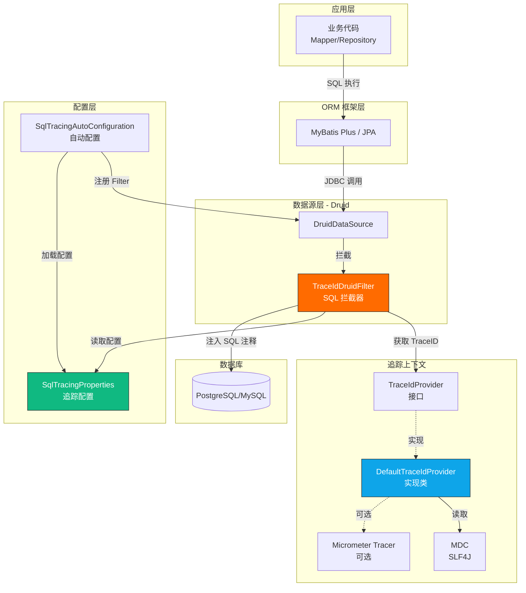
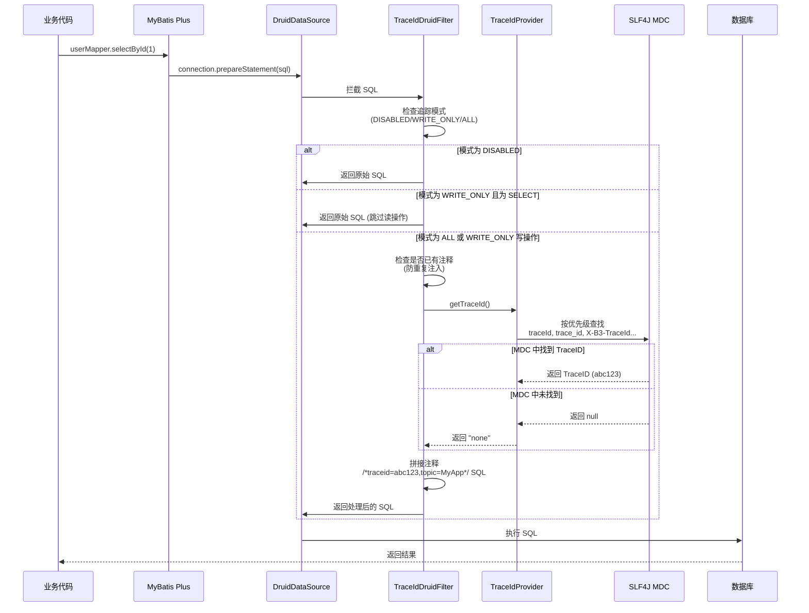

← [返回 README](./README.md)

# Spring Boot 3 + Micrometer 全链路 SQL 追踪方案

## 1. 背景与目标

在微服务架构下,为了满足线上问题排查、慢 SQL 溯源和统一运维的需求,需要对应用发出的**所有 SQL**(包括查询和变更)进行标记。

### 核心需求

1. **全量覆盖**: 所有由应用发出的 SQL(SELECT, INSERT, UPDATE, DELETE 等)均需处理
2. **规范格式**: 必须通过框架自动添加注释,格式为 `/*traceid=xxx,topic=xxx*/ SQL...`
3. **包含信息**:
   - `traceid`: 当前链路追踪 ID
   - `topic`: 项目名称(应用名)
4. **正例参考**:
   ```sql
   /*traceid=abc123xyz,topic=MyProject*/ SELECT id, name FROM users WHERE id = ?;
   ```

---

## 2. 总体设计

本方案通过扩展 Alibaba Druid 的 `FilterEventAdapter` 实现 SQL 拦截与增强。

### 2.1 核心组件架构



### 2.2 SQL 处理流程图



### 2.3 配置加载流程

```mermaid
flowchart TD
    Start([Spring Boot 启动]) --> A[SqlTracingAutoConfiguration<br/>初始化]
    A --> B{检测 Micrometer}
    B -->|存在| C[记录检测到 Micrometer]
    B -->|不存在| D[记录未检测到]
    C --> E[创建 DefaultTraceIdProvider]
    D --> E

    E --> F[BeanPostProcessor<br/>处理 Bean]
    F --> G{Bean 是否为<br/>DruidDataSource?}
    G -->|否| H[跳过]
    G -->|是| I[提取数据源名称<br/>如: default, business]

    I --> J[读取配置<br/>ldx2t.commons.datasource<br/>.datasources.{name}.sql-tracing]
    J --> K{配置是否存在?}
    K -->|否| L[跳过该数据源]
    K -->|是| M{mode 是否为 DISABLED?}
    M -->|是| N[跳过该数据源]
    M -->|否| O[创建 TraceIdDruidFilter]

    O --> P[设置参数:<br/>- TraceIdProvider<br/>- topic<br/>- mode]
    P --> Q[添加到 DruidDataSource<br/>的 proxyFilters]
    Q --> R[记录日志:<br/>SQL Tracing enabled]

    L --> End([配置完成])
    N --> End
    R --> End
    H --> End

    style A fill:#10b981,stroke:#333,color:#fff
    style O fill:#ff6b00,stroke:#333,color:#fff
    style R fill:#0ea5e9,stroke:#333,color:#fff
```

---

