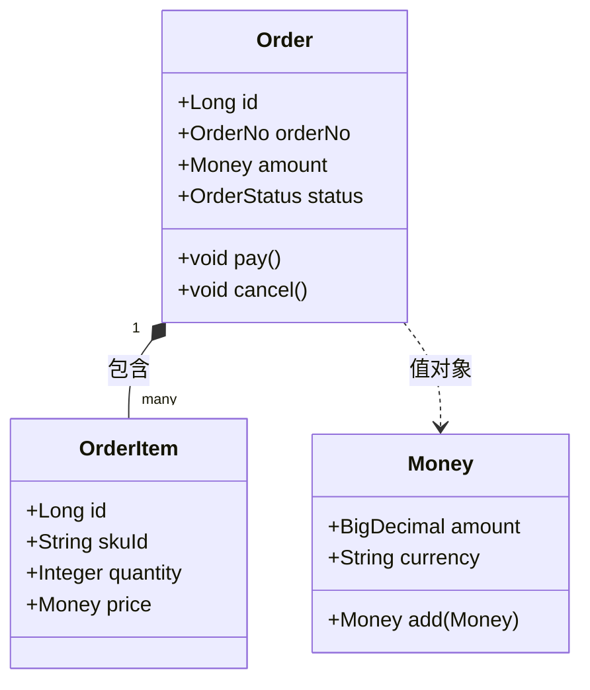
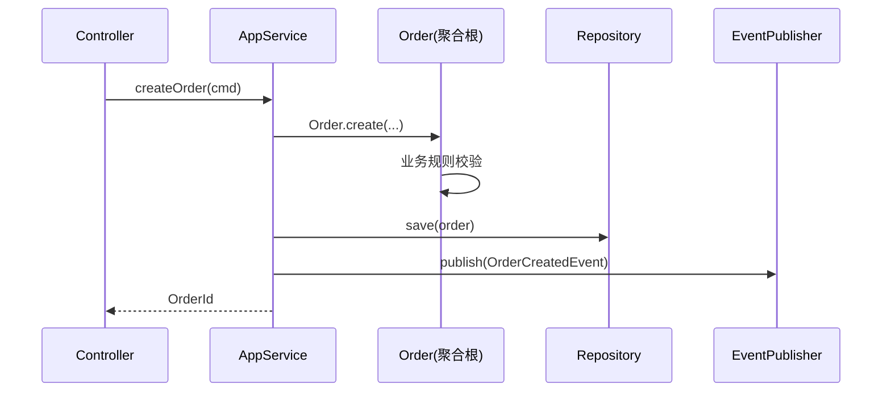

# 软件架构设计说明书规范

面向 **Vue + Java Spring Boot** 项目的**软件/代码级**架构设计文档规范。整合大厂做法：阿里《架构师指南》《Java 开发手册(嵩山版)》《COLA 架构》、字节《架构师白皮书》、美团 LDA（Living Design Approach）/ SOA、腾讯 TARS / TSF + 4+1 视图，以及业界主流（4+1 View / DDD / Clean / Hexagonal / CQRS）。

## 0. 用户速查

| 你想 | 入口 |
|---|---|
| 从零写软件架构设计说明书 | 场景一：新建 |
| 画 4+1 视图 | 场景二：4+1 视图 |
| 选分层架构（DDD / COLA / Clean） | 场景三：分层架构 |
| DDD 战术设计（聚合 / 实体 / 值对象 / 仓储） | 场景四：DDD |
| 设计包结构 / 模块划分 | 场景五：包与模块 |
| 画 UML（类图 / 时序图 / 组件图） | 场景六：UML |
| 写技术选型与对比 | 场景七：选型 |
| HLD / LLD 分级 | 场景八：分级 |
| 修改 / 变更设计文档 | 场景九：变更 |
| 校验合规 | 场景十：P0 必查 8 项 |
| 评审软件架构 | 场景十一：评审 |
| 退出本规范 | 「退出 mc-doc-ad」 |

## 1. 元信息

| 项 | 说明 |
|---|---|
| **适用** | Vue + Java Spring Boot 项目的**软件/代码级**架构设计文档（模块 / 包 / 类 / 领域模型 / 关键流程） |
| **不适用** | 系统总体架构与部署（→ mc-doc-arch）、产品需求（→ mc-doc-prd）、DB 设计（→ mc-doc-dbd）、API 契约（→ mc-doc-api）、Java 编码细节（→ mc-java-spec）、Vue 组件细节（→ mc-webui-spec） |
| 与 mc-doc-arch 的边界 | mc-doc-arch = 系统 / 部署 / 容量 / HA / DR（C4 L1/L2，宏观）；mc-doc-ad = 软件 / 代码 / 模块 / 领域（4+1 视图 + C4 L3，微观） |
| 推荐工具 | draw.io / PlantUML / Mermaid（UML）；IDEA Class Diagram（类图反向）；飞书 / Confluence（在线协作）；架构委员会签批 |
| 核心原则 | **视图分（4+1）+ 分层清晰（依赖单向）+ 领域可演进（DDD 战术）+ 模块高内聚低耦合 + 可评审可变更** |
| 退出 | 「退出 mc-doc-ad」 |

## 2. 全局铁律

1. **首页必有基础信息表 + 修订历史**（倒序，最新在上）
2. **架构原则先于方案**：明确 5-9 条核心设计原则（如「单一职责」「依赖抽象」「面向接口」「领域优先」），所有后续决策必与之对齐
3. **必含 4+1 视图**：逻辑视图 / 开发视图 / 进程视图 / 物理视图 + 场景视图（业界大厂通用，腾讯/华为强制）；其中**逻辑视图 + 开发视图必画**
4. **分层架构必画依赖方向**：单向依赖，禁跨层调用（DDD 四层 / COLA 四层 / Clean 同心圆）
5. **核心业务必画类图 + 时序图**：聚合 / 实体 / 值对象 / 仓储 + 主流程时序
6. **包/模块结构必含命名规范**：对齐 mc-java-spec（包名 `com.company.project.<层>.<领域>`）
7. **技术选型必含对比矩阵**：禁「我们用了 X」一句话，必须含「备选 / 优劣 / 决策」三要素
8. **设计模式应用必标注 GOF 名称**：用了什么模式（Strategy / Factory / Repository / Domain Event）必显式说明
9. **跨模块通信必明确**：同步（HTTP/RPC）/ 异步（MQ/事件）/ 同进程（领域事件）
10. **变更必走架构委员会评审**：禁口头决策；决策同步到《修订历史》

## 3. 场景判定

```
当前任务？
├── 从零写软件架构设计说明书    → 场景一：新建
├── 画 4+1 视图                → 场景二：4+1
├── 选分层架构                 → 场景三：分层
├── 做 DDD 战术设计            → 场景四：DDD
├── 设计包结构 / 模块          → 场景五：包与模块
├── 画 UML（类/时序/组件）     → 场景六：UML
├── 写技术选型对比             → 场景七：选型
├── 分 HLD / LLD               → 场景八：分级
├── 修改 / 变更设计文档        → 场景九：变更
├── 校验合规                   → 场景十：P0 必查
└── 评审软件架构               → 场景十一：评审
```

### 场景一：新建 SADS

**8 大章节**：① 基础信息 + 修订历史 → ② 概述与目标（业务对齐 / 范围 / 质量属性） → ③ 设计原则与约束 → ④ 4+1 视图 → ⑤ 分层架构与依赖 → ⑥ DDD 战术设计（核心域） → ⑦ 关键模块详述（包结构 + 类 + 时序） → ⑧ 技术选型 + 异常与边界 + 演进。

**基础信息表**：项目名 / 代号 / 文档类型（HLD / LLD）/ 状态 / 创建日期 / 软件架构师 / Tech Lead / 前后端 Lead / DBA / QA。

**文档状态机**：`草稿 → 评审中 → 已定稿 → 变更中 → 已定稿`。

**大厂做法**：
- **阿里**：HLD + LLD 双文档；HLD 重架构，LLD 重模块；强依赖《Java 开发手册(嵩山版)》
- **字节**：单文档分层；强 4+1 视图 + 架构委员会
- **腾讯**：4+1 视图强制；TRD（技术需求文档）独立
- **美团**：LDA（Living Design Approach）—— 设计文档与代码共生，README 即设计

**详细目录与模板**：见 `./软件架构设计说明书编写规范 v1.0.md` §1、§9.1。

### 场景二：4+1 视图（大厂通用）

| 视图 | 关注 | 主要干系人 | 必画 |
|---|---|---|---|
| 逻辑视图（Logical） | 类 / 包 / 领域模型 / 接口 | 系统分析师 / 架构师 | ✅ 必画 |
| 开发视图（Development） | 模块 / 包 / 分层 / 工程结构 | 开发 | ✅ 必画 |
| 进程视图（Process） | 并发 / 进程 / 线程 / 通信 | 性能 / 架构师 | 按需（高并发场景必画） |
| 物理视图（Physical） | 节点 / 部署 / 网络 | 运维 / SRE | 引用 mc-doc-arch §6.1 |
| 场景视图（Scenarios） | 关键用例 / 业务流程 | 业务 / 测试 | ✅ 必画（核心用例 ≥ 3） |

**画图原则**：
- 逻辑视图：类图（UML）/ 领域模型图（DDD 风格）
- 开发视图：包图 / 模块图（IDEA 反向 + 手工整理）
- 进程视图：进程-线程时序 / 并发模型
- 场景视图：时序图 / 活动图（Mermaid / PlantUML）

**详细规则 + Mermaid 示例**：见主规范 §4。

### 场景三：分层架构（DDD / COLA / Clean / Hexagonal）

**主流架构对照**：

| 架构 | 层次 | 代表 | 适用场景 |
|---|---|---|---|
| 经典三层（MVC） | Controller / Service / DAO | 早期项目 | 简单 CRUD |
| **DDD 四层** | Interface / Application / Domain / Infrastructure | 阿里 / 字节 / 美团 | 复杂业务（推荐） |
| **COLA 4.0** | Adapter / App / Domain / Infrastructure | 阿里 COLA | 中大型后端（推荐） |
| Clean Architecture（同心圆） | Entity / UseCase / Interface / Infrastructure | 业界 | 强领域 |
| Hexagonal（六边形） | Domain + Ports & Adapters | 业界 | 强可测试性 |
| RAP（Resilient / Adaptive / Portable） | - | 美团 LDA | 弹性系统 |

**铁律（所有分层架构共用）**：
- 依赖方向**单向**：上层依赖下层，禁反向
- **依赖倒置**：领域层不依赖基础设施；基础设施依赖领域（DIP）
- 跨层调用必须走接口，禁直依赖实现

**DDD 四层（推荐）**：

```
┌─────────────────────────────┐
│ Interface（接口层）           │ Controller / RPC / MQ Listener / DTO Assembler
├─────────────────────────────┤
│ Application（应用层）         │ Application Service / Command Handler / Transaction / DTO
├─────────────────────────────┤
│ Domain（领域层，核心）         │ Aggregate / Entity / ValueObject / DomainService / Repository(接口) / DomainEvent
├─────────────────────────────┤
│ Infrastructure（基础设施层）  │ RepositoryImpl / Gateway / MQ / Cache / 第三方 / DB
└─────────────────────────────┘
```

**COLA 4.0（推荐）**：见主规范 §5.2。

**详细规则 + 选型决策表**：见主规范 §5。

### 场景四：DDD 战术设计

**五大战术构件**：

| 构件 | 作用 | 示例 |
|---|---|---|
| Entity（实体） | 有唯一标识，可变 | Order、User、Product |
| Value Object（值对象） | 无标识，不可变 | Address、Money、DateRange |
| Aggregate（聚合） | 一致性边界，含聚合根 | Order + OrderItem（聚合根 = Order） |
| Domain Service（领域服务） | 跨实体的领域逻辑 | PriceCalculator |
| Repository（仓储） | 聚合的持久化抽象 | OrderRepository（接口在领域，实现在基础设施） |

**辅助构件**：
- **Domain Event**（领域事件）：解耦 + 异步（如 `OrderCreatedEvent`）
- **Factory**（工厂）：复杂聚合创建
- **Anti-Corruption Layer（防腐层）**：对接遗留/三方系统

**聚合设计铁律**：
- 聚合要**小**（聚合内强一致，聚合间最终一致）
- 聚合之间**只能通过 ID 引用**，禁直接对象引用
- 一个事务**只修改一个聚合**
- 跨聚合用**领域事件**

**详细规则 + UML 示例**：见主规范 §6。

### 场景五：包结构与模块划分

**包命名规范**（对齐 mc-java-spec + 阿里嵩山版）：

```
com.<company>.<project>
  ├── interfaces        // 接口层
  │   ├── web           // REST Controller
  │   ├── rpc           // RPC Provider
  │   ├── mq            // MQ Listener
  │   └── dto           // 对外 DTO
  ├── application       // 应用层
  │   ├── <domain>
  │   │   ├── command   // 写命令
  │   │   ├── query     // 读查询
  │   │   └── assembler // DTO ↔ Domain
  │   └── shared
  ├── domain            // 领域层（核心）
  │   ├── <domain>
  │   │   ├── model     // Aggregate / Entity / ValueObject
  │   │   ├── service   // Domain Service
  │   │   ├── event     // Domain Event
  │   │   └── repository // Repository 接口
  │   └── shared
  └── infrastructure    // 基础设施层
      ├── persistence   // RepositoryImpl / Mapper
      ├── external      // 三方对接（ACL）
      ├── mq            // MQ Producer
      ├── config        // 配置
      └── util
```

**模块划分原则**：
- **按领域**划分（订单 / 用户 / 商品），禁按技术分层切包
- **高内聚低耦合**：模块内强内聚，模块间通过接口通信
- **依赖单向**：领域层不依赖基础设施
- **环依赖禁**：用 ArchUnit 自动校验

**详细规则 + 完整包树**：见主规范 §7。

### 场景六：UML（类图 / 时序图 / 组件图）

**类图（必画核心域）**：



**时序图（必画主流程 ≥ 3 条）**：



**组件图（按需）**：展示模块间依赖。

**画图原则**：方法签名带可见性（+/-/#）；关联标基数；时序图必含异常分支。

**详细规则 + 完整 Mermaid 示例**：见主规范 §8。

### 场景七：技术选型对比

**选型矩阵模板**：

| 维度 | 方案 A（如 Spring Cloud） | 方案 B（如 Dubbo） | 方案 C（如 gRPC） |
|---|---|---|---|
| 通信协议 | HTTP/2 | Dubbo/HTTP | HTTP/2 |
| 性能 | 中 | 高 | 高 |
| 服务治理 | 强（全套） | 强 | 弱（需配 Istio） |
| 跨语言 | 一般 | 弱 | 强 |
| 学习成本 | 中 | 中 | 高 |
| 团队熟悉度 | 高 | 中 | 低 |
| 社区生态 | 强 | 中 | 中 |
| **总分** | **8.5** | **7.5** | **7.0** |

**决策记录**（对齐 mc-doc-arch ADR）：必含「上下文 / 备选 / 决策 / 后果」四要素。

**详细规则 + 完整示例**：见主规范 §10。

### 场景八：HLD / LLD 分级

| 文档 | 关注 | 读者 | 粒度 |
|---|---|---|---|
| **HLD**（概要设计） | 模块 / 接口 / 分层 / 数据流 | 架构委员会 / 跨团队 | 系统 / 子系统 |
| **LLD**（详细设计） | 类 / 方法 / 字段 / 算法 / 时序 | 同团队开发 | 类 / 函数 |

**大厂做法**：
- **阿里**：HLD + LLD 强制双文档；HLD 架构师签批，LLD 模块负责人签批
- **字节**：单文档 + 模块详述；HLD/LLD 合一，用章节区分
- **腾讯**：TRD（技术需求）+ 详细设计分离
- **美团**：LDA 持续更新；代码即文档

**实践建议**：中型项目 HLD/LLD 合一（本文档），分章节；大型项目拆 HLD + 每模块 LLD。

**详细规则**：见主规范 §11。

### 场景九：变更管理

**流程**：`提出变更 → 影响评估（架构师 / Tech Lead / QA）→ 判定优先级 → 更新设计文档 + ADR → 架构委员会评审 → 通知干系人`。

**严禁**：口头决策 / 跳过评审 / 删除修订历史（仅追加）。

**影响评估**：业务影响 / 技术影响（分层破坏 / 依赖反向 / 聚合重构）/ 测试影响 / 上线影响。

**详细规则 + 修订历史模板**：见主规范 §12.1。

### 场景十：校验（P0 必查 8 项）

| # | 检查项 |
|---|---|
| 1 | 首页有完整基础信息表 + 修订历史 |
| 2 | 设计原则章节存在且 5-9 条 |
| 3 | 4+1 视图齐全（至少逻辑 + 开发 + 场景） |
| 4 | 分层架构图存在且依赖单向 |
| 5 | 核心域有类图 + 至少 3 条主流程时序图 |
| 6 | 包结构对齐 mc-java-spec（按领域划分） |
| 7 | 技术选型有对比矩阵 |
| 8 | 关键设计模式显式标注（GOF 名称） |

**P1**：聚合边界清晰 / 跨聚合用领域事件 / 一个事务只改一个聚合 / 依赖倒置 / ArchUnit 校验 / 异常处理统一 / 命名规范 / 接口稳定 / 配置外置 / 日志埋点对齐 mc-monitor。

**P2**：缓存策略 / 并发模型 / 性能预算（P99）/ 可测试性 / 灰度方案 / 回滚预案。

**P3**：图例完整 / 命名一致 / 引用文档有效 / 图表清晰 / 错别字。

**完整 P0~P3 checklist**：见主规范 §9。

### 场景十一：评审流程

**3 轮评审**：

1. **架构内审**（软件架构师 + Tech Lead）：原则对齐 / 4+1 完整 / 分层合理 / DDD 战术准确
2. **跨团队评审**（前后端 Lead + DBA + QA + 安全）：接口可行 / 数据模型一致 / 性能预算 / 测试覆盖
3. **架构委员会评审**（架构委员会 / 技术委员会）：跨项目复用 / 标准化 / 长期演进 / 技术债

**评审前必交**：完整 SADS + UML + 关键类源码骨架 + ADR。

**评审后必出**：评审纪要 + 待办项（负责人 + 截止日期）+ 修订历史更新 + 文档状态 → `已定稿`。

**禁**：边评审边改 / 评审完不更新版本号 / 跨项目大变更跳过架构委员会。

**详细规则**：见主规范 §12.3。

## 4. 关键文件索引

| 文档 | 用途 | 活跃版本 |
|---|---|---|
| `./软件架构设计说明书编写规范 v1.0.md` | 详细规则 + 完整模板 + 校验 checklist | v1.0 |
| `../mc-doc-arch/SKILL.md` | 系统架构（部署 / 容量 / HA / DR） | v1.0 |
| `../mc-doc-prd/SKILL.md` | 产品需求文档 | v1.0 |
| `../mc-doc-dbd/SKILL.md` | 数据库设计说明书 | v1.0 |
| `../mc-doc-api/SKILL.md` | 接口设计文档 | v1.0 |
| `../mc-java-spec/SKILL.md` | Java 后端实现规范（包结构 / 类设计） | v1.3 |
| `../mc-webui-spec/SKILL.md` | Vue 前端架构 | v1.1 |
| `../mc-test/SKILL.md` | 测试覆盖度（DoD） | v1.0 |
| `../mc-java-security/SKILL.md` | 安全设计 | - |

## 5. 与其他 SKILL 协作

| 涉及 | 同时参考 |
|---|---|
| 业务需求来源 | mc-doc-prd |
| 系统 / 部署 / 容量 | mc-doc-arch（互补） |
| 数据模型 | mc-doc-dbd + mc-database-spec |
| 接口契约 | mc-doc-api + mc-api-spec |
| Java 代码实现（包结构 / DTO / 异常） | mc-java-spec |
| Vue 前端架构 | mc-webui-spec |
| 测试覆盖 | mc-test |
| 安全 / 权限 | mc-java-security |

**SADS 与其他文档的边界**：

| SADS 章节 | 关联规范 |
|---|---|
| §5 分层架构 | mc-java-spec（包结构 / DTO）/ mc-webui-spec（前端架构） |
| §6 DDD 战术 | mc-doc-dbd（聚合 ↔ 表映射）/ mc-doc-api（领域服务 ↔ API） |
| §7 包结构 | mc-java-spec + 阿里《Java 开发手册(嵩山版)》 |
| §8 UML 时序 | mc-api-spec（请求 / 响应）/ mc-doc-api（接口契约） |
| §10 技术选型 | mc-doc-arch ADR + 架构委员会 |

> **关键**：SADS 描述「**软件如何被设计与组织**」（4+1 + 分层 + DDD + 模块），mc-doc-arch 描述「**系统如何部署与保障**」（C4 L1/L2 + HA + DR），PRD 描述「**做什么**」，工程规范描述「**代码怎么写**」。四者互补不重叠。
