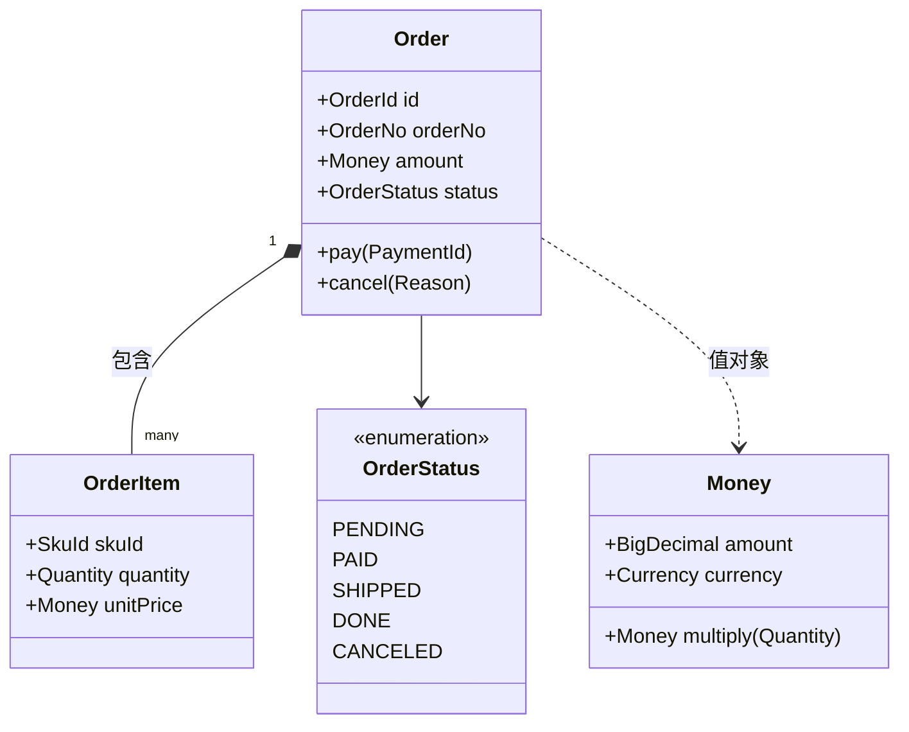
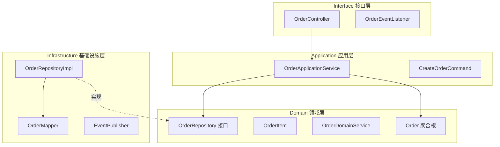
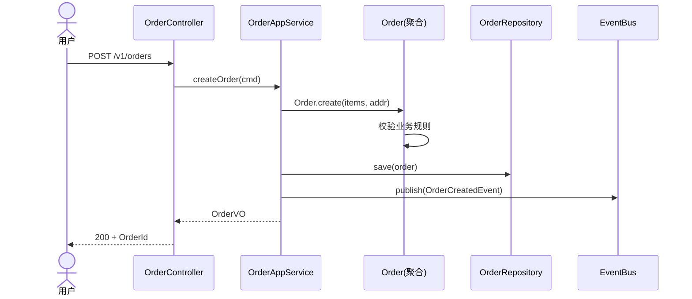
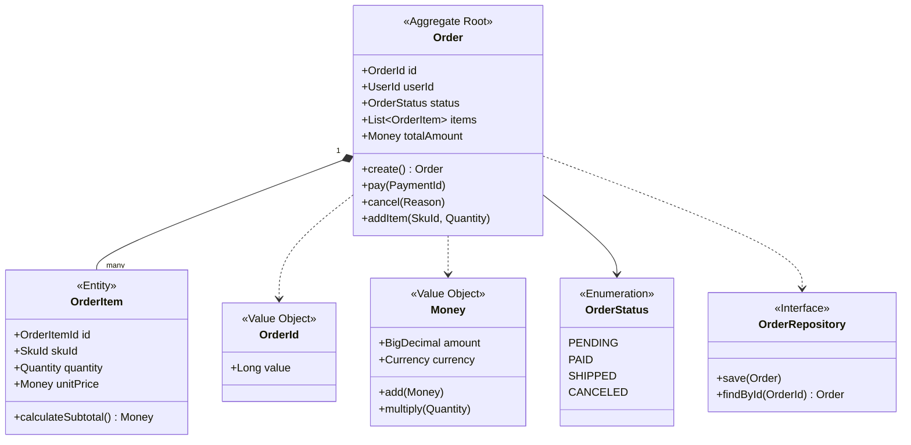
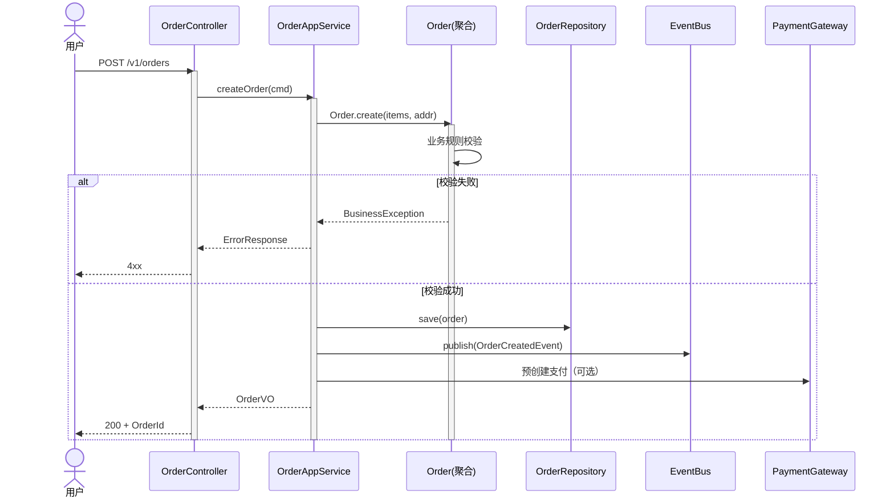
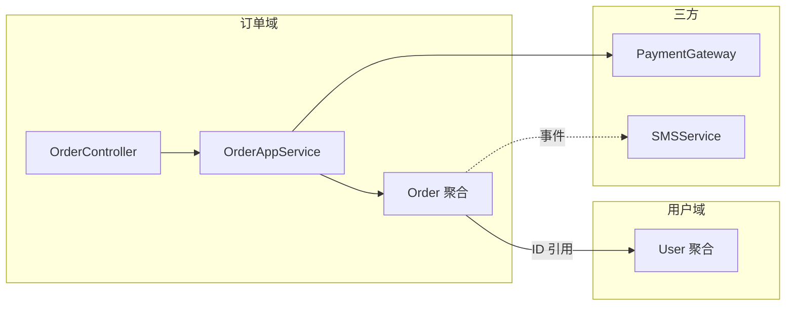
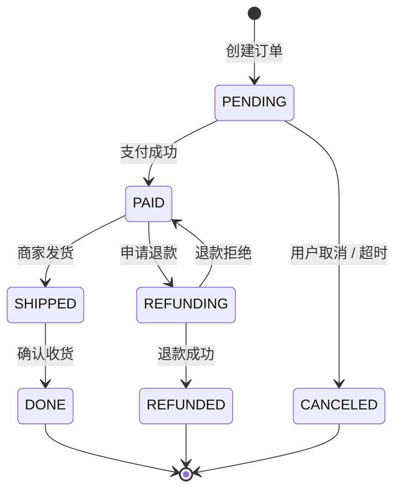

# 软件架构设计说明书编写规范 v1.0

> 版本：v1.0
> 修订日期：2026-06-30
> 配套：`./SKILL.md`（精简入口）；本文件为详细规则与完整模板
> 适用：Vue + Java Spring Boot 项目（软件/代码级架构）
> 参考：4+1 视图模型 + DDD 战术设计 + Clean / Hexagonal / COLA + 阿里《架构师指南》《Java 开发手册(嵩山版)》《COLA 4.0》+ 字节《架构师白皮书》+ 美团 LDA + 腾讯 TARS / TSF

---

## 1. 文档基本信息与版本控制

### 1.1 基础信息表（首页必填）

```markdown
| 项 | 值 |
|---|---|
| 项目名称 | [项目官方名称] |
| 项目代号 | [如 Apollo-V1.2] |
| 文档类型 | HLD / LLD / HLD+LLD 合一 |
| 文档状态 | 草稿 / 评审中 / 已定稿 / 变更中 |
| 创建日期 | YYYY-MM-DD |
| 软件架构师 | [姓名 / 联系方式] |
| 技术负责人（Tech Lead） | [姓名 / 联系方式] |
| 前端负责人（Vue） | [姓名 / 联系方式] |
| 后端负责人（Java） | [姓名 / 联系方式] |
| DBA | [姓名 / 联系方式] |
| QA 负责人 | [姓名 / 联系方式] |
| 技术栈 | Java 21 / Spring Boot 3 / Vue 3 / PostgreSQL 16 |
| 关联 PRD | [PRD 编号 / 链接] |
| 关联系统架构（SAD） | [mc-doc-arch 链接] |
```

### 1.2 修订历史（倒序）

```markdown
| 版本号 | 修订日期 | 修订类型 | 修订内容摘要 | 修订人 | 审核 / 批准人 |
|---|---|---|---|---|---|
| V1.0.3 | 2026-06-28 | 变更 | 订单聚合重构：OrderItem 改为聚合内实体（ADR-0021） | 张三 | 架构委员会 |
| V1.0.2 | 2026-06-25 | 补充 | 补充支付模块时序图（异常分支） | 张三 | Tech Lead |
| V1.0.1 | 2026-06-22 | 变更 | 分层架构从经典三层调整为 DDD 四层（ADR-0018） | 李四 | 架构委员会 |
| V1.0.0 | 2026-06-15 | 新建 | 初始化发布 V1.0 软件架构设计 | 张三 | 架构委员会 |
```

**修订类型枚举**：`新建` / `变更` / `补充` / `删除` / `废弃`。

### 1.3 版本号规范（语义化）

```
V<major>.<minor>.<patch>

major：架构大改（如换分层 / 拆聚合 / 改领域边界）必须架构委员会通过
minor：新增模块 / 新增类 / 新增时序
patch：图例修正 / 文字补充（无架构变更）
```

### 1.4 文档状态机

```
草稿 → 评审中 → 已定稿 → 变更中 → 已定稿 → ...
                  ↓
                已废弃
```

---

## 2. 概述与目标

### 2.1 业务对齐与范围

**3 段式模板**：

```markdown
## 概述

### 业务对齐
[本设计对应的业务域 / PRD 链接 / 上游 SAD 链接]
示例：对应 PRD F-ORDER-001 ~ 005；上游 SAD = 系统架构设计 v1.0 §5.1 订单服务

### 设计范围
- 包含：[本设计覆盖的领域 / 模块 / 服务]
- 不包含：[明确划界]
- 依赖前置：[需要先完成的其他模块 / 基础设施]

### 关键质量属性
| 维度 | 目标 | 对齐 |
|---|---|---|
| 可维护性 | 模块改动平均影响 ≤ 3 个文件 | mc-java-spec |
| 可扩展性 | 新增业务规则不改主流程（OCP） | SOLID |
| 可测试性 | 单元测试覆盖率 ≥ 60% | mc-test |
| 性能 | API P99 ≤ 200ms | mc-perf |
| 安全 | 通过 mc-java-security P0 6 项 | mc-java-security |
```

**大厂做法**：
- **阿里**：业务对齐必含「上下游依赖图」+「数据流图」
- **字节**：质量属性必含量化指标 + 验收方式
- **美团**：必含「业务场景用例」（≥ 3 个核心场景）

### 2.2 干系人

| 干系人 | 关注点 |
|---|---|
| 业务方（PM） | 功能是否覆盖 / 上线时间 |
| 系统架构师 | 是否与 SAD 一致 / 跨项目复用 |
| 开发 | 工作量 / 复杂度 / 工具链 |
| QA | 可测试性 / 边界覆盖 |
| DBA | 数据模型一致性 |
| 安全 | 鉴权 / 脱敏 / 合规 |

---

## 3. 设计原则与约束

### 3.1 核心设计原则（5-9 条）

**示例（推荐组合）**：

1. **单一职责（SRP）**：一个类 / 模块只做一件事
2. **开闭原则（OCP）**：对扩展开放，对修改关闭
3. **依赖倒置（DIP）**：依赖抽象，不依赖实现；领域层不依赖基础设施
4. **接口隔离（ISP）**：接口最小化，禁胖接口
5. **领域优先（DDD）**：业务逻辑集中在领域层，禁泄漏到 Controller / Service
6. **高内聚低耦合**：模块内强内聚，模块间通过接口
7. **无状态服务**：业务服务无状态；Session / 文件走外部
8. **最终一致优先**：跨聚合 / 跨服务用领域事件 + 异步
9. **配置外置**：环境差异走配置中心，禁硬编码

**大厂原则对照**：

| 原则来源 | 强调 |
|---|---|
| 阿里《嵩山版》 | 命名 / 异常 / 日志 / 并发 / MySQL |
| 阿里 COLA | 模块解耦 / 依赖倒置 / 应用层薄 |
| 字节《架构师白皮书》 | 接口稳定 / 可降级 / 可观测 |
| 美团 LDA | 持续演进 / 设计与代码共生 |
| 腾讯 TSF | 服务治理 / 链路追踪 |

### 3.2 约束

| 类型 | 约束 |
|---|---|
| 技术栈 | Java 21 / Spring Boot 3 / Vue 3 / PostgreSQL 16 / Redis 7 / Kafka 3.x |
| 历史 | 兼容 v1 老接口至 2026-12-31 |
| 团队 | 后端 8 人 / 前端 4 人 |
| 合规 | 等保 2.0 三级 / 个人信息保护法 |

---

## 4. 4+1 视图模型（业界大厂通用）

> 4+1 视图由 Philippe Krutchen 提出，是腾讯 / 华为 / 阿里等大厂软件架构文档的事实标准。其中**逻辑视图 + 开发视图 + 场景视图必画**；进程视图 / 物理视图按需。

### 4.1 逻辑视图（Logical View）—— 必画

**关注**：类 / 接口 / 包 / 领域模型。**主要干系人**：系统分析师 / 架构师。

**画法**：UML 类图 / DDD 风格领域模型图。



### 4.2 开发视图（Development View）—— 必画

**关注**：模块 / 包 / 工程结构 / 分层。**主要干系人**：开发。

**画法**：包图 / 模块图。



### 4.3 进程视图（Process View）—— 按需

**关注**：并发 / 进程 / 线程 / IPC。**主要干系人**：性能 / 架构师。

**适用场景**：高并发 / 多线程 / 分布式锁 / 异步任务。

**画法**：进程-线程时序图 / 并发模型（Actor / CSP）。

### 4.4 物理视图（Physical View）—— 引用

**关注**：节点 / 部署 / 网络。**主要干系人**：运维 / SRE。

> **本节直接引用 mc-doc-arch §6.1 部署架构图**，不在 SADS 重复。

### 4.5 场景视图（Scenarios）—— 必画

**关注**：关键用例 / 业务流程。**主要干系人**：业务 / 测试。

**要求**：核心场景 ≥ 3 条；用**时序图**表达；含异常分支。



---

## 5. 分层架构

### 5.1 主流架构对照

| 架构 | 层次 | 依赖方向 | 适用场景 | 代表 |
|---|---|---|---|---|
| 经典三层（MVC） | Controller / Service / DAO | 上→下 | 简单 CRUD | 早期项目 |
| **DDD 四层** | Interface / Application / Domain / Infrastructure | Interface→App→Domain；Infra→Domain（DIP） | 复杂业务（推荐） | 阿里 / 字节 / 美团 |
| **COLA 4.0** | Adapter / App / Domain / Infrastructure | 同上 | 中大型后端（推荐） | 阿里 COLA |
| Clean（同心圆） | Entity / UseCase / Interface / Infra | 外→内 | 强领域 | Robert C. Martin |
| Hexagonal（六边形） | Domain + Ports & Adapters | Adapter→Port→Domain | 强可测试性 | Alistair Cockburn |
| RAP | Resilient / Adaptive / Portable | - | 弹性系统 | 美团 LDA |

### 5.2 推荐方案：DDD 四层（或 COLA 4.0）

```
┌──────────────────────────────────────────────┐
│ Interface（接口层）                            │
│ Controller / RPC / MQ Listener / DTO Assembler │
├──────────────────────────────────────────────┤
│ Application（应用层，薄）                      │
│ ApplicationService / CommandHandler / Tx       │
├──────────────────────────────────────────────┤
│ Domain（领域层，核心，业务规则聚集处）           │
│ Aggregate / Entity / VO / DomainService /      │
│ Repository(接口) / DomainEvent                 │
├──────────────────────────────────────────────┤
│ Infrastructure（基础设施层）                   │
│ RepositoryImpl / Mapper / Gateway / MQ / Cache │
└──────────────────────────────────────────────┘
        ↑ DIP（依赖倒置）：Infra 实现 Domain 接口
```

### 5.3 铁律（所有分层共用）

1. **依赖单向**：Interface → Application → Domain；Infra → Domain（实现接口）
2. **依赖倒置（DIP）**：Repository 接口定义在 Domain 层，实现在 Infrastructure 层
3. **领域层零依赖**：领域层不依赖任何框架（Spring / MyBatis）/ 不依赖基础设施
4. **跨层调用走接口**：禁直接依赖实现类
5. **DTO 不泄漏到领域层**：DTO 在 Interface / Application 层；Domain 层用 Entity / VO

### 5.4 COLA 4.0 模块（阿里开源）

```
com.company.project
  └── framework         // 框架层（公共）
  └── app               // 应用层（CommandHandler / QueryHandler）
  └── domain            // 领域层
  └── infrastructure    // 基础设施层
```

---

## 6. DDD 战术设计

### 6.1 五大战术构件

| 构件 | 作用 | 标识 | 示例 |
|---|---|---|---|
| **Entity（实体）** | 有唯一标识，可变 | `@Entity` | Order、User、Product |
| **Value Object（值对象）** | 无标识，不可变 | `record` / `@Value` | Money、Address、OrderNo |
| **Aggregate（聚合）** | 一致性边界 | 聚合根 = 主 Entity | Order + OrderItem（根 = Order） |
| **Domain Service（领域服务）** | 跨实体的领域逻辑 | `XxxDomainService` | PriceCalculator |
| **Repository（仓储）** | 聚合的持久化抽象 | 接口在 Domain，实现在 Infra | OrderRepository |

### 6.2 辅助构件

- **Domain Event**：解耦 + 异步（`OrderCreatedEvent`）
- **Factory**：复杂聚合创建（`OrderFactory`）
- **Anti-Corruption Layer（ACL，防腐层）**：对接遗留 / 三方系统
- **Read Model**：CQRS 查询模型（与写模型分离）

### 6.3 聚合设计铁律（阿里 / 字节共识）

1. **聚合要小**：聚合内强一致；聚合间最终一致
2. **聚合间只能通过 ID 引用**：禁直接对象引用（避免 N+1 + 一致性陷阱）
3. **一个事务只修改一个聚合**：跨聚合用领域事件
4. **聚合根是唯一入口**：外部只能通过聚合根操作内部实体
5. **聚合内业务规则在聚合根内**：禁泄漏到 Application / Service

### 6.4 DDD 实例：订单聚合



---

## 7. 包结构与模块划分

### 7.1 包命名规范（对齐阿里《嵩山版》+ mc-java-spec）

**通用规则**：
- 全小写，禁下划线 / 大写
- `com.<company>.<project>.<层>.<领域>`
- 领域名业务化（`order` / `user` / `product`）

### 7.2 DDD 四层包树（推荐）

```
com.company.project
├── interfaces                          // 接口层
│   ├── web                             // REST Controller
│   │   ├── order
│   │   │   └── OrderController.java
│   │   └── user
│   ├── rpc                             // RPC Provider
│   ├── mq                              // MQ Listener
│   │   └── order
│   │       └── OrderEventConsumer.java
│   └── dto                             // 对外 DTO（与 API 契约对齐）
│       └── order
│           ├── CreateOrderRequest.java
│           └── OrderVO.java
│
├── application                         // 应用层（薄，编排）
│   ├── order
│   │   ├── command                     // 写命令
│   │   │   ├── CreateOrderCommand.java
│   │   │   └── CreateOrderHandler.java
│   │   ├── query                       // 读查询
│   │   │   └── OrderQueryService.java
│   │   └── assembler                   // DTO ↔ Domain
│   │       └── OrderAssembler.java
│   └── shared
│
├── domain                              // 领域层（核心，零依赖）
│   ├── order
│   │   ├── model                       // 聚合 / 实体 / 值对象
│   │   │   ├── Order.java              // 聚合根
│   │   │   ├── OrderItem.java          // 实体
│   │   │   ├── OrderId.java            // 值对象
│   │   │   └── OrderStatus.java        // 枚举
│   │   ├── service                     // 领域服务
│   │   │   └── OrderDomainService.java
│   │   ├── event                       // 领域事件
│   │   │   ├── OrderCreatedEvent.java
│   │   │   └── OrderPaidEvent.java
│   │   └── repository                  // 仓储接口
│   │       └── OrderRepository.java
│   └── shared
│       └── model
│           ├── Money.java
│           └── AggregateRoot.java
│
└── infrastructure                      // 基础设施层
    ├── persistence                     // 持久化（Repository 实现）
    │   ├── order
    │   │   ├── OrderRepositoryImpl.java
    │   │   ├── OrderPO.java            // 持久化对象
    │   │   └── OrderMapper.java        // MyBatis Mapper
    │   └── converter
    │       └── OrderConverter.java     // PO ↔ Domain
    ├── external                        // 三方对接（ACL）
    │   └── payment
    │       ├── PaymentGatewayImpl.java
    │       └── PaymentGatewayClient.java
    ├── mq                              // MQ Producer
    │   └── KafkaEventPublisher.java
    ├── config                          // 配置
    │   └── RedisConfig.java
    └── util                            // 工具
```

### 7.3 模块划分原则

| 原则 | 说明 |
|---|---|
| **按领域划分** | 订单 / 用户 / 商品；禁按技术分层切包（controller.service / dao.user.service 混乱） |
| **高内聚低耦合** | 模块内强内聚；模块间通过接口 |
| **依赖单向** | 禁环依赖；用 ArchUnit 校验 |
| **接口稳定** | 领域层接口跨模块调用 |
| **包 ≤ 30 类** | 超量拆子包 |

### 7.4 ArchUnit 自动校验

```java
// 校验依赖方向（领域层不依赖任何外部）
@ArchTest
static final ArchRule 领域层零依赖 = noClasses()
    .that().resideInAPackage("..domain..")
    .should().dependOnClassesThat()
    .resideInAnyPackage("..infrastructure..", "..interfaces..", "..application..")
    .orShould().dependOnClassesThat()
    .resideInAnyPackage("org.springframework..", "com.baomidou..");

// 校验禁环依赖
@ArchTest
static final ArchRule 禁环依赖 = slices().matching("com.company.(*)..")
    .should().beFreeOfCycles();
```

---

## 8. UML（类图 / 时序图 / 组件图）

### 8.1 类图（必画核心域）

**铁律**：
- 方法签名带可见性（+ public / - private / # protected）
- 关联标基数（1 / many / 0..1）
- 实体 / 值对象 / 枚举显式标注 stereotype（`<<Aggregate Root>>` / `<<Value Object>>`）
- 关系用统一箭头（继承 ▷ / 实现 ▷ / 关联 → / 依赖 ╌▷）

见 §6.4 示例。

### 8.2 时序图（必画 ≥ 3 条主流程）

**铁律**：
- 每条主流程必含**异常分支**（alt / opt）
- 跨聚合用「领域事件」表达，禁直接调用聚合根
- 调用方向：Interface → Application → Domain → Repository(接口)



### 8.3 组件图（按需）

**适用**：模块间依赖、第三方集成。



### 8.4 状态机图（核心实体必画）



---

## 9. 技术选型与对比

### 9.1 选型矩阵模板

| 维度 | 方案 A | 方案 B | 方案 C |
|---|---|---|---|
| 通信协议 | ... | ... | ... |
| 性能 | ... | ... | ... |
| 服务治理 | ... | ... | ... |
| 跨语言 | ... | ... | ... |
| 学习成本 | ... | ... | ... |
| 团队熟悉度 | ... | ... | ... |
| 社区生态 | ... | ... | ... |
| 合规 | ... | ... | ... |
| **总分** | **X** | **X** | **X** |

### 9.2 决策记录（ADR）

> 对齐 mc-doc-arch ADR。每个关键决策一份独立文件 `docs/adr/NNNN-title.md`。

```markdown
# ADR-0018: 分层架构选 DDD 四层

## 状态
accepted（2026-06-22）

## 上下文
[问题背景 + 必须数据支撑]

## 备选方案
- A. 经典三层（MVC）：简单 / 但领域逻辑泄漏到 Service
- B. DDD 四层：清晰 / 学习成本高
- C. COLA 4.0：DDD 工程化 + 工具支持

## 决策
选 B（DDD 四层）。理由：业务复杂度中等；DDD 战术设计可演进；团队有 DDD 经验。

## 后果
- 正面：领域逻辑内聚；单元测试覆盖率提升
- 负面：开发成本 +15%；Repository 接口层增加模板代码
- 配套：ArchUnit 校验 + 包结构规范
```

### 9.3 常见选型决策点

| 决策点 | 推荐 | 理由 |
|---|---|---|
| ORM | MyBatis Plus | 国内主流 / SQL 可控 / 对齐 mc-database-spec |
| RPC（内部） | Dubbo / gRPC | 高性能；Spring Cloud OpenFeign 用于 HTTP |
| 服务注册发现 | Nacos | 国内主流 / 配置中心一体化 |
| 配置中心 | Nacos / Apollo | 国内主流 |
| 缓存 | Redis Cluster | 对齐 mc-cache |
| MQ | Kafka（高吞吐）/ RocketMQ（事务） | 选型见 ADR |
| 链路追踪 | SkyWalking / Jaeger | 对齐 mc-monitor |
| 任务调度 | XXL-Job / PowerJob | 国内主流 |
| 限流熔断 | Sentinel | 阿里出品 / 配套完善 |

---

## 10. 异常与边界

### 10.1 异常处理统一

- **业务异常**：领域层抛 `BusinessException(code, message)`；Controller 层由 `@RestControllerAdvice` 统一捕获
- **参数校验异常**：Controller 层 `@Valid` 抛 `MethodArgumentNotValidException`
- **系统异常**：兜底 `Exception` → 10900
- **错误码**：对齐 mc-api-spec v1.7（含业务自定义 106xx）

详见 mc-java-spec + mc-api-spec v1.7 §7。

### 10.2 跨模块边界

| 边界 | 通信方式 |
|---|---|
| 同进程同模块 | 方法调用 |
| 同进程跨模块 / 跨聚合 | 领域事件（Spring `ApplicationEventPublisher`） |
| 跨服务 / 跨进程 | HTTP / RPC（同步）/ MQ（异步） |
| 对接遗留系统 | 防腐层（ACL） |

### 10.3 可测试性

| 测试类型 | 范围 | 工具 | 覆盖率门槛 |
|---|---|---|---|
| 单元测试 | 单类 | JUnit 5 + Mockito | ≥ 60% |
| 集成测试 | 模块 / 服务 | Testcontainers | 核心流程 100% |
| 契约测试 | API | Spring Cloud Contract | 关键接口 |
| 端到端测试 | 全链路 | Playwright | 主场景 |

详见 mc-test。

---

## 11. HLD / LLD 分级

| 维度 | HLD（概要设计） | LLD（详细设计） |
|---|---|---|
| 关注 | 模块 / 接口 / 分层 / 数据流 | 类 / 方法 / 字段 / 算法 / 时序 |
| 读者 | 架构委员会 / 跨团队 | 同团队开发 |
| 粒度 | 系统 / 子系统 | 类 / 函数 |
| 审批 | 架构委员会签批 | 模块负责人签批 |
| 变更频率 | 低（季度级） | 高（迭代级） |

**大厂做法**：
- **阿里**：HLD + LLD 强制双文档；HLD 架构师签批，LLD 模块负责人签批
- **字节**：HLD/LLD 合一，用章节区分（设计原则与分层 = HLD；模块详述 = LLD）
- **腾讯**：TRD（技术需求） + 详细设计分离；TRD 走技术委员会
- **美团**：LDA（Living Design Approach）持续更新；代码即文档，README 即设计

**实践建议**：
- 中型项目（5-15 人）：HLD/LLD 合一，本文档分章节（§3-§5 = HLD，§6-§8 = LLD）
- 大型项目（> 15 人）：拆 HLD + 每模块独立 LLD

---

## 12. 变更与评审

### 12.1 变更管理

**流程**：

```
[ 提出变更 ]
    ↓
[ 影响评估（架构师 / Tech Lead / QA）]
    ↓
[ 判定优先级（P0 立即 / P1 本迭代 / P2 下迭代）]
    ↓
[ 更新 SADS + 撰写 / 更新 ADR ]
    ↓
[ 架构委员会评审 ]
    ↓
[ 更新修订历史 + 通知干系人 ]
```

**严禁**：
- 口头决策（必须更新到 SADS + ADR）
- 跳过评审（影响范围 > 1 模块必须评审）
- 删除修订历史（仅追加）
- 跨层破坏（依赖反向 / 跨聚合直接调用）— ArchUnit 必须红绿

### 12.2 影响评估

| 维度 | 评估内容 |
|---|---|
| 业务影响 | 是否影响线上功能 / 用户行为 |
| 技术影响 | 分层破坏 / 依赖反向 / 聚合重构 / 接口契约变更 |
| 测试影响 | 是否需重测 / 回归测试范围 / 单测重写 |
| 上线影响 | 是否需灰度 / 数据迁移 / 停机 / 蓝绿 |

### 12.3 评审流程

**3 轮评审**：

| 轮次 | 参与方 | 关注点 | 产出 |
|---|---|---|---|
| 1. 架构内审 | 软件架构师 + Tech Lead | 原则对齐 / 4+1 完整 / 分层合理 / DDD 战术准确 | 内部修改建议 |
| 2. 跨团队评审 | 前后端 Lead + DBA + QA + 安全 | 接口可行 / 数据模型一致 / 性能预算 / 测试覆盖 | 跨团队待办 |
| 3. 架构委员会评审 | 架构委员会 / 技术委员会 | 跨项目复用 / 标准化 / 长期演进 / 技术债 | 委员会签批 |

**评审前必交**：
- 完整 SADS（含修订历史）
- UML（类图 / 时序图 / 状态机）
- 关键类源码骨架
- ADR（关键决策）
- 关联 PRD / SAD / DBD / API 文档链接

**评审后必出**：
- 评审纪要
- 待办项（负责人 + 截止日期）
- 修订历史更新（V1.0.X）
- 文档状态：`评审中` → `已定稿`

**禁**：
- 边评审边改 SADS
- 评审完不更新版本号
- 跨项目大变更跳过架构委员会

---

## 13. 校验 Checklist（P0~P3）

### 13.1 P0 必查 8 项

| # | 检查项 | 检查方式 |
|---|---|---|
| 1 | 首页有完整基础信息表 + 修订历史 | 文档开头检查 |
| 2 | 设计原则章节存在且 5-9 条 | §3.1 |
| 3 | 4+1 视图齐全（至少逻辑 + 开发 + 场景） | §4 |
| 4 | 分层架构图存在且依赖单向 | §5 |
| 5 | 核心域有类图 + 至少 3 条主流程时序图 | §8 |
| 6 | 包结构对齐 mc-java-spec（按领域划分） | §7 |
| 7 | 技术选型有对比矩阵 | §9 |
| 8 | 关键设计模式显式标注（GOF 名称） | §5-§6 |

### 13.2 P1 高优检查

| # | 检查项 |
|---|---|
| 9 | 聚合边界清晰（聚合内强一致，聚合间最终一致） |
| 10 | 跨聚合用领域事件，禁直接调用聚合根 |
| 11 | 一个事务只修改一个聚合 |
| 12 | 依赖倒置：Repository 接口在 Domain，实现在 Infra |
| 13 | 领域层零依赖（无 Spring / MyBatis 依赖） |
| 14 | ArchUnit 校验依赖方向 + 禁环依赖 |
| 15 | 异常处理统一（@RestControllerAdvice） |
| 16 | 命名规范（包 / 类 / 方法对齐嵩山版） |
| 17 | 接口稳定（接口先定义后实现） |
| 18 | 配置外置（无硬编码） |
| 19 | 日志埋点对齐 mc-monitor（trace_id） |

### 13.3 P2 中优检查

| # | 检查项 |
|---|---|
| 20 | 缓存策略明确（对齐 mc-cache） |
| 21 | 并发模型明确（线程池 / 锁） |
| 22 | 性能预算量化（API P99 ≤ 200ms） |
| 23 | 可测试性（单元测试覆盖率 ≥ 60%） |
| 24 | 灰度方案（如影响线上） |
| 25 | 回滚预案 |

### 13.4 P3 低优检查

| # | 检查项 |
|---|---|
| 26 | 图例完整（UML stereotype / 颜色 / 箭头） |
| 27 | 命名一致（领域术语与 PRD 一致） |
| 28 | 引用文档有效（PRD / SAD / DBD / API 链接） |
| 29 | 图表清晰（分辨率 / 标注） |
| 30 | 错别字 / 语病 |

---

## 14. 模板速查

### 14.1 完整 SADS 目录

```markdown
# [项目名称] 软件架构设计说明书 V[major.minor.patch]

## 1. 基础信息
   1.1 项目信息表
   1.2 修订历史

## 2. 概述与目标
   2.1 业务对齐与范围
   2.2 干系人

## 3. 设计原则与约束
   3.1 核心设计原则（5-9 条）
   3.2 技术与业务约束

## 4. 4+1 视图
   4.1 逻辑视图（类图）
   4.2 开发视图（包图）
   4.3 进程视图（按需）
   4.4 物理视图（引用 SAD）
   4.5 场景视图（时序图，≥ 3 条）

## 5. 分层架构
   5.1 选型（DDD 四层 / COLA / Clean）
   5.2 分层依赖图
   5.3 铁律

## 6. DDD 战术设计（核心域）
   6.1 五大战术构件
   6.2 辅助构件
   6.3 聚合设计铁律
   6.4 核心聚合类图

## 7. 包结构与模块划分
   7.1 包命名规范
   7.2 包树
   7.3 模块划分原则
   7.4 ArchUnit 校验

## 8. UML
   8.1 类图（核心域）
   8.2 时序图（≥ 3 条主流程）
   8.3 组件图（按需）
   8.4 状态机图（核心实体）

## 9. 技术选型与对比
   9.1 选型矩阵
   9.2 ADR 索引
   9.3 常见选型决策点

## 10. 异常与边界
   10.1 异常处理统一
   10.2 跨模块边界
   10.3 可测试性

## 11. HLD / LLD 分级（如适用）

## 12. 变更与评审
   12.1 变更管理
   12.2 影响评估
   12.3 评审流程

## 13. 附录
   13.1 ADR 全文
   13.2 术语表
   13.3 引用文档（PRD / SAD / DBD / API / mc-java-spec）
```

### 14.2 单聚合模板（LLD 级）

```markdown
### 聚合：[名称]

#### 1. 边界与职责
- 聚合根：[Entity 名]
- 内部实体：[XxxEntity]
- 值对象：[XxxVO]
- 不包含：[其他聚合]

#### 2. 不变量（Invariants）
- [业务规则 1]
- [业务规则 2]

#### 3. 类图
[Mermaid classDiagram]

#### 4. 操作与状态机
- create / pay / cancel / ship / ...
[Mermaid stateDiagram]

#### 5. 时序图（主操作）
[Mermaid sequenceDiagram]

#### 6. 仓储接口
[Repository 接口签名]

#### 7. 领域事件
- OrderCreatedEvent
- OrderPaidEvent

#### 8. 与其他聚合的关系
- 通过 [XxxId] 引用 [Yyy 聚合]
- 监听 [ZzzEvent]
```

### 14.3 ADR 模板

```markdown
# ADR-NNNN: [决策标题]

## 状态
proposed / accepted / deprecated / superseded by ADR-MMMM

## 日期
YYYY-MM-DD

## 上下文
[问题背景 / 决策触发点 / 必须数据]

## 备选方案
- 方案 A：[描述 + 优劣]
- 方案 B：[描述 + 优劣]

## 决策
[选哪个 + 一句话核心理由]

## 后果
- 正面：[改善]
- 负面：[成本 / 风险]
- 后续：[配套工作]

## 相关
- 关联 ADR：ADR-XXXX
- 关联文档：[SADS 章节 / PRD / DBD / API]
```

### 14.4 修订历史模板

```markdown
| 版本号 | 修订日期 | 修订类型 | 修订内容摘要 | 修订人 | 审核 / 批准人 |
|---|---|---|---|---|---|
| V1.0.X | YYYY-MM-DD | 变更 / 补充 / 删除 | [一句话 + ADR 编号] | [姓名] | [评审会 / 委员会] |
```

---

## 附录 A：大厂做法对照

| 维度 | 阿里 | 字节 | 腾讯 | 美团 | 本规范 |
|---|---|---|---|---|---|
| 文档分层 | HLD + LLD 强制 | 单文档 + 章节 | TRD + 详细设计 | LDA 持续更新 | HLD/LLD 合一 + 章节分（中小）/ 拆分（大） |
| 视图模型 | 4+1 | 4+1 | 4+1（强制） | 4+1 + LDA | 4+1 |
| 分层架构 | DDD 四层 / COLA | DDD 四层 | DDD 四层 + TSF | DDD + LDA | DDD 四层 / COLA（推荐） |
| 包结构规范 | 嵩山版强制 | 内部规范 | TSF 规范 | LDA | mc-java-spec + 嵩山版 |
| 决策记录 | ADR + 委员会 | ADR + 架构委员会 | 邮件 + TRD | ADR | ADR + 委员会 |
| ArchUnit 校验 | 强 | 强 | 中 | 中 | 强（必含） |
| 评审 | 架构委员会 | 架构委员会 | 技术委员会 | 同行评审 | 3 轮（含委员会） |

## 附录 B：术语表

| 术语 | 含义 |
|---|---|
| SADS | Software Architecture Design Specification 软件架构设计说明书 |
| HLD | High Level Design 概要设计 |
| LLD | Low Level Design 详细设计 |
| SAD | System Architecture Design 系统架构设计（→ mc-doc-arch） |
| 4+1 View | Logical / Development / Process / Physical + Scenarios（Krutchen） |
| DDD | Domain-Driven Design 领域驱动设计 |
| Aggregate | 聚合（一致性边界） |
| Aggregate Root | 聚合根（聚合的唯一入口） |
| Entity | 实体（有唯一标识） |
| Value Object | 值对象（无标识，不可变） |
| Domain Service | 领域服务（跨实体的领域逻辑） |
| Repository | 仓储（聚合的持久化抽象） |
| Domain Event | 领域事件（解耦 + 异步） |
| ACL | Anti-Corruption Layer 防腐层 |
| Bounded Context | 限界上下文（DDD 战略） |
| CQRS | Command Query Responsibility Segregation 读写分离 |
| Event Sourcing | 事件溯源 |
| COLA | Clean Object-Oriented and Layered Architecture（阿里） |
| Clean Architecture | 整洁架构（Robert C. Martin） |
| Hexagonal | 六边形架构（Ports & Adapters） |
| SOLID | SRP / OCP / LSP / ISP / DIP 五大原则 |
| DIP | Dependency Inversion Principle 依赖倒置原则 |
| GOF | Gang of Four 设计模式四作者 |
| LDA | Living Design Approach（美团） |
| ADR | Architecture Decision Record 架构决策记录 |
| TRD | Technical Requirement Document（腾讯） |
| TSF | Tencent Service Framework 腾讯微服务平台 |
| ArchUnit | Java 架构测试框架 |
