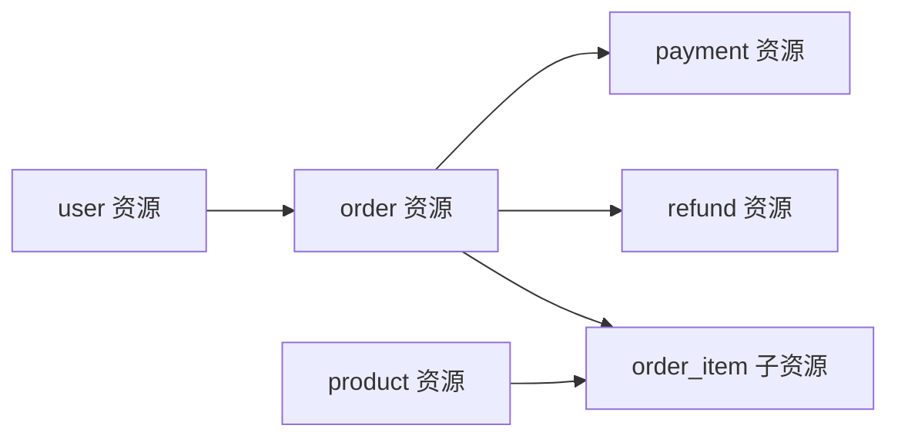

# 接口设计文档编写规范 v1.0

> 版本：v1.0
> 修订日期：2026-06-24
> 配套：`./SKILL.md`（精简入口）；本文件为详细规则与完整模板
> 适用：RESTful HTTP API（Vue + Java Spring Boot 项目）
> 参考：OpenAPI 3.x + Apifox / YApi / Swagger + 字节 / 阿里 / 腾讯 / 美团大厂做法 + mc-api-spec v1.7 工程规则

---

## 1. 文档基本信息与版本控制

### 1.1 基础信息表（首页必填）

```markdown
| 项 | 值 |
|---|---|
| 项目名称 | [项目官方名称] |
| 项目代号 | [如 Apollo-V1.2] |
| 文档状态 | 草稿 / 评审中 / 已定稿 / 变更中 |
| 创建日期 | YYYY-MM-DD |
| 架构师 | [姓名 / 联系方式] |
| 后端负责人（Lead） | [姓名 / 联系方式] |
| 前端负责人（Lead） | [姓名 / 联系方式] |
| API Owner | [姓名 / 联系方式] |
| 契约维护人 | [姓名 / 联系方式] |
| 契约平台 | Apifox / YApi / Swagger |
| 当前 API 版本 | v1 |
```

### 1.2 修订历史（倒序）

```markdown
| 版本号 | 修订日期 | 修订类型 | 修订内容摘要 | 修订人 | 审核 / 批准人 |
|---|---|---|---|---|---|
| V1.0.4 | 2026-06-27 | 变更 | 错误码段调整：106xxx 文件类并入 105xxx（10503-10506）；106xxx 释放为业务自定义（§6.5） | 张三 | 架构委员会 |
| V1.0.3 | 2026-06-25 | 变更 | /v1/orders POST 新增 coupon_code 字段（API-ORDER-002） | 张三 | 前后端 Lead |
| V1.0.2 | 2026-06-20 | 补充 | 错误码段 105xx 限流补充 Retry-After Header 说明 | 张三 | API Owner |
| V1.0.1 | 2026-06-18 | 变更 | API-ORDER-004 取消订单从 PUT 改为 POST 动作 | 李四 | 后端 Lead |
| V1.0.0 | 2026-06-15 | 新建 | 初始化发布 V1.0 接口设计 | 张三 | 架构委员会 |
```

**修订类型枚举**：`新建` / `变更` / `补充` / `删除`（必含 deprecated 过渡期）/ `废弃`。

### 1.3 版本号规范（语义化）

```
V<major>.<minor>.<patch>

major：API 大版本（v1 → v2，不兼容变更）必须架构委员会通过
minor：新增接口 / 新增字段（兼容性变更）
patch：文档修正 / 示例补充（无契约变更）
```

### 1.4 文档状态机

```
草稿 → 评审中 → 已定稿 → 变更中 → 已定稿 → ...
                  ↓
                已废弃
```

---

## 2. 总体说明

### 2.1 协议与基础

| 项 | 规范 |
|---|---|
| 协议 | HTTPS / TLS 1.3（公网）/ HTTP（内网，建议 mTLS） |
| 数据格式 | JSON（请求 / 响应统一 application/json） |
| 字符编码 | UTF-8 |
| 时间格式 | ISO-8601 字符串 OR 毫秒时间戳（项目内统一） |
| 时区 | 后端 UTC 存储 / 处理；响应按用户时区或时间戳 |
| 字段命名 | 全局 snake_case（URL 路径参数 / 查询 / body） |
| URL 资源段 | lowercase + kebab-case + 复数名词 |

### 2.2 域名与路由

| 类型 | 域名 | 示例 |
|---|---|---|
| 用户侧 API | api.example.com | `https://api.example.com/v1/orders` |
| 开放 API | open.example.com | `https://open.example.com/v1/...` |
| 后台 API | admin-api.example.com | `https://admin-api.example.com/v1/admin/...` |

### 2.3 通用 Header

**请求 Header**：

| Header | 必填 | 说明 |
|---|---|---|
| Authorization | 鉴权接口必填 | `Bearer <access_token>` 或签名头 |
| Content-Type | 有 Body 必填 | `application/json; charset=utf-8` |
| Accept | 否 | `application/json` |
| Idempotency-Key | 写操作必填 | UUID v4，防重复提交 |
| X-Trace-Id | 否 | 链路追踪（不传则服务端生成） |
| X-Request-Id | 否 | 客户端请求 ID |
| User-Agent | 否 | 客户端标识 |

**响应 Header**：

| Header | 必返 | 说明 |
|---|---|---|
| X-Trace-Id | 是 | 链路追踪 ID |
| Content-Type | 是 | `application/json; charset=utf-8` |
| X-RateLimit-Remaining | 否 | 剩余配额 |
| Retry-After | 限流时必返 | 重试等待秒数 |

---

## 3. 资源建模

### 3.1 资源识别

**资源**：业务对象的名词（订单 order / 用户 user / 商品 product / 退款 refund）。**禁**：动词资源（getOrder / createOrder）。

**资源关系**：

| 关系 | URL 表达 | 示例 |
|---|---|---|
| 集合 | `/{resources}` | `/v1/orders` |
| 单个 | `/{resources}/{id}` | `/v1/orders/{order_id}` |
| 子资源 | `/{resources}/{id}/{sub}` | `/v1/orders/{order_id}/items` |
| 业务动作 | `/{resources}/{id}/{action}` | `/v1/orders/{order_id}/cancel` |

### 3.2 资源关系图



### 3.3 资源字段速查（共享字段）

| 字段 | 类型 | 说明 |
|---|---|---|
| id | string | 主键（雪花 ID 必须 String） |
| created_at | integer/string | 创建时间（时间戳或 ISO-8601） |
| updated_at | integer/string | 更新时间 |
| status | string | 状态（大写英文值） |

---

## 4. 接口清单

### 4.1 清单模板（全局）

| # | 编号 | URL | Method | 用途 | 鉴权 | 模块 | PRD 关联 | 状态 |
|---|---|---|---|---|---|---|---|---|
| 1 | API-ORDER-001 | /v1/orders | GET | 订单列表（Offset 分页） | user | 订单 | F-ORDER-001 | active |
| 2 | API-ORDER-002 | /v1/orders | POST | 创建订单 | user | 订单 | F-ORDER-002 | active |
| 3 | API-ORDER-003 | /v1/orders/{order_id} | GET | 订单详情 | user | 订单 | F-ORDER-001 | active |
| 4 | API-ORDER-004 | /v1/orders/{order_id} | PATCH | 修改订单（局部） | user | 订单 | F-ORDER-002 | active |
| 5 | API-ORDER-005 | /v1/orders/{order_id}/cancel | POST | 取消订单 | user | 订单 | F-ORDER-003 | active |
| 6 | API-ORDER-006 | /v1/orders/{order_id}/refund | POST | 申请退款 | user | 订单 | F-ORDER-004 | active |
| 7 | API-ORDER-007 | /v1/orders/search | POST | 复杂条件查询 | admin | 后台 | F-ADMIN-001 | active |
| 8 | API-ORDER-008 | /v1/orders/export | POST | 导出订单（异步 Job） | admin | 后台 | F-ADMIN-002 | active |
| - | API-ORDER-OLD-001 | /v1/orders/batch-create | POST | 批量创建（已废弃） | user | 订单 | - | deprecated |

### 4.2 接口编号规范

**格式**：`API-[MODULE]-[NNN]` / `API-[MODULE]-OLD-[NNN]`（废弃）

| 字段 | 规则 |
|---|---|
| MODULE | 大写英文，全局唯一（ORDER / USER / PRODUCT / ADMIN_ORDER） |
| NNN | 3 位序号，按接口添加顺序递增，不复用 |
| 状态 | active / deprecated / removed |

**严禁**：删除已上线接口编号（必须 deprecated 标记）；接口编号复用。

---

## 5. 单接口详述模板

### 5.1 模板（核心）

```markdown
### API-[MODULE]-NNN: [接口名称]

- **URL**：`{METHOD} /v{N}/{resource}`
- **用途**：[一句话]
- **鉴权**：[user / admin / open / none]
- **幂等**：[是 / 否]（写操作默认是，Header `Idempotency-Key`，48h 保留）
- **关联 PRD**：[F-XXX-NNN]
- **关联 DB**：[表名]

#### 1. 路径参数
| 参数 | 类型 | 必填 | 说明 |
|---|---|---|---|
| order_id | string | 是 | 订单 ID |

#### 2. 查询参数
| 参数 | 类型 | 必填 | 默认 | 说明 |
|---|---|---|---|---|
| page | integer | 否 | 1 | 页码 |
| page_size | integer | 否 | 20 | 每页（≤ 100） |
| status | string | 否 | - | 状态筛选（PENDING/PAID/...） |
| created_after | string | 否 | - | ISO-8601 / 时间戳 |

#### 3. 请求 Header
| Header | 必填 | 说明 |
|---|---|---|
| Authorization | 是 | Bearer Token |
| Idempotency-Key | 写操作必填 | UUID v4 |

#### 4. 请求 Body
| 字段 | 类型 | 必填 | 校验 | 说明 |
|---|---|---|---|---|
| field_name | string | 是 | ≤ 32 字符 | 字段说明 |

#### 5. 请求示例
```json
{ "field_name": "value" }
```

#### 6. 响应 Body（成功，HTTP 200）
| 字段 | 类型 | 说明 |
|---|---|---|
| code | integer | 0 表示成功 |
| message | string | "success" |
| data | object | 业务数据 |
| error | null/object[] | 失败时填充 |
| trace_id | string | 链路追踪 ID |
| timestamp | integer | 响应时间戳（毫秒） |

#### 7. 响应示例（成功）
```json
{ "code": 0, "message": "success", "data": {...}, "error": null, "trace_id": "...", "timestamp": 1718660400000 }
```

#### 8. 响应示例（失败）
```json
{ "code": 10100, "message": "请求参数错误", "data": null,
  "error": [{ "field": "email", "code": "FORMAT_INVALID", "message": "邮箱格式不正确", "value": "invalid-email" }],
  "trace_id": "...", "timestamp": 1718660400000 }
```

#### 9. 错误码（本接口可能返回）
| code | 子类型 | 场景 | message |
|---|---|---|---|
| 10101 | REQUIRED_MISSING | 缺字段 | "xxx 不能为空" |
| 10400 | NOT_FOUND | 资源不存在 | "xxx 不存在" |
| 10503 | UPLOAD_FAILED | 文件上传失败（如适用） | "文件上传失败，请重试" |
| 106xx | <业务子类型> | 业务自定义（余额不足 / 风控 / 农时冲突等，详见 §6.5） | "<业务提示>" |

#### 10. 性能预算
- P99：≤ 200ms（核心）/ 500ms（主流程）/ 1s（后台）
- 超时：客户端 30s

#### 11. Apifox 契约链接
https://apifox.com/project/xxx/apis/[id]
```

### 5.2 字段说明铁律

- **类型**：必须明确（string / integer / number / boolean / array / object + 嵌套）
- **必填**：是 / 否 / 条件必填（满足 X 时必填）
- **校验**：长度（≤ N 字符）/ 格式（手机正则 / 邮箱）/ 范围（1-999）/ 自定义
- **业务说明**：禁只列字段名，必须含业务含义
- **敏感字段**：标注脱敏（如 phone → 138****8888）

---

## 6. 错误码与状态码

### 6.1 应用层 vs 路由层边界

| 层 | HTTP 状态 | 含义 | 响应体 |
|---|---|---|---|
| 应用层（业务） | 200 | 业务异常统一 200 + 6 字段信封 | 6 字段信封 |
| 路由 / 网关层 | 401 / 403 / 404 / 405 / 413 / 415 / 502 / 503 / 504 | 路由 / 网关拦截 | 原始 HTTP 错误（无信封） |

### 6.2 错误码分段（5 位数字）

| 段 | 含义 | 高频 code |
|---|---|---|
| 0 | 成功 | 0 |
| 101xx | 参数错误 | 10100 通用 / 10101 必填缺失 / 10102 格式不正确 / 10103 超长 / 10104 超范围 |
| 102xx | 认证失败 | 10200 未登录 / 10201 Token 失效 / 10202 Token 过期 / 10203 Token 签名错误 / 10204 账号冻结 |
| 103xx | 权限不足 | 10300 通用 / 10301 无数据权限 / 10302 无操作权限 |
| 104xx | 资源错误 | 10400 不存在 / 10401 唯一冲突 / 10402 状态冲突 / 10403 库存不足 / 10404 数据被引用 |
| 105xx | 限流 / 重试 / 文件上传 | 10500 限流（Retry-After）/ 10501 重复提交 / 10502 服务降级 / 10503 文件上传失败 / 10504 类型不支持 / 10505 体积过大 / 10506 内容为空 |
| 106xx | **业务自定义**（v1.7 新增） | 业务线登记认领（余额不足 / 风控 / 农时冲突 / 活动上限等强业务语义），详见 §6.5 |
| 107xx | 部分成功 | 10700 批量部分成功（data 非 null） |
| 109xx | 系统错误 | 10900 内部错误 / 10901 三方超时 / 10902 三方异常 |

> v1.7 变更：原 106xxx「文件与上传类」已并入 105xxx（10503-10506），106xxx 段释放为业务自定义错误段。详见 mc-api-spec §7.9 / §7.10。

### 6.3 error 字段结构（字段级错误）

```json
"error": [
  {
    "field": "email",
    "code": "FORMAT_INVALID",
    "message": "邮箱格式不正确",
    "value": "invalid-email"
  }
]
```

### 6.4 错误码管理

- **统一归属**：通用错误码（10xxx ~ 105xxx、107xx、109xx）归档在 mc-api-spec v1.7 §7（全局唯一）
- **禁冲突**：新增错误码必须查 v1.7 §7 是否已占用
- **禁复用**：废弃错误码不删除不复用
- **业务自定义归本项目**：106xxx 段由本项目接口设计文档自行登记（§6.5），同时同步到 mc-api-spec §7.10 的全局认领表

### 6.5 业务自定义错误码（106xxx，本项目登记）

> v1.7 新增。106xxx 段释放给业务自定义错误，适配本项目当前业务（如农业域：农时冲突、地块轮作、设备离线阈值、订单超卖、风控拦截等）。

**判定原则**：通用错误码（10xxx ~ 105xxx）能覆盖的优先用通用码；只有**强业务语义、跨实体判定**的错误才落到 106xx。

| 错误码 | 业务域 | 描述 | 触发条件 | 前端处理 | 登记人 / 日期 |
|---|---|---|---|---|---|
| 10600 | 交易 | 余额不足 | 用户账户余额 < 订单金额 | 引导充值 | / |
| 10601 | 交易 | 风控拦截 | 命中风控规则（异地、频次、黑名单） | 提示联系客服 | / |
| 10602 | 农事 | 农时冲突 | 操作违反当季农时规则 | 提示推荐农时 | / |
| 10603 | 农事 | 地块轮作冲突 | 同一地块作物轮作周期未到 | 提示轮作周期 | / |
| 10604 | 物联 | 设备离线告警阈值 | 设备离线超阈值，操作被拒 | 提示设备状态 | / |
| 10605 | 营销 | 活动未开始 / 已结束 | 当前时间不在活动有效期 | 提示活动时间 | / |
| 10606 | 营销 | 参与次数达上限 | 用户已达活动参与上限 | 提示已达上限 | / |
| ... | ... | ... | ... | ... | ... |

**登记规则**：
- PR 时同步更新本表 + mc-api-spec §7.10 全局表
- 错误码不可复用，废弃后空位保留
- `error` 数组可携带字段级明细（如 `field: "balance"`）

**响应示例**（业务自定义错误）：

```json
{
  "code": 10600,
  "message": "账户余额不足",
  "data": null,
  "error": [
    { "field": "balance", "code": "INSUFFICIENT_BALANCE", "message": "当前余额 ¥120.50，订单需 ¥256.80", "value": "120.50" }
  ],
  "trace_id": "c0a8010116983728001",
  "timestamp": 1718660400000
}
```

---

## 7. 横切关注点

### 7.1 鉴权

| 场景 | 方式 | Header |
|---|---|---|
| 用户侧 API | JWT Bearer Token | `Authorization: Bearer <access_token>` |
| 开放 API（三方对接） | HMAC-SHA256 签名 | `X-App-Id` + `X-Signature` + `X-Timestamp` + `X-Nonce` |
| 后台 API | JWT + RBAC | 同用户侧 + 角色权限 |
| 内部服务调用 | mTLS 或内部 Token | 网关层处理 |

**Token 生命周期**：access_token ≤ 2h；refresh_token ≤ 30d 且一次性；无感刷新走 `POST /v1/auth/refresh`。

**签名规范（开放 API）**：
- 签名串：`method + "\n" + path + "\n" + sorted_query + "\n" + body_hash + "\n" + timestamp`
- 算法：HMAC-SHA256(secret, 签名串)
- 防重放：timestamp ± 5min + nonce 唯一性（5min 窗口）

### 7.2 限流

| 维度 | 策略 | 响应 |
|---|---|---|
| 用户级 | 100 QPS / 用户 | 10500 + `Retry-After: <seconds>` |
| IP 级 | 1000 QPS / IP | 同上 |
| App 级 | 总 QPS 上限 | 同上 |
| 写操作级 | 10 QPS / 用户 | 防刷 |

**Header 响应**：
- `X-RateLimit-Limit`：配额上限
- `X-RateLimit-Remaining`：剩余
- `Retry-After`：重试等待秒数

### 7.3 幂等

| 项 | 规范 |
|---|---|
| 适用 | 所有写操作（POST / PATCH / PUT / DELETE 业务动作） |
| Header | `Idempotency-Key: <uuid v4>` |
| 保留期 | 48 小时 |
| 同 key + 同 Body | 返回首次结果 |
| 同 key + 不同 Body | 返 10501「请勿重复提交」 |
| 未传 key | 服务端可拒绝（写操作必传）或允许但提示风险 |

---

## 8. 分页与批量

### 8.1 三种分页

| 场景 | 模式 | 请求参数 | 响应字段 |
|---|---|---|---|
| 后台 / 跳页 / <10 万 | Offset | `page` + `page_size` | list / total / page / page_size / has_more / summary |
| Feed / 无限滚动 / 海量 | Cursor | `cursor` + `limit` | list / next_cursor / has_more / summary |
| 高性能 / 深翻页 / >100 万 | Keyset | `last_id` + `last_value` + `limit` | list / last_id / last_value / has_more / summary |

> `limit` 与 `page_size` 禁止混用：Offset 用 `page_size`，Cursor/Keyset 用 `limit`。

**响应示例（Offset）**：

```json
{
  "code": 0,
  "data": {
    "list": [...],
    "total": 128,
    "page": 1,
    "page_size": 20,
    "has_more": true,
    "summary": null
  }
}
```

### 8.2 批量操作

| 数据量 | 模式 | 响应 |
|---|---|---|
| N ≤ 100 | 同步 | 10700 部分成功（data 含成功 / 失败列表） |
| N > 100 | 异步 Job | 返 `job_id` + `poll_url`，轮询 `GET /v1/jobs/{job_id}` |

**异步 Job 响应示例**：

```json
{
  "code": 0,
  "data": {
    "job_id": "job_202606241234",
    "status": "PENDING",
    "poll_url": "/v1/jobs/job_202606241234"
  }
}
```

---

## 9. 校验 Checklist（P0~P3）

### 9.1 P0 必查 8 项

| # | 检查项 | 检查方式 |
|---|---|---|
| 1 | 首页有完整基础信息表 + 修订历史 | 文档开头检查 |
| 2 | 资源建模章节存在 | §3 |
| 3 | 接口清单完整（编号 / URL / Method / 鉴权 / 模块） | §4.1 |
| 4 | 每接口有完整 8 要素（URL/Method/路径/查询/请求/响应/错误码/示例） | §5 |
| 5 | 字段命名 snake_case（路径参数 / 查询 / body） | 全文检查 |
| 6 | 业务异常 HTTP 200 + 6 字段信封 | 响应示例 |
| 7 | 写操作支持 Idempotency-Key | §7.3 |
| 8 | 接口清单与 Apifox / OpenAPI 一一对应 | 对照 Apifox |

### 9.2 P1 高优检查

| # | 检查项 |
|---|---|
| 9 | ID 与金额字段为 String 类型 |
| 10 | 错误码 5 位数字分段清晰 |
| 11 | 分页参数不混用（page_size vs limit） |
| 12 | 限流响应带 Retry-After |
| 13 | 批量 N > 100 走异步 Job |
| 14 | 鉴权方案明确（每接口标注） |
| 15 | URL 路径深度 ≤ 3 层（不含 version） |
| 16 | URL 含 /v{N}/ 前缀 |

### 9.3 P2 中优检查

| # | 检查项 |
|---|---|
| 17 | 性能预算量化（P99 / 超时） |
| 18 | 幂等保留期明确（48h） |
| 19 | Token 生命周期明确（access / refresh） |
| 20 | 通用 Header 齐全（X-Trace-Id 等） |
| 21 | 兼容性策略明确 |
| 22 | deprecated 接口标注 |

### 9.4 P3 低优检查

| # | 检查项 |
|---|---|
| 23 | 命名规范（模块代号 / 错误码分段） |
| 24 | 引用文档有效（链接可访问） |
| 25 | 图例完整（资源关系图 / 流程图） |
| 26 | 错别字 / 语病 |

---

## 10. 契约管理（OpenAPI / Apifox）

### 10.1 契约维护铁律

1. 接口设计文档定稿后，**必须**录入 Apifox / YApi / Swagger
2. Apifox 项目结构按模块划分（订单 / 用户 / 商品 / 后台）
3. 每接口必含：完整 schema + 示例 + Mock + 关联错误码
4. 文档变更必同步更新契约（双向校验：文档 ↔ Apifox）
5. 前后端基于 Apifox 在线契约同步开发（前端用 Mock 联调，后端按契约实现）

### 10.2 OpenAPI 3.x 结构

```yaml
openapi: 3.0.3
info:
  title: 订单 API
  version: 1.0.0
  description: 订单模块接口契约
servers:
  - url: https://api.example.com
    description: 生产
  - url: https://api-staging.example.com
    description: 预发
security:
  - bearerAuth: []
paths:
  /v1/orders:
    get: { ... }
    post: { ... }
components:
  securitySchemes:
    bearerAuth:
      type: http
      scheme: bearer
  schemas:
    ApiResponse_Order:
      type: object
      required: [code, message, data, error, trace_id, timestamp]
      properties:
        code: { type: integer }
        message: { type: string }
        data: { $ref: '#/components/schemas/Order' }
        error: { type: array, nullable: true }
        trace_id: { type: string }
        timestamp: { type: integer }
```

### 10.3 Mock 规范

| 项 | 规范 |
|---|---|
| Mock 数据 | 必须符合 schema（含必填字段） |
| 边界 Mock | 含极值（最大长度 / 最小值） |
| 异常 Mock | 含 4 种典型错误码响应 |
| Mock URL | `https://mock-api.example.com/v1/...` |
| 环境隔离 | dev / staging / prod 各自 Mock |

---

## 11. 版本与向后兼容

### 11.1 URL 版本

**强制**：所有 URL 必含 `/v{N}/` 前缀。

**升版本触发**：不兼容变更（删字段 / 改类型 / 改语义）必须升 v(N+1)。

### 11.2 兼容性矩阵

| 变更类型 | 是否兼容 | 做法 |
|---|---|---|
| 加可选请求字段 | ✅ 兼容 | 直接加 |
| 加响应字段 | ✅ 兼容 | 直接加 |
| 加新接口 | ✅ 兼容 | 直接加 |
| 删字段 | ❌ 不兼容 | 先 deprecated → 下版本删 |
| 改字段类型 | ❌ 不兼容 | 新字段过渡 → 升版本 |
| 改语义 | ❌ 不兼容 | 新接口或升版本 |
| 改 URL 路径 | ❌ 不兼容 | 新 URL + 老 URL deprecated |

### 11.3 废弃流程

```
[ 接口标 deprecated: true ]
    ↓
[ 文档公告 + 邮件 / 群通知（含替代方案） ]
    ↓
[ 观察流量（Apifox / 网关日志） ]
    ↓
[ 流量为 0 持续 30 天 ]
    ↓
[ 下个 major 版本删除 ]
```

**Deprecated 响应 Header**：
- `Deprecation: true`
- `Sunset: <date>`（计划下线时间）
- `Link: </v2/xxx>; rel="successor-version"`

---

## 12. 评审流程

### 12.1 3 轮评审

| 轮次 | 参与方 | 关注点 | 产出 |
|---|---|---|---|
| 1. 前后端内审 | 前端 Lead + 后端 Lead + API Owner | 资源建模 / 接口清单 / 字段对齐 | 修改建议 |
| 2. 契约评审 | 前后端开发 + API Owner + QA | Apifox 契约 / Mock / 错误码 / 兼容性 | Apifox 定稿 |
| 3. 架构评审 | 架构师 + 后端 Lead + 安全 | 跨模块一致 / 鉴权 / 版本策略 / 性能预算 | 架构签字 |

### 12.2 评审前必交

- 完整接口设计文档（含修订历史）
- Apifox 契约（含 Mock）
- 资源关系图
- 关联 PRD（接口需求）

### 12.3 评审后必出

- 评审纪要
- 待办项（负责人 + 截止日期）
- 修订历史更新（V1.0.X）
- 文档状态：`评审中` → `已定稿`
- Apifox 同步定稿

**禁**：边评审边改文档 / 评审完不更新 Apifox / 跳过契约评审直接开发。

---

## 13. 模板速查

### 13.1 完整接口设计文档目录

```markdown
# [项目名称] 接口设计文档 V[major.minor.patch]

## 1. 基础信息
   1.1 项目信息表
   1.2 修订历史

## 2. 总体说明
   2.1 协议与基础
   2.2 域名与路由
   2.3 通用 Header

## 3. 资源建模
   3.1 资源识别
   3.2 资源关系图
   3.3 共享字段

## 4. 接口清单
   4.1 全局清单
   4.2 编号规范

## 5. 单接口详述
   5.1 API-[MODULE]-001: [接口名]
       (8 要素：URL/Method/路径/查询/请求/响应/错误码/示例)
   5.2 API-[MODULE]-002: ...
   ...

## 6. 错误码体系
   6.1 应用层 vs 路由层边界
   6.2 错误码分段（5 位数字）
   6.3 error 字段结构
   6.4 错误码管理
   6.5 业务自定义错误码（106xxx，本项目登记）

## 7. 横切关注点
   7.1 鉴权（JWT / 签名）
   7.2 限流
   7.3 幂等

## 8. 分页与批量
   8.1 三种分页
   8.2 批量操作

## 9. 版本与兼容性
   9.1 URL 版本
   9.2 兼容性矩阵
   9.3 废弃流程

## 10. 附录
   10.1 OpenAPI 文件链接
   10.2 Apifox 项目链接
   10.3 引用文档（PRD / SAD / DBD）
   10.4 术语表
```

### 13.2 单接口模板（速查）

```markdown
### API-[MODULE]-NNN: [名称]

- URL：`{METHOD} /v{N}/...`
- 用途：[一句话]
- 鉴权：[user/admin/open/none]
- 幂等：[是/否]
- 关联 PRD：[F-XXX-NNN] / DB：[表名]

#### 路径 / 查询参数
[表格]

#### 请求 Body
[表格 + 示例]

#### 响应 Body（成功）
[表格 + 示例]

#### 错误码
[本接口可能返回的 code 清单；通用码（101xx/104xx/105xx）+ 业务码（106xx，登记于 §6.5）]

#### 性能预算
P99 ≤ Xms / 超时 Xs

#### Apifox 契约
[链接]
```

### 13.3 修订历史模板

```markdown
| 版本号 | 修订日期 | 修订类型 | 修订内容摘要 | 修订人 | 审核 / 批准人 |
|---|---|---|---|---|---|
| V1.0.X | YYYY-MM-DD | 变更 / 补充 / 删除 | [一句话 + 编号 API-XXX-NNN] | [姓名] | [评审会] |
```

---

## 附录 A：大厂做法对照

| 维度 | 字节 | 阿里 | 腾讯 | 美团 | 本规范 |
|---|---|---|---|---|---|
| 契约平台 | Apifox | 自研 / YApi | YApi | Swagger | Apifox / YApi |
| 错误码体系 | 业务码 + 子类型 | 业务码 + 子类型 | 数字分段 | 数字分段 | 5 位数字分段 + 子类型 |
| 鉴权 | JWT + 签名 | JWT + OAuth | JWT | JWT + 签名 | JWT + HMAC（开放） |
| 限流 | Sentinel | Sentinel | 自研 | 限流网关 | Sentinel + Retry-After |
| 版本管理 | URL 版本 | URL 版本 | URL 版本 | Header 版本 | URL 版本（强制 /v{N}/） |
| 评审 | 4 轮（含 TOC） | 3 轮 | 4 轮 | 3 轮 | 3 轮（前后端 / 契约 / 架构） |
| Mock | Apifox 内置 | YApi Mock | YApi Mock | Swagger + 自研 | Apifox Mock |

## 附录 B：术语表

| 术语 | 含义 |
|---|---|
| API | Application Programming Interface 应用程序接口 |
| REST | Representational State Transfer 表述性状态转移 |
| URL | Uniform Resource Locator 统一资源定位符 |
| CRUD | Create / Read / Update / Delete 增删改查 |
| DTO | Data Transfer Object 数据传输对象 |
| VO | Value Object 值对象 |
| OpenAPI | OpenAPI Specification（前身 Swagger） |
| Apifox | 国产 API 协作平台 |
| YApi | 开源 API 管理平台（去哪儿） |
| JWT | JSON Web Token |
| HMAC | Hash-based Message Authentication Code 哈希消息认证码 |
| RBAC | Role-Based Access Control 基于角色的访问控制 |
| SLA | Service Level Agreement 服务等级协议 |
| Idempotency | 幂等性（同请求多次结果一致） |
| BCP | Backward Compatibility 向后兼容 |
| RFC | Request for Comments（规范文档） |
