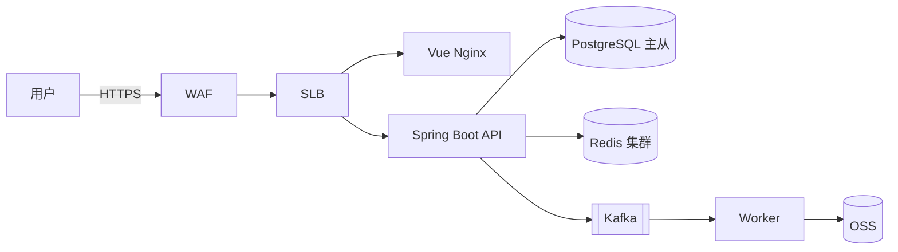

# 系统架构设计说明书规范

面向 **Vue + Java Spring Boot** 项目的系统架构设计说明书（System Architecture Design，简称 SAD/ADD）规范。整合行业通用做法（C4 模型 / ADR / AWS Well-Architected）+ 大厂工程实践。

## 0. 用户速查

| 你想 | 入口 |
|---|---|
| 从零写架构说明书 | 场景一：新建 |
| 画架构图 | 场景二：C4 + 部署图 |
| 记录技术选型 / 决策 | 场景三：ADR |
| 设计高可用 / 灾备 | 场景四：HA / DR |
| 做容量规划 | 场景五：性能预算 |
| 修改 / 变更架构文档 | 场景六：变更管理 |
| 校验架构文档合规 | 场景七：P0 必查 7 项 |
| 评审架构文档 | 场景八：评审流程 |
| 退出本规范 | 「退出 mc-doc-arch」 |

## 1. 元信息

| 项 | 说明 |
|---|---|
| **适用** | Vue + Java Spring Boot 前后端分离项目的系统架构设计文档 |
| **不适用** | 产品需求（→ mc-doc-prd）、DB 详细设计（→ mc-doc-dbd）、API 详细契约（→ mc-doc-api）、单接口/单模块技术方案 |
| 推荐工具 | draw.io / Excalidraw（架构图）；Mermaid / PlantUML（代码化）；飞书 / Confluence（在线协作）；ADR 单独成文件归档 |
| 核心原则 | **视图分层（C4）+ 决策可追溯（ADR）+ 非功能可量化 + 可评审可变更** |
| 退出 | 「退出 mc-doc-arch」 |

## 2. 全局铁律

1. **首页必有基础信息表 + 修订历史**（倒序，最新在上）
2. **架构原则先于方案**：明确 3-7 条核心原则（如「无状态服务」「最终一致性」「读写分离」），后续决策必与之对齐
3. **必含 C4 上下文 + 容器图**：Level 1 + Level 2 必画；Level 3（组件）按需；Level 4（动态）放在流程章节
4. **技术选型必走 ADR**：禁「我们用了 Redis」一句话记录，必须含「上下文 + 备选 + 决策 + 后果」
5. **非功能性需求可量化**：性能 / 可用性 / 容量 / 安全 指标必须带数字（P99 ≤ 200ms / SLA 99.9% / QPS 5000）
6. **依赖必标注方向与协议**：图上每条线必标「同步 HTTP / 异步 MQ / gRPC / 定时拉取」
7. **高可用必含双活或主备方案**：核心链路禁单点；RTO / RPO 明确
8. **必含部署架构图**：网络拓扑 + 安全域 + 流量入口 + 数据流向
9. **变更必走架构评审**：禁口头决策；决策记录入 ADR + 修订历史
10. **必含风险与权衡章节**：列出已知技术债、临时方案、待演进点

## 3. 场景判定

```
当前任务？
├── 从零写架构说明书               → 场景一：新建
├── 画架构图（C4 / 部署）          → 场景二：图表
├── 记录技术选型 / 关键决策        → 场景三：ADR
├── 设计高可用 / 灾备             → 场景四：HA / DR
├── 做容量规划 / 性能预算          → 场景五：容量
├── 修改 / 变更架构文档            → 场景六：变更管理
├── 校验架构文档合规              → 场景七：P0 必查
└── 评审架构文档                  → 场景八：评审
```

### 场景一：新建 SAD

**8 大章节**：① 基础信息 + 修订历史 → ② 上下文与目标（业务背景 / 干系人 / 范围 / 质量目标）→ ③ 架构原则与约束 → ④ 总体架构（C4 L1/L2）→ ⑤ 关键模块详述 → ⑥ 部署与运维架构 → ⑦ 非功能性保障（HA / DR / 容量 / 安全 / 可观测）→ ⑧ 风险、权衡与演进路径。

**基础信息表**：项目名 / 代号 / 状态 / 创建日期 / 架构师 / Tech Lead / 前后端 Lead / SRE / 安全。

**文档状态机**：`草稿 → 评审中 → 已定稿 → 变更中 → 已定稿`。

**详细目录与模板**：见 `./系统架构设计说明书编写规范 v1.0.md` §1、§8.1。

### 场景二：C4 + 部署图

**C4 四层**：

| 层级 | 关注 | 必含元素 | 适用场景 |
|---|---|---|---|
| L1 Context | 系统 + 外部角色 + 外部系统 | 用户角色 / 三方系统 / 主系统（黑盒） | 全员对齐，必画 |
| L2 Container | 系统内主要进程/服务/数据存储 | 前端 / 后端 / DB / 缓存 / MQ / OSS | 架构对齐，必画 |
| L3 Component | 单个 Container 内的模块 | Controller / Service / 领域模块 | 复杂服务，按需 |
| L4 Code | 类 / 接口级 | UML 类图 | 极少用，IDE 生成 |

**画图原则**：节点带技术栈标签（如「Spring Boot 3 / JDK 21」）；连线带协议 + 同步/异步标注；颜色 ≤ 4 种（业务/基础设施/外部/异常）；每图必带图例。

**部署图**：VPC / 子网 / 安全组 / SLB / ECS / K8s Namespace / Pod / DB 主从 / Redis 集群 / OSS。标注公网入口、内部调用、跨可用区。

**Mermaid 速查**：



**详细模板 + 完整 Mermaid 示例**：见主规范 §3.4。

### 场景三：ADR（架构决策记录）

**ADR 模板**（每个决策一份独立文件，归档至 `docs/adr/NNNN-title.md`）：

```markdown
# ADR-0007: 用 Redis 缓存用户会话

## 状态
accepted（2026-06-20）/ superseded by ADR-0012 / deprecated

## 上下文
当前 Session 存数据库，QPS 5000 时 DB CPU 90%+...

## 备选方案
- A. Redis Cluster（内存 / 集群分片 / TTL 原生）
- B. DB 加索引 + 内存池（不引新组件 / 性能提升有限）
- C. 本地 Caffeine（无网络开销 / 多实例不一致）

## 决策
选 A。理由：性能 + 多实例一致 + 已有运维能力。

## 后果
正面：DB CPU 降至 30%；负面：新增可用性依赖、缓存击穿需布隆过滤、双写一致需处理。
```

**ADR 编号**：连续递增，禁复用；被取代标记 `superseded by ADR-NNNN`，不删除原文。

**详细规则 + ADR 模板**：见主规范 §3.6、§8.2。

### 场景四：高可用 / 灾备

**核心指标**：

| 指标 | 含义 | 典型值 |
|---|---|---|
| SLA | 服务等级协议（对外承诺） | 99.9% / 99.95% |
| RTO | 恢复时间目标（业务可承受中断时长） | 核心 ≤ 5min / 边缘 ≤ 30min |
| RPO | 数据丢失目标（可承受丢失时间窗） | 交易 ≤ 0（强一致）/ 日志 ≤ 1min |

**架构要素**：无状态服务（多实例 + 健康检查）/ DB 主从切换（Patroni / RDS HA）/ 缓存集群分片 / MQ 多副本 / 跨 AZ 部署 / 同城双活或异地灾备。

**降级方案**：核心保交易，非核心降级（推荐/评论/统计）；熔断（Sentinel / Resilience4j）/ 限流（网关）/ 兜底数据（缓存快照）。

**详细规则**：见主规范 §4.1、§4.2。

### 场景五：容量规划

**量化模型**：

```
日活 DAU × 人均 QPS = 峰值 QPS（× 系数 3-5）
峰值 QPS × 单机 QPS 上限 = 所需实例数（+ 30% 余量）
DB：单表行数 / 索引大小 / 慢 SQL 比例
缓存：命中率目标 ≥ 95%、内存占用、淘汰策略
MQ：TPS、积压阈值、消费并行度
```

**容量表模板**：

| 资源 | 当前峰值 | 半年预测 | 一年预测 | 扩容阈值 | 扩容方式 |
|---|---|---|---|---|---|
| API 实例 | 4 × 8C16G | 6 | 10 | CPU 70% | HPA |
| PG 主库 | 2TB / QPS 3000 | 3TB | 5TB | 80% / 慢 SQL > 1% | 读分离 → 分库 |
| Redis | 64G / 20 万 QPS | 96G | 128G | 内存 70% | 扩分片 |

**性能预算**（端到端）：FCP ≤ 1.5s / API P99 ≤ 200ms / DB P99 ≤ 10ms / 缓存 P99 ≤ 2ms。

**详细规则**：见主规范 §4.3。

### 场景六：变更管理

**流程**：`提出变更 → 影响评估（架构师 / SRE / 安全）→ 判定优先级 → 撰写 / 更新 ADR → 更新修订历史 → 架构评审会 → 通知干系人`。

**修订类型**：新建 / 变更 / 补充 / 废弃（ADR 标 superseded）。

**严禁**：口头决策跳过 ADR / 删除修订历史 / 删除被取代的 ADR 文件。

**详细规则**：见主规范 §6.1。

### 场景七：校验（P0 必查 7 项）

| # | 检查项 |
|---|---|
| 1 | 首页有完整基础信息表 + 修订历史 |
| 2 | 架构原则章节存在且 3-7 条 |
| 3 | C4 L1 上下文图 + L2 容器图齐全 |
| 4 | 关键决策有对应 ADR 文件 |
| 5 | 非功能指标带数字（SLA / RTO / RPO / P99） |
| 6 | 部署架构图存在，标注可用区 + 安全域 |
| 7 | 风险与权衡章节存在 |

**P1**：依赖图无环 / 单点风险标注 / 容量半年预测 / 灰度回滚方案 / 监控告警覆盖核心 SLI / 安全合规项 / 降级预案 / 数据流向标注。

**P2**：可观测性（链路 / 指标 / 日志）/ 多 AZ / 多 Region / 蓝绿或灰度发布 / 备份恢复 / 演练记录。

**P3**：图例完整 / 命名规范 / 引用文档有效 / 图表清晰。

**完整 P0~P3 checklist**：见主规范 §7。

### 场景八：评审流程

**3 轮评审**：

1. **架构内审**（架构师 + Tech Lead）：原则对齐 / 决策合理性 / 模型完整性
2. **跨团队评审**（前后端 Lead + SRE + 安全 + DBA）：可行性 / 工作量 / 运维风险 / 合规
3. **决策评审**（架构委员会 / 技术委员会）：跨项目影响 / 长期演进 / 标准化

**评审前必交**：完整 SAD + C4 图 + ADR 列表 + 容量测算 + HA/DR 预案。

**评审后必出**：评审纪要 + 待办项（负责人 + 截止日期）+ 修订历史更新（V1.0.X）+ 文档状态 → `已定稿`。

**禁**：边评审边改 SAD / 评审完不更新版本号 / 跨项目大决策不走决策评审。

**详细规则**：见主规范 §6.3。

## 4. 关键文件索引

| 文档 | 用途 | 活跃版本 |
|---|---|---|
| `./系统架构设计说明书编写规范 v1.0.md` | 详细规则 + 完整模板 + 校验 checklist | v1.0 |
| `../mc-doc-prd/SKILL.md` | 产品需求文档规范 | v1.0 |
| `../mc-doc-dbd/SKILL.md` | 数据库设计说明书规范 | v1.0 |
| `../mc-doc-api/SKILL.md` | 接口设计文档规范 | v1.0 |
| `../mc-java-spec/SKILL.md` | Java 后端实现规范 | v1.3 |
| `../mc-api-spec/SKILL.md` | API 工程规则 | v1.7 |
| `../mc-perf/SKILL.md` | 性能规范（SLA / 慢查询） | - |
| `../mc-monitor/SKILL.md` | 监控规范（链路 / trace_id） | - |
| `../mc-cache/SKILL.md` | 缓存规范 | - |
| `../mc-java-security/SKILL.md` | 安全规范 | - |

## 5. 与其他 SKILL 协作

| 涉及 | 同时参考 |
|---|---|
| 产品需求来源 | mc-doc-prd |
| DB 详细设计 / 物理模型 | mc-doc-dbd + mc-database-spec |
| API 契约 / 接口设计文档 | mc-doc-api + mc-api-spec |
| 性能 SLA / 慢查询 | mc-perf |
| 监控 / 链路 / 告警 | mc-monitor |
| 缓存设计 | mc-cache |
| 安全 / 权限 / 合规 | mc-java-security + mc-web-security |
| 高可用 / 容灾代码实现 | mc-java-spec + mc-cache |

**SAD 与其他文档的边界**：

| SAD 章节 | 关联工程规范 |
|---|---|
| §4 总体架构 | mc-java-spec（分层）/ mc-webui-spec（前端架构） |
| §5 关键模块 | mc-doc-dbd（数据模型）/ mc-doc-api（接口契约） |
| §7 性能与容量 | mc-perf SLA + mc-monitor 指标体系 |
| §7 安全 | mc-java-security + mc-web-security |

> **关键**：SAD 描述「**系统如何构建与为何如此构建**」，工程规范描述「**代码怎么写**」，PRD 描述「**做什么**」。三者互补不重叠。
