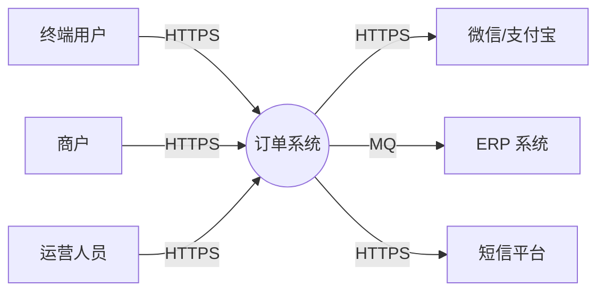
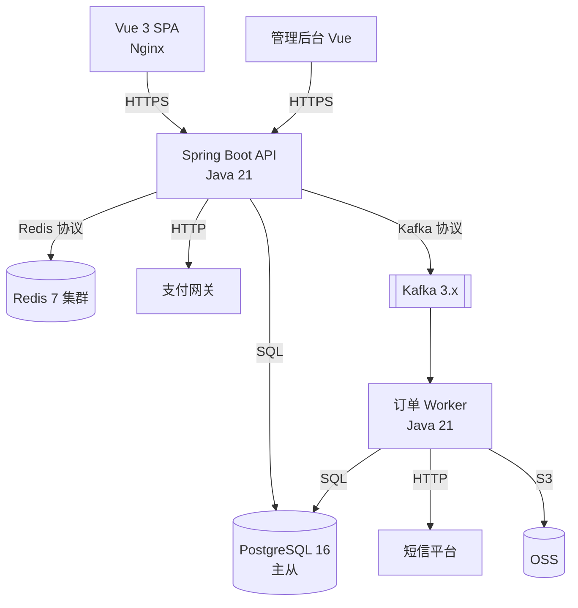
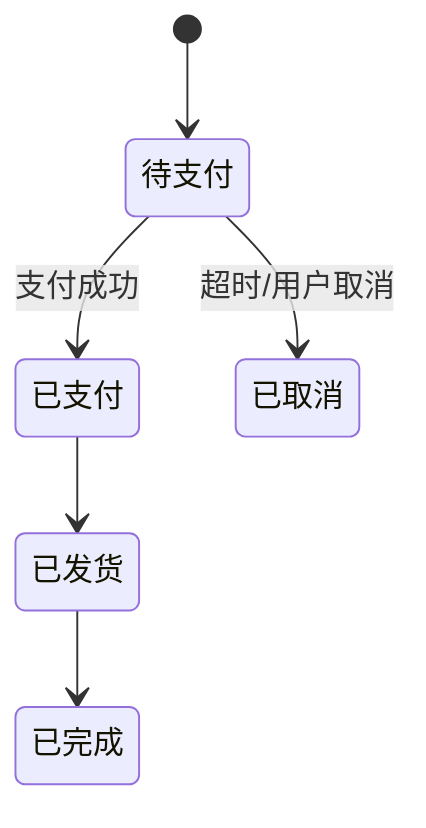
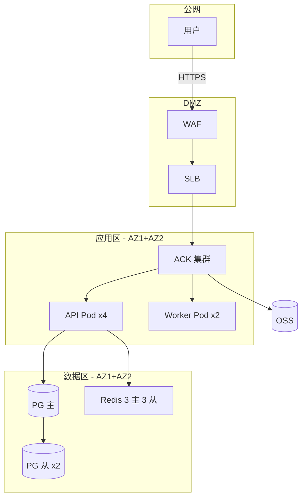

# 系统架构设计说明书编写规范 v1.0

> 版本：v1.0
> 修订日期：2026-06-24
> 配套：`./SKILL.md`（精简入口）；本文件为详细规则与完整模板
> 适用：Vue + Java Spring Boot 前后端分离项目
> 参考：C4 模型 + ADR（架构决策记录）+ AWS Well-Architected + 字节 / 阿里 / 腾讯大厂做法

---

## 1. 文档基本信息与版本控制

### 1.1 基础信息表（首页必填）

```markdown
| 项 | 值 |
|---|---|
| 项目名称 | [项目官方名称] |
| 项目代号 | [如 Apollo-V1.2] |
| 文档状态 | 草稿 / 评审中 / 已定稿 / 变更中 |
| 创建日期 | YYYY-MM-DD |
| 架构师 | [姓名 / 联系方式] |
| 技术负责人（Tech Lead） | [姓名 / 联系方式] |
| 前端负责人（Vue） | [姓名 / 联系方式] |
| 后端负责人（Java） | [姓名 / 联系方式] |
| SRE / 运维负责人 | [姓名 / 联系方式] |
| 安全负责人 | [姓名 / 联系方式] |
```

### 1.2 修订历史（倒序）

```markdown
| 版本号 | 修订日期 | 修订类型 | 修订内容摘要 | 修订人 | 审核 / 批准人 |
|---|---|---|---|---|---|
| V1.0.3 | 2026-06-25 | 变更 | 引入 Kafka 替代原有 RabbitMQ（ADR-0012） | 张三 | 架构委员会 |
| V1.0.2 | 2026-06-20 | 补充 | 补充 RPO 指标与备份策略 | 张三 | SRE 负责人 |
| V1.0.1 | 2026-06-18 | 变更 | 容器图补充 Sentinel 熔断节点 | 李四 | Tech Lead |
| V1.0.0 | 2026-06-15 | 新建 | 初始化发布 V1.0 架构方案 | 张三 | 架构委员会 |
```

**修订类型枚举**：`新建` / `变更` / `补充` / `删除` / `废弃`。

### 1.3 版本号规范（语义化）

```
V<major>.<minor>.<patch>

major：架构大改（如单体 → 微服务、DB 换型）必须架构委员会通过
minor：新增模块 / 新增三方依赖 / 局部重构
patch：图例修正 / 文字补充 / 不改架构
```

### 1.4 文档状态机

```
草稿 → 评审中 → 已定稿 → 变更中 → 已定稿 → ...
                  ↓
                已废弃
```

---

## 2. 上下文与目标

### 2.1 业务背景与范围

**3 段式模板**：

```markdown
## 业务背景

### 业务定位
[本系统在业务大盘中的位置，对应 PRD 中的产品定位]

### 当前问题
[现有架构瓶颈 / 痛点，必须数据支撑]
示例：当前单体应用 QPS 峰值 800，DB CPU 长期 85%+，
     P99 接口延迟从 200ms 退化到 1.2s。

### 本次范围
- 包含：[本次架构覆盖的业务域 / 模块]
- 不包含：[明确划界，避免范围蔓延]
- 依赖前置：[需要先完成的基建 / 数据迁移 / 三方接入]
```

**大厂做法**：背景必须回链 PRD；痛点必须带数字；范围必须含「不做什么」。

### 2.2 干系人与关注点

| 干系人 | 角色 | 关注点 | 沟通方式 |
|---|---|---|---|
| 业务方 | PM / 业务 Leader | 上线时间 / 业务连续性 | 双周对齐 |
| 研发 | 前后端 / DBA | 工作量 / 复杂度 / 工具链 | 评审会 |
| 运维 / SRE | 部署 / 监控 | 部署难度 / 可观测性 / 故障恢复 | 评审 + Runbook |
| 安全 | 合规 | 数据保护 / 鉴权 / 审计 | 安全评审 |
| 财务 | 成本 | 资源成本 / 增长曲线 | 季度对齐 |

### 2.3 质量目标（非功能）

| 维度 | 指标 | 目标值 |
|---|---|---|
| 性能 | API P99 | ≤ 200ms（核心）/ 500ms（主流程） |
| 可用性 | SLA | 99.9%（核心交易）/ 99.5%（边缘） |
| 一致性 | 强 / 最终 | 交易强一致；统计最终一致（≤ 1min） |
| 可扩展 | 横向扩展 | API 无状态，DB 读写分离 + 分库预留 |
| 安全 | 合规 | 等保 2.0 三级 / GDPR |
| 可维护 | 部署 | 蓝绿 / 灰度，回滚 ≤ 5min |

---

## 3. 架构原则与约束

### 3.1 核心原则（3-7 条）

**示例**：

1. **服务无状态**：所有业务服务不存会话；Session / 文件走外部存储
2. **读写分离**：核心读走从库 / 缓存；写走主库
3. **最终一致优先**：跨域交互默认异步消息；强一致仅在交易主链
4. **按领域聚合**：以业务领域划分模块；禁按技术分层切包
5. **配置外置**：环境差异走配置中心；禁硬编码
6. **故障可恢复**：所有外部依赖可降级 / 熔断；禁强依赖三方

### 3.2 约束

| 类型 | 约束 |
|---|---|
| 技术栈 | Java 21 / Spring Boot 3 / Vue 3 / PostgreSQL 16 |
| 部署 | K8s / 阿里云 ACK / 跨可用区 |
| 合规 | 等保三级 / 个人信息保护法 |
| 历史 | 兼容 v1 老接口至 2026-12-31 |
| 团队 | 后端 8 人 / 前端 4 人 / 预算上限 X 万 / 月 |

---

## 4. 总体架构（C4 模型）

### 4.1 C4 L1 - 系统上下文图

**目的**：30 秒内让非技术干系人看懂「系统服务谁 / 与谁交互」。



**画图要点**：① 系统 1 个（黑盒）② 外部角色用「人形」③ 外部系统用「方块 + 技术标签」④ 连线标协议 + 方向。

### 4.2 C4 L2 - 容器图

**目的**：拆分系统内部主要进程 / 数据存储，技术对齐。



**必标**：① 技术栈（Spring Boot 3 / JDK 21）② 协议（HTTPS / SQL / Kafka 协议）③ 调用方向 ④ 数据流向。

### 4.3 C4 L3 - 组件图（按需）

**适用**：核心服务的内部模块拆分（如订单服务拆「下单 / 履约 / 退款」三大模块）。简单服务可省略。

### 4.4 关键架构决策（ADR 索引）

| ADR 编号 | 标题 | 状态 | 日期 |
|---|---|---|---|
| ADR-0001 | 采用 Spring Boot 3 单体多模块（非微服务） | accepted | 2026-06-15 |
| ADR-0002 | DB 选 PostgreSQL（禁 MySQL） | accepted | 2026-06-15 |
| ADR-0007 | 会话缓存选 Redis Cluster | accepted | 2026-06-20 |
| ADR-0012 | 消息中间件 Kafka 替代 RabbitMQ | accepted | 2026-06-25 |

**ADR 详细模板**：见 §3.6（注意：本章节是 SAD 内的索引，详细 ADR 单独成文件）。

---

## 5. 关键模块详述

按业务域或子系统拆分，每个模块包含：

```markdown
### 模块：订单服务

#### 1. 职责边界
- 包含：订单创建 / 查询 / 状态流转 / 退款
- 不包含：支付（→ 支付网关）/ 库存扣减（→ 库存服务）

#### 2. 关键接口契约
- 详见 mc-doc-api：GET /v1/orders、POST /v1/orders 等
- 完整契约：https://apifox.com/project/xxx

#### 3. 数据模型
- 主表：trade_order（详见 mc-doc-dbd §3.1）
- 关联：trade_order_item、payment_record

#### 4. 状态机


#### 5. 关键依赖
- 同步：支付网关（300ms 超时 + 熔断）/ 库存服务（200ms 超时）
- 异步：发消息到 Kafka `order.created` topic

#### 6. 性能与容量
- 单实例 QPS：500 / CPU 60% / 内存 4G
- 当前 4 实例，半年扩至 6
```

---

## 6. 部署与运维架构

### 6.1 部署架构图

**必含**：网络拓扑 / 安全域 / 流量入口 / 数据流向 / 可用区。



### 6.2 环境矩阵

| 环境 | 用途 | 资源规格 | 数据来源 |
|---|---|---|---|
| dev | 开发联调 | 最小化 | Mock + 脱敏数据 |
| test | QA 测试 | 1/4 生产 | 脱敏快照 |
| staging | 预发布 | 同生产 | 生产快照 + Mock |
| prod | 生产 | 见容量表 | 真实数据 |

### 6.3 发布与回滚

| 类型 | 策略 | 回滚时间 |
|---|---|---|
| 前端 | 蓝绿 / CDN 切换 | ≤ 2min |
| 后端 API | 滚动 + 健康检查 | ≤ 5min |
| DB DDL | 在线 DDL + 双写 + 灰度 | 见 mc-database-spec |
| 配置 | 配置中心热更 | ≤ 30s |

### 6.4 可观测性

| 维度 | 工具 | 关键指标 |
|---|---|---|
| 日志 | ELK / Loki | trace_id / 错误率 |
| 指标 | Prometheus + Grafana | QPS / P99 / 错误率 / 资源 |
| 链路 | SkyWalking / Jaeger | 跨服务调用链 |
| 告警 | AlertManager | 详见 mc-monitor |

---

## 7. 非功能性保障

### 7.1 高可用（HA）

| 资源 | HA 方案 | RTO |
|---|---|---|
| API | 多实例 + 健康检查 + 自动重启 | ≤ 30s |
| DB | 主从 + Patroni 自动切换 | ≤ 1min |
| Redis | 集群分片 + 哨兵 | ≤ 30s |
| MQ | 多副本（RF=3） | ≤ 30s |
| SLB | 双活 | ≤ 10s |

### 7.2 灾备（DR）

| 维度 | 方案 | 目标 |
|---|---|---|
| 备份 | DB 全量日备 + WAL 增量 / OSS 跨区 | RPO ≤ 5min |
| 同城双活 | 跨 AZ 部署 | RTO ≤ 5min |
| 异地灾备 | 异步复制到备用 Region（核心数据） | RTO ≤ 30min |
| 演练 | 季度切换演练 + 记录报告 | - |

### 7.3 性能与容量

| 资源 | 当前峰值 | 半年预测 | 扩容阈值 | 扩容方式 |
|---|---|---|---|---|
| API 实例 | 4 × 8C16G，QPS 2000 | QPS 3500 | CPU 70% | HPA 自动扩 |
| PG 主 | 2TB / QPS 3000 | 3.5TB | CPU 70% / 慢 SQL > 1% | 读分离 → 分库 |
| Redis | 64G / 20 万 QPS | 96G | 内存 70% | 扩分片 |
| Kafka | TPS 5000 | 8000 | 积压 > 1万 | 扩分区 |

### 7.4 安全

| 维度 | 措施 | 参考 |
|---|---|---|
| 鉴权 | JWT + Refresh + RBAC | mc-java-security |
| 传输 | HTTPS / TLS 1.3 / 内网 mTLS | - |
| 脱敏 | 后端输出脱敏（138****8888） | mc-java-security §8 |
| 审计 | 敏感操作日志 + 不可篡改 | mc-monitor |
| 防 DDoS | WAF + 高防 IP | - |

---

## 8. 风险、权衡与演进路径

### 8.1 已知风险与权衡

| 风险 / 权衡 | 影响 | 缓解 / 接受决策 | ADR |
|---|---|---|---|
| Redis 集群抖动导致缓存击穿 | API 短时延迟上升 | 布隆过滤 + 单飞 + 兜底 | ADR-0007 |
| 最终一致统计有 1min 延迟 | 财务对账需注意 | 接受，业务通知 | - |
| 暂未拆库存服务（单体内） | 单库压力大 | 6 个月内拆出 | 列入路线图 |

### 8.2 演进路径

| 阶段 | 目标 | 关键动作 | 预计时间 |
|---|---|---|---|
| V1.0 | 单体多模块上线 | 见本文档 | 2026-07 |
| V1.5 | 读写分离 + 缓存优化 | 加从库 + Redis 集群 | 2026-10 |
| V2.0 | 拆分订单 / 库存 / 支付服务 | DDD 重构 + 服务化 | 2027-Q1 |

---

## 9. 校验 Checklist（P0~P3）

### 9.1 P0 必查 7 项

| # | 检查项 | 检查方式 |
|---|---|---|
| 1 | 首页有完整基础信息表 + 修订历史 | 文档开头检查 |
| 2 | 架构原则章节存在且 3-7 条 | §3.1 |
| 3 | C4 L1 上下文图 + L2 容器图齐全 | §4.1、§4.2 |
| 4 | 关键决策有对应 ADR 文件 | docs/adr/ 校验 |
| 5 | 非功能指标带数字（SLA / RTO / RPO / P99） | §7 |
| 6 | 部署架构图存在，标注可用区 + 安全域 | §6.1 |
| 7 | 风险与权衡章节存在 | §8.1 |

### 9.2 P1 高优检查

| # | 检查项 |
|---|---|
| 8 | 依赖图无环 / 无循环依赖 |
| 9 | 单点风险逐项标注 |
| 10 | 容量半年预测存在 |
| 11 | 灰度 / 回滚方案明确 |
| 12 | 监控告警覆盖核心 SLI |
| 13 | 安全合规项明确（等保 / GDPR / 个保） |
| 14 | 降级预案完整 |
| 15 | 数据流向标注（含跨域） |

### 9.3 P2 中优检查

| # | 检查项 |
|---|---|
| 16 | 可观测性三件套（日志 / 指标 / 链路）齐全 |
| 17 | 多 AZ / 多 Region 部署说明 |
| 18 | 蓝绿 / 灰度发布机制 |
| 19 | 备份与恢复演练记录 |
| 20 | 容量预测超过一年 |

### 9.4 P3 低优检查

| # | 检查项 |
|---|---|
| 21 | 图例完整（颜色 / 形状含义） |
| 22 | 命名规范（模块代号 / 资源命名） |
| 23 | 引用文档有效（链接可访问） |
| 24 | 图表清晰（分辨率 / 标注） |
| 25 | 错别字 / 语病 |

---

## 10. 模板速查

### 10.1 完整 SAD 目录

```markdown
# [项目名称] 系统架构设计说明书 V[major.minor.patch]

## 1. 基础信息
   1.1 项目信息表
   1.2 修订历史

## 2. 上下文与目标
   2.1 业务背景（定位 / 问题 / 范围）
   2.2 干系人与关注点
   2.3 质量目标（非功能）

## 3. 架构原则与约束
   3.1 核心原则（3-7 条）
   3.2 技术与业务约束

## 4. 总体架构（C4）
   4.1 L1 系统上下文图
   4.2 L2 容器图
   4.3 L3 组件图（按需）
   4.4 ADR 索引

## 5. 关键模块详述
   5.1 模块 A：职责 / 接口 / 数据 / 状态机 / 依赖 / 性能
   5.2 模块 B：...

## 6. 部署与运维架构
   6.1 部署架构图
   6.2 环境矩阵
   6.3 发布与回滚
   6.4 可观测性

## 7. 非功能性保障
   7.1 高可用
   7.2 灾备
   7.3 性能与容量
   7.4 安全

## 8. 风险、权衡与演进路径
   8.1 已知风险 / 技术债
   8.2 演进路线图

## 9. 附录
   9.1 ADR 全文
   9.2 术语表
   9.3 引用文档（PRD / DB / API 规范）
```

### 10.2 ADR 模板（单独文件）

```markdown
# ADR-NNNN: [决策标题]

## 状态
proposed / accepted / deprecated / superseded by ADR-MMMM

## 日期
YYYY-MM-DD

## 上下文
[问题背景 / 决策触发点 / 必须带数据]

## 备选方案
- 方案 A：[描述 + 优劣]
- 方案 B：[描述 + 优劣]
- 方案 C：[描述 + 优劣]

## 决策
[选哪个 + 一句话核心理由]

## 后果
- 正面：[带来什么改善]
- 负面：[新增什么成本 / 风险]
- 后续需做：[配套工作 / 演进]

## 相关
- 关联 ADR：ADR-XXXX
- 关联文档：[SAD 章节 / PRD / DB 规范]
```

### 10.3 单模块详述模板

```markdown
### 模块：[名称]

#### 1. 职责边界
- 包含：[X / Y]
- 不包含：[Z → 其他模块]

#### 2. 接口契约
- 详见 mc-doc-api
- Apifox：[链接]

#### 3. 数据模型
- 主表：[表名]
- 详见 mc-doc-dbd §X

#### 4. 状态机
[Mermaid stateDiagram-v2]

#### 5. 关键依赖
- 同步：[X 服务（超时 / 熔断策略）]
- 异步：[Topic / Group]

#### 6. 性能与容量
- 单实例：QPS / CPU / 内存
- 集群：当前 N 实例 / 半年 N+X
```

---

## 附录 A：大厂做法对照

| 维度 | 字节 | 阿里 | 腾讯 | 美团 | 本规范 |
|---|---|---|---|---|---|
| 架构图法 | C4 + 自研 | C4 + 阿里架构师指南 | 4+1 视图 | C4 | C4 + ADR |
| 决策记录 | ADR + Wiki | ADR + 技术委员会 | 邮件 + Wiki | ADR | ADR 文件归档 |
| 容量规划 | 强（季度评审） | 强（容量大脑） | 中 | 中 | 半年 / 一年预测 |
| HA / DR | 双活 + 异地灾备 | 五库一体 / 同城双活 | 三地多中心 | 同城双活 | 按 SLA 分级 |
| 评审 | 4 轮（含 TOC） | 3 轮（含技术委员会） | 4 轮 | 3 轮 | 3 轮（含架构委员会） |

## 附录 B：术语表

| 术语 | 含义 |
|---|---|
| SAD / ADD | System / Architecture Design Document 系统架构设计说明书 |
| C4 | Context / Container / Component / Code 四层架构图法 |
| ADR | Architecture Decision Record 架构决策记录 |
| SLA | Service Level Agreement 服务等级协议（对外承诺） |
| SLO | Service Level Objective 服务等级目标（内部目标） |
| SLI | Service Level Indicator 服务等级指标（度量值） |
| RTO | Recovery Time Objective 恢复时间目标 |
| RPO | Recovery Point Objective 数据丢失目标 |
| HA | High Availability 高可用 |
| DR | Disaster Recovery 灾难恢复 |
| AZ | Availability Zone 可用区 |
| ToS | Terms of Service 服务条款 |
| HPA | Horizontal Pod Autoscaler 水平扩缩容 |
