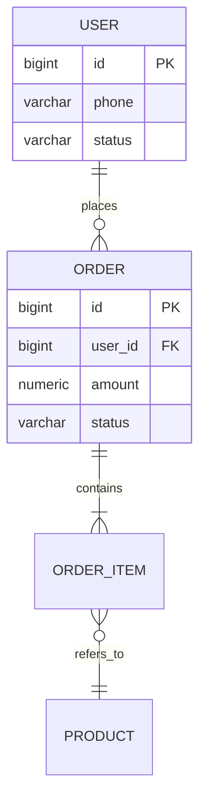

# 数据库设计说明书规范

面向 **PostgreSQL** 项目的数据库设计说明书（Database Design Document，简称 DBD）规范。整合数据库建模（概念 / 逻辑 / 物理）+ 大厂工程实践。

## 0. 用户速查

| 你想 | 入口 |
|---|---|
| 从零写 DBD | 场景一：新建 |
| 画 ER 图 / 关系图 | 场景二：概念与逻辑模型 |
| 写表清单 / 字段说明 | 场景三：物理设计 |
| 设计索引 | 场景四：索引方案 |
| 分区 / 分库分表 | 场景五：分区与分片 |
| 数据迁移与版本管理 | 场景六：迁移与变更 |
| 估容量 / 性能预算 | 场景七：容量与性能 |
| 校验 DBD 合规 | 场景八：P0 必查 8 项 |
| 评审 DBD | 场景九：评审流程 |
| 退出本规范 | 「退出 mc-doc-dbd」 |

## 1. 元信息

| 项 | 说明 |
|---|---|
| **适用** | PostgreSQL 项目的数据库设计文档（概念 / 逻辑 / 物理三层） |
| **不适用** | 产品需求（→ mc-doc-prd）、系统总体架构（→ mc-doc-arch）、API 契约（→ mc-doc-api）、SQL 工程编码规范（→ mc-database-spec） |
| 推荐工具 | dbdiagram.io / DBeaver / Navicat（ER 图）；Flyway / Liquibase（版本管理）；飞书 / Confluence（文档协作） |
| 核心原则 | **三层建模 + 命名一致 + 索引可量化 + 变更可追溯 + 与工程规范互补** |
| 退出 | 「退出 mc-doc-dbd」 |

## 2. 全局铁律

1. **首页必有基础信息表 + 修订历史**（倒序，最新在上）
2. **三层模型齐全**：概念（ERD）→ 逻辑（表清单 + 关系）→ 物理（DDL + 类型 + 索引）
3. **表清单覆盖全表**：每张表必含「表名 / 用途 / 类型 / 估算行数 / 主键 / 关键索引」
4. **关键字段必带业务含义**：禁只列字段名，必须含「字段名 + 类型 + 必填 + 默认值 + 业务说明 + 字典」
5. **金额用 numeric(M,D)**、状态用 varchar 大写英文值、JSONB 带 GIN 索引、标签用 int[] + intarray（对齐 mc-database-spec）
6. **索引方案必含「字段 + 类型 + 命中场景 + 估算选择性」**：禁「我们建了几个索引」一句话
7. **大表必含分区或分库方案**：单表预估 > 1000 万行必须有水平拆分策略
8. **DDL 与代码一致**：DBD 中的 DDL 必须和 Flyway / Liquibase 迁移脚本一一对应
9. **变更必走 DBA 评审**：禁口头加字段；DDL 必须有迁移脚本 + 回滚脚本
10. **数据安全与合规**：敏感字段标注「加密 / 脱敏」；保留期与合规要求明确

## 3. 场景判定

```
当前任务？
├── 从零写 DBD                    → 场景一：新建
├── 画 ER 图                      → 场景二：概念与逻辑模型
├── 写表清单 / 字段说明            → 场景三：物理设计
├── 设计索引                      → 场景四：索引方案
├── 分区 / 分库分表                → 场景五：分区与分片
├── 数据迁移 / 版本管理            → 场景六：迁移与变更
├── 估容量 / 性能预算              → 场景七：容量与性能
├── 校验 DBD 合规                 → 场景八：P0 必查
└── 评审 DBD                      → 场景九：评审
```

### 场景一：新建 DBD

**8 大章节**：① 基础信息 + 修订历史 → ② 设计目标与约束 → ③ 概念模型（ERD）→ ④ 逻辑设计（表清单 + 关系）→ ⑤ 物理设计（DDL + 字段 + 索引）→ ⑥ 分区 / 分库分表方案 → ⑦ 数据安全 / 容量 / 性能 → ⑧ 数据迁移与变更管理。

**基础信息表**：项目名 / 代号 / 状态 / 创建日期 / 架构师 / 后端 Lead / DBA / 数据负责人。

**文档状态机**：`草稿 → 评审中 → 已定稿 → 变更中 → 已定稿`。

**详细目录与模板**：见 `./数据库设计说明书编写规范 v1.0.md` §1、§9.1。

### 场景二：概念与逻辑模型

**概念模型（ERD）**：实体 + 关系 + 基数。**画图原则**：实体名业务化（用户 / 订单 / 商品）；关系标基数（1:1 / 1:N / N:M）；N:M 必须显式画出关系表；子类继承用「ISA」或拆父子表。



**逻辑模型**：表清单 + 关系列表（外键关系在文档中描述，禁 DDL 真建外键，对齐 mc-database-spec 铁律 4）。

**详细规则 + Mermaid 示例**：见主规范 §3。

### 场景三：物理设计（表清单 + 字段说明）

**表清单**：

| # | 表名 | 类型 | 用途 | 估算行数 | 主键 | 关键索引 |
|---|---|---|---|---|---|---|
| 1 | `ump_user` | 实体表 | 用户主表 | 50 万 | id | uk_phone / idx_status_created |
| 2 | `trade_order` | 事务表 | 订单主表 | 1000 万 / 年 | id | idx_user_status / idx_created_at（分区） |
| 3 | `ump_user_role_rel` | 关系表 | 用户-角色映射 | 100 万 | id | uk_user_role |

**单表字段说明模板**：

| 字段名 | 类型 | 必填 | 默认值 | 业务说明 | 字典 / 枚举 | 敏感 |
|---|---|---|---|---|---|---|
| id | bigint | 是 | 雪花 ID | 主键 | - | - |
| phone | varchar(20) | 是 | - | 手机号，唯一 | - | 脱敏 |
| status | varchar(16) | 是 | 'ACTIVE' | 用户状态 | ACTIVE / FROZEN / DELETED | - |
| password_hash | varchar(100) | 是 | - | bcrypt 加密 | - | 加密 |
| created_at | timestamptz | 是 | now() | 创建时间 | - | - |

**必备字段**（对齐 mc-database-spec 场景一）：实体 / 事务表必含 `id` + `created_at` + `updated_at` + `is_deleted`。

**详细规则 + 完整模板**：见主规范 §4。

### 场景四：索引方案

**索引清单**：

| 表 | 索引名 | 字段 | 类型 | 命中场景 | 估算选择性 |
|---|---|---|---|---|---|
| ump_user | uk_phone | phone | 唯一 B-Tree | 登录 / 注册校验 | 100% |
| trade_order | idx_user_status | (user_id, status) | 复合 B-Tree | 用户订单列表 | 高 |
| trade_order | idx_created_at | created_at | B-Tree（分区键） | 时间范围查询 | 中 |
| trade_goods | idx_tags | tag_ids | GIN + gin__int_ops | 标签筛选 | 高 |
| trade_goods | idx_attributes | attributes | GIN | JSONB 动态属性 | 高 |

**关键约束**：索引命名 `idx_` / `uk_` 前缀；逻辑删除字段配套部分唯一索引 `WHERE (is_deleted = 0)`；JSONB 必 GIN；深分页用 Keyset 而非 OFFSET。

**详细规则**：见主规范 §5。

### 场景五：分区与分片

**分区方案**（PostgreSQL 原生分区）：

| 表 | 策略 | 分区键 | 分区数 | 维护策略 |
|---|---|---|---|---|
| trade_order | RANGE 按月 | created_at | 12 / 年 + 历史归档 | pg_partman 自动 |
| trade_log | RANGE 按日 | created_at | 30 滚动 | 自动 drop 老分区 |
| user_behavior | HASH | user_id | 16 | 静态 |

**分库分表**（慎用，达到单库瓶颈再上）：分片键选择（user_id / merchant_id）；跨片查询禁 UNION ALL，走汇总表；分布式 ID 用雪花。

**详细规则**：见主规范 §6。

### 场景六：迁移与变更管理

**版本管理**：Flyway（推荐）或 Liquibase。脚本命名 `V{YYYYMMDDHHmm}__{描述}.sql`，例如 `V202606201030__create_trade_order.sql`。

**变更流程**：`提出 DDL → DBA 评估（锁 / 数据量 / 兼容）→ 编写迁移脚本 + 回滚脚本 → 灰度环境验证 → 生产低峰执行 → 更新 DBD 修订历史`。

**严禁**：直接在生产 DDL（必走迁移脚本）；删除已上线字段（必须先标 deprecated）；跳过回滚脚本。

**在线 DDL 三步法**（大表加字段）：

```
1. 建新表 + 双写
2. 数据回填 + 校验
3. 切流量 + 下线老表
```

**详细规则**：见主规范 §8。

### 场景七：容量与性能

**容量估算**：

| 表 | 单行均大小 | 日新增 | 月增量 | 年总量 | 半年磁盘 |
|---|---|---|---|---|---|
| trade_order | 1.2 KB | 3 万 | 90 万 | 1100 万 | 4 GB |
| trade_order_item | 0.8 KB | 8 万 | 240 万 | 2900 万 | 11 GB |
| trade_op_log | 0.5 KB | 20 万 | 600 万 | 7300 万 | 14 GB（分区） |

**性能预算**：

| 指标 | 目标 |
|---|---|
| 单库 QPS | 主库 ≤ 3000 / 从库 ≤ 8000 |
| 主库连接数 | ≤ 500（应用层 Druid 连接池限流） |
| 单 SQL P99 | ≤ 10ms |
| 慢 SQL 比例 | < 1%（> 100ms 算慢） |
| 大表精确 count | 禁；用 pg_class.reltuples 估算 |

**详细规则**：见主规范 §7。

### 场景八：校验（P0 必查 8 项）

| # | 检查项 |
|---|---|
| 1 | 首页有完整基础信息表 + 修订历史 |
| 2 | ER 图覆盖核心实体与关系 |
| 3 | 表清单完整（含表名 / 类型 / 行数 / 主键 / 索引） |
| 4 | 关键字段带业务说明 + 字典 |
| 5 | 索引方案完整（字段 + 类型 + 场景 + 选择性） |
| 6 | 大表（> 1000 万）有分区或分库方案 |
| 7 | DDL 与 Flyway 脚本一致 |
| 8 | 敏感字段标注加密 / 脱敏 |

**P1**：必备字段齐全（created_at / updated_at / is_deleted）/ 部分唯一索引 / JSONB GIN / 标签字典表 int4 / 状态字段大写英文值 / 金额 numeric / 外键关系文档化（禁 DDL 真建）/ 字典枚举完整。

**P2**：分区策略与运维（pg_partman）/ 分库分片键合理 / 备份恢复演练 / 数据归档策略 / 容量半年预测。

**P3**：命名规范（小写下划线 / 模块前缀）/ 表名字数 ≤ 32 / 图例完整 / 引用文档有效。

**完整 P0~P3 checklist**：见主规范 §9。

### 场景九：评审流程

**3 轮评审**：

1. **后端内审**（后端 Lead + 模块开发）：模型完整性 / 业务对齐 / 字段合理
2. **DBA 评审**（DBA + 性能组）：索引合理 / 分区方案 / 性能预算 / DDL 兼容性
3. **架构评审**（架构师 + 后端 Lead + DBA）：跨域模型一致 / 长期演进 / 与 SAD 对齐

**评审前必交**：完整 DBD + ER 图 + 表清单 + 关键 DDL + Flyway 脚本 + 容量测算。

**评审后必出**：评审纪要 + 待办项（负责人 + 截止日期）+ 修订历史更新（V1.0.X）+ 文档状态 → `已定稿`。

**禁**：边评审边改 DBD / 评审完不更新版本号 / DDL 跳过 DBA 评审。

**详细规则**：见主规范 §10。

## 4. 关键文件索引

| 文档 | 用途 | 活跃版本 |
|---|---|---|
| `./数据库设计说明书编写规范 v1.0.md` | 详细规则 + 完整模板 + 校验 checklist | v1.0 |
| `../mc-doc-prd/SKILL.md` | 产品需求文档规范 | v1.0 |
| `../mc-doc-arch/SKILL.md` | 系统架构设计说明书规范 | v1.0 |
| `../mc-doc-api/SKILL.md` | 接口设计文档规范 | v1.0 |
| `../mc-database-spec/SKILL.md` | 数据库工程规范（建表 / SQL / 标签 / EAV） | v1.1 |
| `../mc-api-spec/SKILL.md` | API 工程规则（字段命名对齐） | v1.7 |
| `../mc-java-spec/SKILL.md` | Java 实体 / Mapper 规范 | v1.3 |
| `../mc-perf/SKILL.md` | 性能规范（慢 SQL / SLA） | - |

## 5. 与其他 SKILL 协作

| 涉及 | 同时参考 |
|---|---|
| 业务需求来源 | mc-doc-prd §3.3 字段校验表 |
| 总体架构 / 部署 | mc-doc-arch §5 关键模块 |
| 接口字段对齐 | mc-doc-api + mc-api-spec |
| 建表 / SQL / 标签 / EAV 工程规则 | mc-database-spec |
| Java 实体 / MyBatis Plus 映射 | mc-java-spec |
| 慢查询 / 性能预算 | mc-perf |

**DBD 与其他文档的边界**：

| DBD 章节 | 关联工程规范 |
|---|---|
| §4 物理设计（类型 / 必备字段） | mc-database-spec 场景一 |
| §5 索引方案 | mc-database-spec 场景二（SQL 命中索引） |
| §6 分区 / 分片 | mc-database-spec + mc-perf §6 |
| §7 标签 / EAV 模型 | mc-database-spec 场景三、四 |
| §8 数据迁移 | Flyway / Liquibase + mc-database-spec |

> **关键**：DBD 描述「**数据库长什么样、为什么这么设计**」，mc-database-spec 描述「**怎么写 SQL / 怎么建表**」，mc-doc-api 描述「**字段如何暴露给前端**」。三者互补不重叠。
