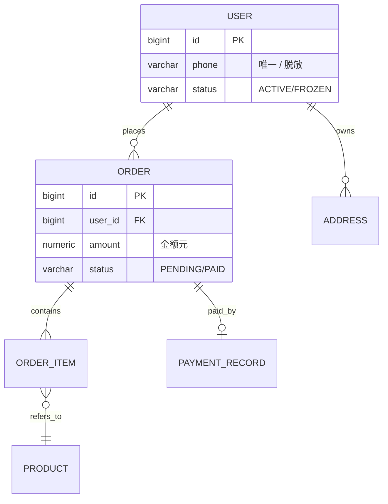

# 数据库设计说明书编写规范 v1.0

> 版本：v1.0
> 修订日期：2026-06-24
> 配套：`./SKILL.md`（精简入口）；本文件为详细规则与完整模板
> 适用：PostgreSQL 项目
> 参考：数据库建模（概念 / 逻辑 / 物理）+ 字节 / 阿里 / 腾讯大厂做法 + mc-database-spec 工程规范

---

## 1. 文档基本信息与版本控制

### 1.1 基础信息表（首页必填）

```markdown
| 项 | 值 |
|---|---|
| 项目名称 | [项目官方名称] |
| 项目代号 | [如 Apollo-V1.2] |
| 文档状态 | 草稿 / 评审中 / 已定稿 / 变更中 |
| 创建日期 | YYYY-MM-DD |
| 架构师 | [姓名 / 联系方式] |
| 后端负责人（Lead） | [姓名 / 联系方式] |
| DBA | [姓名 / 联系方式] |
| 数据负责人 | [姓名 / 联系方式] |
| 数据库版本 | PostgreSQL 16 |
| ORM | MyBatis Plus |
| 迁移工具 | Flyway / Liquibase |
```

### 1.2 修订历史（倒序）

```markdown
| 版本号 | 修订日期 | 修订类型 | 修订内容摘要 | 修订人 | 审核 / 批准人 |
|---|---|---|---|---|---|
| V1.0.3 | 2026-06-25 | 变更 | trade_order 增加 refund_amount 字段（V202606251030） | 张三 | DBA 王五 |
| V1.0.2 | 2026-06-20 | 补充 | trade_order 按月分区方案补充（pg_partman） | 张三 | DBA 王五 |
| V1.0.1 | 2026-06-18 | 变更 | ump_user 增加部分唯一索引（逻辑删除） | 李四 | 后端 Lead |
| V1.0.0 | 2026-06-15 | 新建 | 初始化发布 V1.0 数据库设计方案 | 张三 | 架构委员会 |
```

**修订类型枚举**：`新建` / `变更` / `补充` / `删除`（必含数据迁移）/ `废弃`。

### 1.3 版本号规范（语义化）

```
V<major>.<minor>.<patch>

major：模型大改（如拆库 / 换主键策略）必须架构委员会通过
minor：新增表 / 新增字段 / 新增索引（含 Flyway 迁移脚本）
patch：文档修正 / 注释补充（无 DDL 变更）
```

### 1.4 文档状态机

```
草稿 → 评审中 → 已定稿 → 变更中 → 已定稿 → ...
                  ↓
                已废弃
```

---

## 2. 设计目标与约束

### 2.1 设计目标

**3 段式模板**：

```markdown
## 设计目标

### 业务支撑
[本数据库支撑的核心业务域 / 场景]
示例：支撑订单交易主链，包含下单 / 支付 / 履约 / 退款全流程。

### 性能与容量目标
- 单库 QPS：主库 ≤ 3000 / 从库 ≤ 8000
- 单表行数：核心实体表 ≤ 500 万；事务表通过分区控制在单分区 ≤ 1000 万
- 慢 SQL 比例：< 1%

### 一致性目标
- 交易主链：强一致（ACID）
- 统计 / 报表：最终一致（≤ 1min 延迟）
```

### 2.2 设计约束

| 类型 | 约束 |
|---|---|
| 数据库 | PostgreSQL 16（禁 MySQL） |
| 字符集 / 排序 | UTF-8 / zh-CN |
| ORM | MyBatis Plus（应用层） |
| 连接池 | Druid（应用层） |
| 历史兼容 | 兼容 v1 接口字段至 2026-12-31 |
| 合规 | 等保 2.0 三级 / 个人信息保护法（敏感字段加密 / 脱敏 / 保留期） |
| 容量上限 | 单库磁盘 ≤ 500 GB（超出转分库或归档） |

### 2.3 设计原则

1. **单库职责清晰**：一个数据库只服务一个业务域（订单库 / 用户库分离）
2. **无外键约束**：数据一致性在应用层保证（对齐 mc-database-spec 铁律 4）
3. **逻辑删除优先**：禁物理删除业务数据（审计 + 合规要求）
4. **读写分离**：核心读走从库 + 缓存；写走主库
5. **金额禁浮点**：一律 numeric(M,D)
6. **JSONB / 标签专项处理**：动态属性用 JSONB + GIN；多标签用 int[] + intarray

---

## 3. 概念模型（ER 图）

### 3.1 ER 图规范

**必画元素**：① 实体（业务名，如「用户」「订单」）② 关系（动词 + 基数）③ 关键字段（PK / FK / 业务键）。

**基数表示**：

| 表示 | 含义 |
|---|---|
| `||--||` | 1:1 |
| `||--o{` | 1:N（强） |
| `}o--o{` | N:M（必须显式关系表） |

**Mermaid 示例**：



**画图原则**：实体布局从左到右 / 从上到下，避免连线交叉；关键字段标 PK / FK；超 10 个实体拆分子图。

### 3.2 关系列表（文档化外键）

**严禁在 DDL 中创建外键约束**（对齐 mc-database-spec 铁律 4）。关系在文档列表中维护：

| 子表 | 字段 | 父表 | 字段 | 基数 | 删除策略 |
|---|---|---|---|---|---|
| trade_order | user_id | ump_user | id | N:1 | 应用层校验存在 |
| trade_order_item | order_id | trade_order | id | N:1 | 跟随主表逻辑删除 |
| payment_record | order_id | trade_order | id | 1:1 | 应用层防重 |

---

## 4. 逻辑与物理设计

### 4.1 表清单（全局）

| # | 表名 | 类型 | 用途 | 估算行数 | 主键 | 关键索引 | 模块 |
|---|---|---|---|---|---|---|---|
| 1 | `ump_user` | 实体表 | 用户主表 | 50 万 | id | uk_phone / idx_status_created | 用户 |
| 2 | `ump_user_profile` | 扩展表 | 用户冷数据 / 大字段 | 50 万 | id | uk_user_id | 用户 |
| 3 | `ump_user_role_rel` | 关系表 | 用户-角色映射 | 100 万 | id | uk_user_role | 用户 |
| 4 | `trade_order` | 事务表 | 订单主表（分区） | 1000 万 / 年 | id | idx_user_status / 分区键 | 订单 |
| 5 | `trade_order_item` | 事务表 | 订单明细 | 2900 万 / 年 | id | idx_order_id | 订单 |
| 6 | `trade_product` | 实体表 | 商品主表 | 10 万 | id | uk_sku / idx_tags | 商品 |
| 7 | `trade_product_attr` | 扩展表 | 动态属性（JSONB） | 10 万 | id | GIN attributes | 商品 |
| 8 | `payment_record` | 事务表 | 支付流水 | 800 万 / 年 | id | uk_order_id / idx_channel_status | 支付 |
| 9 | `ump_op_log` | 日志表 | 操作日志 | 5000 万 / 年 | bigserial | idx_user_created | 审计 |
| 10 | `sys_dict` | 字典表 | 全局字典 | 1000 | serial | uk_category_code | 系统 |

**表类型判定**：见 mc-database-spec 场景一（实体 / 事务 / 关系 / 扩展 / 配置 / 日志 / 汇总）。

### 4.2 单表字段说明模板（核心）

```markdown
### 表：trade_order（订单主表）

| 字段名 | 类型 | 必填 | 默认值 | 业务说明 | 字典 / 枚举 | 敏感 |
|---|---|---|---|---|---|---|
| id | bigint | 是 | 雪花 ID | 主键 | - | - |
| order_no | varchar(32) | 是 | - | 订单业务编号，全局唯一 | - | - |
| user_id | bigint | 是 | - | 下单用户 ID（→ ump_user.id） | - | - |
| amount | numeric(12,2) | 是 | 0 | 订单总金额（元） | - | - |
| status | varchar(16) | 是 | 'PENDING' | 订单状态 | PENDING/PAID/SHIPPED/DONE/CANCELED/REFUNDED | - |
| payment_channel | varchar(16) | 否 | - | 支付渠道 | WECHAT/ALIPAY/BALANCE | - |
| paid_at | timestamptz | 否 | - | 支付时间 | - | - |
| remark | varchar(200) | 否 | - | 用户备注 | - | - |
| created_at | timestamptz | 是 | now() | 创建时间 | - | - |
| updated_at | timestamptz | 是 | now() | 更新时间 | - | - |
| is_deleted | smallint | 是 | 0 | 逻辑删除：0 否 / 1 是 | - | - |

**表级约束**：
- 唯一约束：order_no（部分唯一索引 WHERE is_deleted = 0）
- 分区策略：RANGE 分区 by created_at（按月）
```

**字段说明铁律**：
- 每个字段必须含「业务说明」（禁只列字段名 + 类型）
- 字段名小写下划线 / ≤ 32 字符（对齐 mc-database-spec）
- 状态 / 类型字段必须列出枚举值，禁数字编码
- 敏感字段（密码 / 身份证 / 手机）必须标「加密」或「脱敏」

### 4.3 物理类型选择速查

| 业务含义 | PG 类型 | 反例 |
|---|---|---|
| 主键 ID | bigint（雪花） | ❌ uuid（索引性能差） |
| 金额 | numeric(12,2) | ❌ double / float / integer 分 |
| 状态 / 类型 | varchar(16) + 大写英文值 | ❌ ENUM 类型 / 数字编码 |
| 短文本 | varchar(n) 必须指定长度 | ❌ text（仅长文用） |
| 长文本 / 备注 | varchar(500) / text | - |
| 时间 | timestamptz | ❌ timestamp（无时区） |
| 布尔 | smallint（0/1） | - |
| JSON 动态属性 | jsonb + GIN 索引 | ❌ json（无索引） |
| 多标签 | int[] + intarray + GIN | ❌ JSONB / varchar[] / bigint[] |
| 字典表 id | serial（int4） | - |

---

## 5. 索引方案

### 5.1 索引清单模板

| 表 | 索引名 | 字段 | 类型 | 命中场景 | 估算选择性 | 备注 |
|---|---|---|---|---|---|---|
| ump_user | uk_phone | phone | 唯一 B-Tree | 登录 / 注册校验 | 100% | 部分唯一（is_deleted=0） |
| trade_order | uk_order_no | order_no | 唯一 B-Tree | 业务编号查询 | 100% | 部分唯一 |
| trade_order | idx_user_status | (user_id, status, created_at DESC) | 复合 B-Tree | 用户订单列表 | 高 | 含排序 |
| trade_order | idx_created_at | created_at | B-Tree | 时间范围查询 | 中 | 分区键 |
| trade_product | idx_tags | tag_ids | GIN + gin__int_ops | 标签筛选 | 高 | intarray |
| trade_product | idx_attributes | attributes | GIN | JSONB 动态属性 | 高 | EAV |
| trade_product | idx_weight | ((attributes->>'weight')::numeric) | B-Tree 表达式 | 重量范围查询 | 高 | 表达式索引 |
| ump_op_log | idx_user_created | (user_id, created_at) | 复合 B-Tree | 用户操作历史 | 高 | - |

### 5.2 索引设计原则

| 原则 | 说明 |
|---|---|
| 命名一致 | 普通 `idx_字段1_字段2`；唯一 `uk_字段1_字段2` |
| 复合索引字段序 | 等值 → 范围 → 排序（最左前缀） |
| 覆盖索引 | 高频查询用 `INCLUDE` 避免回表 |
| 逻辑删除配套 | 唯一约束改部分唯一索引 `WHERE (is_deleted = 0)` |
| JSONB 必 GIN | 所有 JSONB 列必须 `USING GIN` |
| 标签必 intarray | 禁 JSONB / varchar[] 存标签 |
| 深分页禁 OFFSET | Keyset 分页（last_id + last_value） |
| 单表索引数 | ≤ 8（写性能与查询性能平衡） |

### 5.3 反模式（禁）

| 反模式 | 后果 | 替代 |
|---|---|---|
| 大表 OFFSET > 10000 | 深分页慢 | Keyset 分页 |
| SELECT * | 索引失效 / 网络浪费 | 明确字段 |
| LIKE '%xxx%' | 全表扫描 | 改全文检索 / GIN trigram |
| 强制外键 | 性能 / 分库障碍 | 应用层校验 |
| 精确 count(*) 大表 | 锁表 / 慢 | pg_class.reltuples 估算 |
| 数字状态码 | 不可读 | varchar 大写英文值 |

---

## 6. 分区与分库分表

### 6.1 分区方案（PostgreSQL 原生）

**适用条件**：单表预估 > 1000 万行 / 年，且查询有明显时间或 ID 范围特征。

| 表 | 策略 | 分区键 | 分区粒度 | 分区数 | 维护 |
|---|---|---|---|---|---|
| trade_order | RANGE | created_at | 月 | 12 / 年 + 历史 | pg_partman 自动 |
| trade_order_item | RANGE | created_at | 月 | 12 / 年 | pg_partman |
| payment_record | RANGE | created_at | 月 | 12 / 年 | pg_partman |
| ump_op_log | RANGE | created_at | 日 | 30 滚动 | 自动 drop 30 天前 |
| user_behavior | HASH | user_id | - | 16 | 静态 |

**分区示例 DDL**：

```sql
CREATE TABLE trade_order (
    id bigint NOT NULL,
    order_no varchar(32) NOT NULL,
    user_id bigint NOT NULL,
    amount numeric(12,2) NOT NULL DEFAULT 0,
    status varchar(16) NOT NULL DEFAULT 'PENDING',
    created_at timestamptz NOT NULL DEFAULT now(),
    -- ... 其他字段
    PRIMARY KEY (id, created_at)  -- 分区键必须包含在主键
) PARTITION BY RANGE (created_at);

CREATE TABLE trade_order_2026_07 PARTITION OF trade_order
    FOR VALUES FROM ('2026-07-01') TO ('2026-08-01');
```

### 6.2 分库分表（慎用）

**触发条件**（任一）：单库磁盘 > 500GB / 单库 QPS 持续 > 5000 / 单表 > 1 亿行且无法用分区解决。

**关键决策**：

| 维度 | 选项 |
|---|---|
| 分片键 | user_id / merchant_id / order_id（高频查询字段） |
| 分片数 | 8 / 16 / 32（2 的幂） |
| 分布算法 | HASH（均匀）/ RANGE（按时间）/ 一致性哈希 |
| 跨片查询 | 走汇总表（禁 UNION ALL） |
| 全局 ID | 雪花算法（禁自增） |

**强烈建议**：在架构委员会评审通过前，不引入分库分表。优先用分区 + 读写分离 + 归档解决。

---

## 7. 数据安全 / 容量 / 性能

### 7.1 数据安全

| 维度 | 措施 | 字段示例 |
|---|---|---|
| 加密存储 | 应用层 bcrypt / AES | password_hash / 身份证号 |
| 脱敏输出 | 后端响应脱敏 | phone → 138****8888 |
| 逻辑删除 | is_deleted 字段 | 所有业务表 |
| 保留期 | 按合规要求 | 操作日志 180 天 / 交易 7 年 |
| 备份 | 全量日备 + WAL 增量 | RPO ≤ 5min |
| 权限 | 应用账号最小化 | 禁 superuser 应用连接 |

### 7.2 容量估算

| 表 | 单行均大小 | 日新增 | 月增量 | 年总量 | 半年磁盘 |
|---|---|---|---|---|---|
| trade_order | 1.2 KB | 3 万 | 90 万 | 1100 万 | 4 GB |
| trade_order_item | 0.8 KB | 8 万 | 240 万 | 2900 万 | 11 GB |
| payment_record | 1.0 KB | 2.5 万 | 75 万 | 900 万 | 4 GB |
| ump_op_log | 0.5 KB | 20 万 | 600 万 | 7300 万 | 14 GB（分区） |
| ump_user | 1.5 KB | 500 | 1.5 万 | 18 万 | < 1 GB |

**总磁盘预测**：当前 80 GB / 半年 120 GB / 一年 200 GB（含索引，按数据 1.5 倍估算）。

### 7.3 性能预算

| 指标 | 目标 | 监控 |
|---|---|---|
| 单库 QPS | 主 ≤ 3000 / 从 ≤ 8000 | pg_stat_statements |
| 主库连接数 | ≤ 500 | Druid 监控 |
| 单 SQL P99 | ≤ 10ms | pg_stat_statements |
| 慢 SQL 比例 | < 1%（> 100ms） | 慢日志 |
| 索引命中率 | ≥ 99% | pg_stat_user_indexes |
| 缓存命中率 | ≥ 95%（应用层） | Redis 监控 |

---

## 8. 数据迁移与变更管理

### 8.1 版本管理工具

**Flyway**（推荐）：脚本命名 `V{YYYYMMDDHHmm}__{描述}.sql`

```
db/migration/
├── V202606151000__create_ump_user.sql
├── V202606151100__create_trade_order.sql
├── V202606201030__add_trade_order_refund_amount.sql
└── V202606251030__create_idx_trade_order_user_status.sql
```

**Liquibase**：XML / YAML changeset。

### 8.2 变更流程

```
[ 提出变更（产品 / 开发）]
    ↓
[ DBA 评估：锁级别 / 数据量 / 兼容性 / 回滚 ]
    ↓
[ 编写迁移脚本 + 回滚脚本 ]
    ↓
[ 灰度环境验证（数据一致性 + 性能）]
    ↓
[ 生产低峰执行 ]
    ↓
[ 更新 DBD 修订历史 + 通知干系人 ]
```

**严禁**：
- 直接在生产执行 DDL（必走迁移脚本）
- 删除已上线字段（必须先标 deprecated，下个版本再删）
- 跳过回滚脚本（每个变更必须可回滚）
- 跳过 DBA 评审

### 8.3 在线 DDL 三步法（大表加字段 / 改类型）

```
步骤 1：建新表（含新字段）+ 应用双写（新老表同步）
步骤 2：数据回填（小批量 + 索引）+ 一致性校验
步骤 3：读切到新表 → 停老表写 → 下线老表
```

**适用场景**：表行数 > 1000 万 且 DDL 锁时间不可接受。

### 8.4 回滚策略

| 变更类型 | 回滚方式 |
|---|---|
| 加字段 | DROP COLUMN（无数据丢失风险） |
| 删字段 | 不可回滚（必须先 deprecated 双写） |
| 改类型 | 需要预先准备回滚脚本（数据转换可逆） |
| 加索引 | DROP INDEX |
| 重命名 | 需要双名过渡期 |

---

## 9. 校验 Checklist（P0~P3）

### 9.1 P0 必查 8 项

| # | 检查项 | 检查方式 |
|---|---|---|
| 1 | 首页有完整基础信息表 + 修订历史 | 文档开头检查 |
| 2 | ER 图覆盖核心实体与关系 | §3 |
| 3 | 表清单完整（含表名 / 类型 / 行数 / 主键 / 索引） | §4.1 |
| 4 | 关键字段带业务说明 + 字典 | §4.2 |
| 5 | 索引方案完整（字段 + 类型 + 场景 + 选择性） | §5 |
| 6 | 大表（> 1000 万）有分区或分库方案 | §6 |
| 7 | DDL 与 Flyway 脚本一致 | 对照 db/migration |
| 8 | 敏感字段标注加密 / 脱敏 | §4.2 / §7.1 |

### 9.2 P1 高优检查

| # | 检查项 |
|---|---|
| 9 | 必备字段齐全（created_at / updated_at / is_deleted） |
| 10 | 逻辑删除字段配套部分唯一索引 |
| 11 | JSONB 列带 GIN 索引 |
| 12 | 标签字典表 id 是 int4（serial） |
| 13 | 状态 / 类型字段用 varchar 大写英文值 |
| 14 | 金额字段用 numeric(M,D) |
| 15 | 外键关系文档化（DDL 中无真外键） |
| 16 | 字典枚举完整 |

### 9.3 P2 中优检查

| # | 检查项 |
|---|---|
| 17 | 分区策略与运维（pg_partman）方案 |
| 18 | 分库分片键合理 |
| 19 | 备份恢复演练记录 |
| 20 | 数据归档策略 |
| 21 | 容量半年预测 |

### 9.4 P3 低优检查

| # | 检查项 |
|---|---|
| 22 | 命名规范（小写下划线 / 模块前缀） |
| 23 | 表名 ≤ 32 字符 / 字段名 ≤ 32 字符 |
| 24 | 图例完整 |
| 25 | 引用文档有效（链接可访问） |
| 26 | 图表清晰（分辨率 / 标注） |

---

## 10. 模板速查

### 10.1 完整 DBD 目录

```markdown
# [项目名称] 数据库设计说明书 V[major.minor.patch]

## 1. 基础信息
   1.1 项目信息表
   1.2 修订历史

## 2. 设计目标与约束
   2.1 设计目标（业务 / 性能 / 一致性）
   2.2 设计约束（技术 / 合规 / 历史）
   2.3 设计原则

## 3. 概念模型（ER 图）
   3.1 核心实体关系图
   3.2 关系列表（文档化）

## 4. 逻辑与物理设计
   4.1 表清单（全局）
   4.2 单表字段说明（按表逐一）
   4.3 物理类型选择

## 5. 索引方案
   5.1 索引清单
   5.2 索引设计原则
   5.3 反模式清单

## 6. 分区与分库分表
   6.1 分区方案（PostgreSQL 原生）
   6.2 分库分表（如有）

## 7. 数据安全 / 容量 / 性能
   7.1 数据安全（加密 / 脱敏 / 保留期）
   7.2 容量估算
   7.3 性能预算

## 8. 数据迁移与变更管理
   8.1 版本管理（Flyway / Liquibase）
   8.2 变更流程
   8.3 在线 DDL 三步法
   8.4 回滚策略

## 9. 附录
   9.1 完整 DDL（核心表）
   9.2 字典码表
   9.3 引用文档（SAD / PRD / API 规范）
```

### 10.2 单表字段说明模板

```markdown
### 表：[表名]（[业务名]）

**类型**：实体 / 事务 / 关系 / 扩展 / 配置 / 日志 / 汇总
**用途**：[一句话]
**估算行数**：[当前 / 一年]

| 字段名 | 类型 | 必填 | 默认值 | 业务说明 | 字典 / 枚举 | 敏感 |
|---|---|---|---|---|---|---|
| id | bigint | 是 | 雪花 | 主键 | - | - |
| ... | ... | ... | ... | ... | ... | ... |

**表级约束**：
- 唯一：[字段]（部分唯一 WHERE is_deleted = 0）
- 分区：[策略 by 字段]

**关键索引**：
- uk_[字段]：[场景]
- idx_[字段]：[场景]

**Flyway 脚本**：`V[YYYYMMDDHHmm]__create_[表名].sql`
```

### 10.3 修订历史模板

```markdown
| 版本号 | 修订日期 | 修订类型 | 修订内容摘要 | 修订人 | 审核 / 批准人 |
|---|---|---|---|---|---|
| V1.0.X | YYYY-MM-DD | 变更 / 补充 / 删除 | [一句话 + Flyway 脚本编号] | [姓名] | [DBA / 评审会] |
```

---

## 附录 A：大厂做法对照

| 维度 | 字节 | 阿里 | 腾讯 | 美团 | 本规范 |
|---|---|---|---|---|---|
| 建模工具 | PowerDesigner | ER/Studio | PowerDesigner | dbdiagram | dbdiagram + DBeaver |
| 分区策略 | pg_partman | TDDL | TDSQL | 自研 | pg_partman |
| 分库分表 | 早 / 激进 | 早 / TDDL | 中 / TDSQL | 中 / 自研 | 慎用 / 优先分区 |
| 版本管理 | Flyway | 自研 | Liquibase | Flyway | Flyway |
| 评审 | DBA + 架构委员会 | DBA + 技术委员会 | DBA | DBA + 后端 Lead | 3 轮（后端 / DBA / 架构） |
| 数据迁移 | 双写 + 灰度 | OTA | 灰度 + 校验 | 双写 | 在线 DDL 三步法 |

## 附录 B：术语表

| 术语 | 含义 |
|---|---|
| DBD | Database Design Document 数据库设计说明书 |
| ERD | Entity-Relationship Diagram 实体关系图 |
| DDL | Data Definition Language 数据定义语言 |
| DML | Data Manipulation Language 数据操作语言 |
| GIN | Generalized Inverted Index 反向索引（PostgreSQL） |
| EAV | Entity-Attribute-Value 实体-属性-值模型 |
| ORM | Object-Relational Mapping 对象关系映射 |
| RPO | Recovery Point Objective 数据丢失目标 |
| pg_partman | PostgreSQL 分区管理扩展 |
| Flyway | 数据库迁移版本管理工具 |
| Liquibase | 数据库变更管理工具 |
| Druid | 阿里数据库连接池 |
