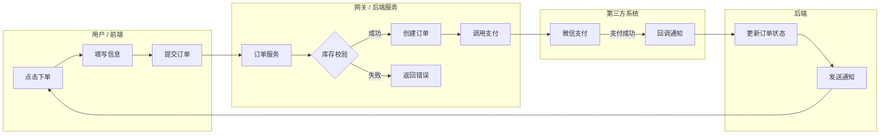
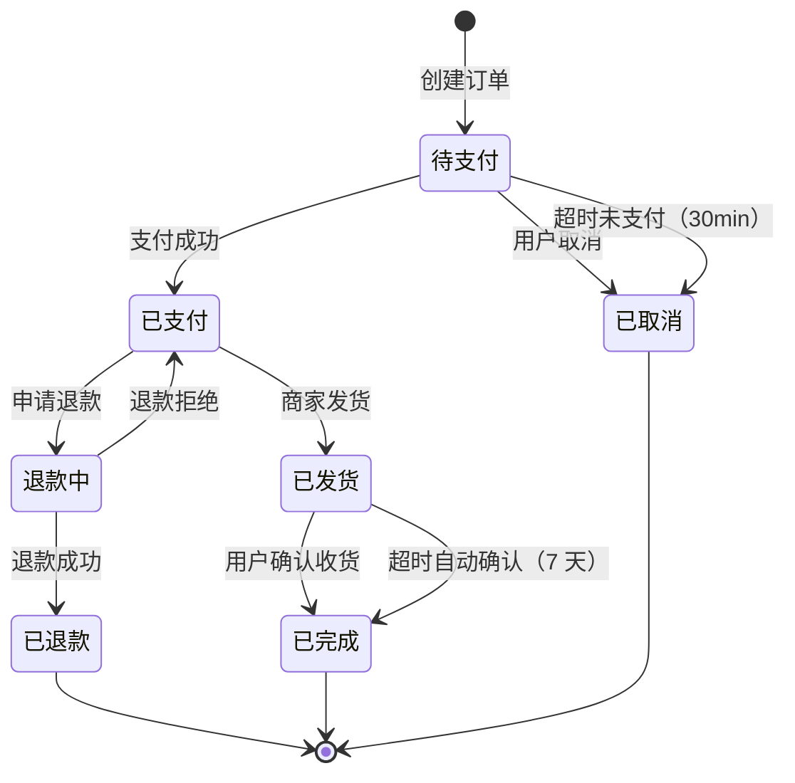

# PRD 编写规范 v1.0

> 版本：v1.0
> 修订日期：2026-06-24
> 配套：`./SKILL.md`（精简入口）；本文件为详细规则与完整模板
> 适用：Vue + Java Spring Boot 前后端分离项目
> 参考：用户基础规范 + 字节 / 阿里 / 腾讯 / 美团大厂做法

---

## 1. 文档基本信息与版本控制

### 1.1 基础信息表（首页必填）

```markdown
| 项 | 值 |
|---|---|
| 项目名称 | [项目官方名称] |
| 项目代号 | [如 Apollo-V1.2] |
| 文档状态 | 草稿 / 评审中 / 已定稿 / 变更中 |
| 创建日期 | YYYY-MM-DD |
| 产品负责人（PM） | [姓名 / 联系方式] |
| 技术负责人（Lead） | [姓名 / 联系方式] |
| 前端负责人（Vue） | [姓名 / 联系方式] |
| 后端负责人（Java） | [姓名 / 联系方式] |
| 测试负责人（QA） | [姓名 / 联系方式] |
| 交互 / UI 设计 | [姓名 / 联系方式] |
```

### 1.2 修订历史（倒序）

```markdown
| 版本号 | 修订日期 | 修订类型 | 修订内容摘要 | 修订人 | 审核 / 批准人 |
|---|---|---|---|---|---|
| V1.0.3 | 2026-06-25 | 变更 | 用户列表新增「最近登录」字段 | 张三 | 全体评审会 |
| V1.0.2 | 2026-06-20 | 补充 | 补充「商户审核流」前端防重逻辑 | 张三 | 王五 |
| V1.0.1 | 2026-06-18 | 变更 | 调整登录失败锁定阈值为 5 次 | 李四 | 全体评审会 |
| V1.0.0 | 2026-06-15 | 新建 | 初始化发布 V1.0 核心功能需求 | 张三 | 李四（研发总监） |
```

**修订类型枚举**：
- `新建`：全新功能或新模块
- `变更`：修改已有功能
- `补充`：增加边界 / 异常处理（不改主流程）
- `删除`：移除功能（必含数据迁移方案）
- `废弃`：标记不再维护（保留兼容）

### 1.3 版本号规范（语义化）

```
V<major>.<minor>.<patch>

major：完整重构或重大变更（评审会全员通过）
minor：新增功能模块
patch：bug 修复 / 边界补充
```

**示例**：
- V1.0.0：首次发布
- V1.1.0：新增「报表导出」模块
- V1.1.1：补充导出边界处理
- V2.0.0：权限模型重构

### 1.4 文档状态机

```
草稿 → 评审中 → 已定稿 → 变更中 → 已定稿 → ...
                  ↓
                已废弃
```

- `草稿`：PM 内部撰写中
- `评审中`：发出评审邀请，未通过
- `已定稿`：评审通过，研发可启动
- `变更中`：已定稿后又要改，重新评审
- `已废弃`：归档，不再维护

---

## 2. 导言与业务模型设计

### 2.1 项目背景与业务价值

**3 段式模板**：

```markdown
## 项目背景

### 痛点描述
[用数据或具体业务场景说明当前存在的问题]
示例：当前用户登录失败率 12%，主因为验证码短信延迟 30s+，
     导致 8% 用户放弃登录。

### 产品定位
[本系统在整体架构中的位置]
示例：用户中心 v2 是统一身份认证入口，承载全集团 SSO，
     对接 8 个业务子系统。

### 业务价值
[上线后预计提升的目标]
- 登录成功率：88% → 95%（+7pp）
- 平均登录耗时：8s → 3s（-62%）
- 客服咨询量：月均 1200 单 → 600 单（-50%）
```

**大厂做法补充**：
- **数据驱动**：痛点必须有数据支撑，禁「用户体验差」「效率低」等模糊描述
- **北极星指标**：业务价值必含 1 个核心指标 + 3-5 个二级指标
- **对比基准**：明确当前值 + 目标值 + 时间窗口

### 2.2 用户角色与权限定义

**角色定义表**（Vue 动态菜单 + SB 接口权限基础）：

| 角色名称 | 角色 Code | 业务职责 | 关联菜单 / 页面 | 敏感操作权限 |
|---|---|---|---|---|
| 超级管理员 | `ROLE_ADMIN` | 掌控全盘数据，管理系统配置 | 全系统菜单 | 用户禁用 / 日志导出 / 参数修改 |
| 财务专员 | `ROLE_FINANCE` | 审核退款，导出对账单 | 财务管理 / 个人中心 | 退款审批 / 打款确认 |
| 普通运营 | `ROLE_OPERATOR` | 内容维护，用户咨询 | 用户管理 / 内容管理 | 新增 / 修改内容，无删除 |
| 访客 | `ROLE_GUEST` | 仅浏览公开内容 | 首页 / 公开页 | 无 |

**关键约束**：
- `Code` 必须是 `ROLE_XXX` 格式（对齐 mc-java-security §3 Spring Security）
- 一个用户可有多角色（权限并集）
- 敏感操作（删除 / 导出 / 转账）必须独立标注，便于 mc-java-security 数据权限设计

### 2.3 全局业务流程图

**规范**：使用**泳道图**（Cross-functional Flowchart），划分角色泳道。



**画图原则**：
- 泳道角色数 ≤ 5（超量拆子流程）
- 每个节点必带动作动词
- 决策点（菱形）必有双向出口
- 异常路径（红色虚线）必画
- 节点编号便于引用（如「② 创建订单」）

---

## 3. 功能需求详述

### 3.1 功能模块命名规范

`F-[模块]-[序号]`

| 示例 | 含义 |
|---|---|
| F-USER-001 | 用户管理 / 第 1 个功能 |
| F-ORDER-003 | 订单管理 / 第 3 个功能 |
| F-PAYMENT-002 | 支付管理 / 第 2 个功能 |

**模块代号**：大写英文，全局唯一（在修订历史中引用）。

### 3.2 页面 / 模块描述模板

每个核心页面或模块按以下 6 子项编写：

```markdown
### F-USER-001 - 用户管理列表页

#### 1. 页面访问地址与入口
- 菜单路径：系统设置 → 用户管理
- 前端路由：@/views/system/user/index.vue
- 路由名：SysUser
- 是否需登录：是
- 所需权限：user:read

#### 2. 原型及 UI 视觉参考
[在此插入原型链接或截图]
https://figma.com/file/xxx/user-list

#### 3. 交互与展示要素
- **页面加载逻辑**：进入时预加载「用户状态」字典（API: GET /v1/dict/user-status）
- **加载状态**：Skeleton 屏显 3 行占位（约 200ms 内显示）
- **组件化建议**：
  - 「用户导入弹窗」→ UserImportDialog.vue
  - 「用户详情抽屉」→ UserDetailDrawer.vue
  - 「重置密码弹窗」→ ResetPasswordDialog.vue

#### 4. 数据元素与输入校验表
[见 §3.3 字段校验表模板]

#### 5. 前后端交互与边界逻辑
[见 §3.4 边界逻辑规范]

#### 6. 接口需求
- GET /v1/users（列表查询，支持分页 + 多条件筛选）
- POST /v1/users（创建用户）
- PATCH /v1/users/{id}（修改用户）
- DELETE /v1/users/{id}（删除，软删除）
- POST /v1/users/{id}/reset-password（重置密码）

**接口契约维护在 Apifox**：https://apifox.com/project/xxx
```

### 3.3 字段校验表模板（核心）

| 字段名称 | 元素类型 | 必填 | 前端校验规则 | 异常提示文字 | 后端字段映射 | 字典 Code |
|---|---|---|---|---|---|---|
| 用户手机号 | Input | 是 | 11 位数字 + 手机号正则 | "请输入正确的 11 位手机号" | `phone VARCHAR(20)` | - |
| 用户角色 | Select（单选） | 是 | 必须选择一个现有角色 | "请选择用户角色" | `role_id BIGINT` | `ROLE_*` |
| 登录密码 | Password | 是 | 8-20 位 + 大小写 + 数字 | "密码强度不足，请重新输入" | `password (加密)` | - |
| 状态 | Switch | 否 | 默认启用 | - | `status SMALLINT` | `1=启用 0=禁用` |
| 头像 | Upload | 否 | jpg/png，≤ 2MB | "仅支持 jpg/png，≤ 2MB" | `avatar_url VARCHAR(500)` | - |
| 备注 | Textarea | 否 | ≤ 200 字 | "备注不超过 200 字" | `remark VARCHAR(200)` | - |

**关键约束**：
- 后端字段类型对齐 mc-database-spec（金额 numeric，状态 varchar 大写英文值）
- 字段映射必含「字段名 + 类型 + 长度」
- 字典 Code 对齐 mc-api-spec v1.6 §3.5（枚举字符串字面值，禁数字）
- 敏感字段（密码 / 身份证）标注「加密 / 脱敏」

**校验规则速查**：

| 类型 | 规则示例 |
|---|---|
| 长度 | `8-20 位`、`≤ 200 字` |
| 格式 | `11 位数字 + 手机号正则`、`邮箱格式` |
| 范围 | `1-999`、`≤ 2MB` |
| 必填 | `必填` / `选填` / `条件必填（满足 X 时必填）` |
| 自定义 | `必须包含大小写 + 数字` |

### 3.4 边界逻辑规范（最核心）

#### 3.4.1 防重复提交

```markdown
**防重提交规范**（对齐 mc-web-security 场景四 + mc-api-spec v1.6 §5.4）：

- 前端：所有「提交 / 保存 / 支付 / 审核」按钮，点击后立即置灰（Loading 状态），
       直到后端响应返回或超时（30s）
- 后端：写操作必须实现幂等性（Idempotency-Key Header，UUID v4）
       - 同 key + 同请求体 → 返回首次结果
       - 同 key + 不同请求体 → 返回 10501「请勿重复提交」
- 超时：30s 后端无响应，前端解除 Loading 并提示「网络异常，请稍后重试」
```

#### 3.4.2 列表分页规则

```markdown
**默认规则**：
- 默认排序：`created_at DESC`（创建时间倒序）
- 分页大小：默认 10 条，可切换 20 / 50 / 100
- 翻页缓存：第 1 页缓存 5min，第 2 页起不缓存
- 数据量提示：超过 10000 条提示「请使用筛选条件缩小范围」

**响应格式**（对齐 mc-api-spec v1.6 §6.2 Offset 分页）：
{
  "list": [...],
  "total": 128,
  "page": 1,
  "page_size": 20,
  "has_more": true,
  "summary": null
}

**空数据处理**：
- 后端返回空 list（[]）时，前端必须展示「暂无数据」占位图
- 禁止展示空白、持续 Loading、或 JS 报错
```

#### 3.4.3 异常处理

```markdown
**业务异常**（HTTP 200 + code != 0）：
- 前端 axios 响应拦截器统一捕获
- 根据 code 分类处理：
  - 10200~10206（认证）→ 跳登录页
  - 10300~10303（权限）→ 跳 forbidden 页
  - 10100~10106（参数）→ ElMessage.error(message) + 渲染 error[] 到表单
  - 10500/10501（限流 / 重复）→ 读 Retry-After Header
  - 其他 → ElMessage.error(message)

**基础设施异常**（HTTP != 200）：
- 400 / 404 → 友好错误页
- 401 → 跳登录（保险路径）
- 405 / 413 / 415 → 路由 / 网关错误，告警
- 502 / 503 / 504 → 「服务异常，请稍后重试」+ 上报 Sentry
```

#### 3.4.4 状态机规范（核心实体必画）

订单 / 审批 / 支付等含状态流转的业务，必须画状态机图。



**必填**：初始态（`[*]`）+ 终态 + 异常分支（取消 / 失败 / 超时）。

### 3.5 接口契约规范

**严禁**在 Word / PRD 中手写完整 API 设计。

**正确流程**：

```
1. PM 在 PRD 列出接口需求（URL 数量 + 关键字段，不写完整 schema）
2. 后端 Lead 架构评审后在 Apifox / YApi 录入契约
3. 前后端基于在线契约同步开发
   - 前端用 Apifox Mock 联调
   - 后端按契约实现
4. 联调阶段以 Apifox 契约为准，PRD 不再更新接口细节
```

**PRD 中接口需求模板**：

```markdown
## 接口需求

本功能需新增以下接口（契约维护在 Apifox）：
https://apifox.com/project/xxx/apis

| # | URL | Method | 用途 | 关键字段 |
|---|---|---|---|---|
| 1 | /v1/users | GET | 用户列表 | page, page_size, status, keyword |
| 2 | /v1/users | POST | 创建用户 | username, phone, role_id, password |
| 3 | /v1/users/{id} | PATCH | 修改 | username, phone, role_id |
| 4 | /v1/users/{id} | DELETE | 软删除 | - |
| 5 | /v1/users/{id}/reset-password | POST | 重置密码 | new_password |

**接口约束**：
- 列表接口必须支持分页（page + page_size）和筛选（status + keyword）
- 创建 / 修改接口必须支持 Idempotency-Key
- 所有接口返回 6 字段信封（详见 mc-api-spec v1.6 §4）
- 错误码：10100 参数错误 / 10401 用户名冲突 / 10204 用户被冻结
```

---

## 4. 非功能性需求（NFR）

### 4.1 安全需求

| 项 | 规范 |
|---|---|
| 敏感信息脱敏 | 后端输出脱敏（如 138****8888），禁前端 JS 截取（详见 mc-java-security §8） |
| Token 管理 | access_token ≤ 2h，refresh_token ≤ 30d，refresh 一次性 |
| 无感刷新 | accessToken 过期时用 refreshToken 自动置换 |
| 密码存储 | bcrypt cost ≥ 12（详见 mc-java-security §5） |
| 接口签名 | 开放 API 用 HMAC-SHA256 + nonce（防重放） |
| 防 SQL 注入 | MyBatis `#{}` 参数化，禁 `${}` |
| 文件上传 | Magic Number 校验 + UUID 重命名 + 独立 OSS 域名 |
| CSRF | JWT 模式无风险；Cookie 模式 SameSite=Lax + 双提交 Token |

### 4.2 性能需求

| 指标 | 目标 | 备注 |
|---|---|---|
| 首屏加载（FCP） | ≤ 1.5s | 路由懒加载 + Gzip/Brotli |
| LCP | ≤ 2.5s | Core Web Vitals |
| INP | ≤ 200ms | 交互响应 |
| 接口 P99 | ≤ 200ms（核心）/ 500ms（主流程）/ 1s（后台） | 详见 mc-perf |
| 文件上传 | ≥ 20MB 必须分片上传 + 断点续传 + MD5 秒传 | |
| 大表查询 | 禁 OFFSET > 10000，用 Keyset 分页 | 详见 mc-perf §6 |

### 4.3 兼容性需求

| 维度 | 规范 |
|---|---|
| 浏览器 | Chrome 100+ / Firefox 100+ / Safari 15+ / Edge 100+ |
| 移动端 | iOS 14+ / Android 9+（如需响应式） |
| 分辨率 | 1280×720 起步，推荐 1920×1080 |
| 日期格式 | ISO-8601：`yyyy-MM-dd HH:mm:ss` |
| 时区 | 后端 UTC 存储，前端按用户时区展示 |
| 字典统一 | 后端提供字典接口，前端缓存（禁硬编码） |

### 4.4 数据埋点（大厂做法）

**指标层级**：

```
北极星指标（1 个，核心）
  ↓ 拆解
二级指标（3-5 个）
  ↓ 拆解
过程指标（用户行为埋点）
```

**PRD 中埋点表模板**：

| 事件名 | 触发时机 | 关键属性 | 上报方式 | 目标值 |
|---|---|---|---|---|
| `page_view` | 页面加载完成 | page_path / referrer | GA / 自建 | DAU 10 万 |
| `order_create_click` | 点击「提交订单」 | sku_id / quantity / amount | Sentry | 转化 30% |
| `order_create_success` | 创建成功 | order_id / amount | 同上 | 转化 28% |
| `order_create_fail` | 创建失败 | reason / error_code | 同上 | < 2% |
| `payment_start` | 跳转支付 | order_id / channel | 同上 | - |
| `payment_success` | 支付成功 | order_id / amount | 同上 | 转化 85% |

**关键约束**：
- 事件名 snake_case
- 属性必含 trace_id（对齐 mc-monitor）便于关联异常
- 目标值必须可量化、有时间窗口

---

## 5. 简化与敏捷交付

### 5.1 原型替代文字

**适用**：原型已含明确交互备注（如「点击弹窗」「校验 11 位」）。

**做法**：PRD 章节写「详细交互与校验请参见原型图批注 [链接]」，不重复描述。

### 5.2 摒弃 Word 接口设计

**严禁**在 Word 中手写 API 接口设计。

**正确流程**：
1. PM 在 PRD 列出接口需求 + 关键字段
2. 后端 Lead 架构评审后录入 Apifox / YApi / Swagger
3. 前后端基于在线契约开发 + Mock 联调

### 5.3 文档篇幅控制

| PRD 类型 | 页数上限 | 备注 |
|---|---|---|
| 小功能（单页面） | ≤ 5 页 | 用原型 + 字段表 |
| 中功能（多页面） | ≤ 15 页 | 含状态机 + 流程图 |
| 大功能（跨模块） | ≤ 30 页 | 字节做法 |
| 超大功能 | 拆分为多个 PRD | 避免单文档过载 |

---

## 6. 需求变更与验收

### 6.1 变更管理（CCB）

**流程**：

```
[ 提出变更 ]
    ↓
[ 评估影响（PM / 研发 / QA）]
    ↓
[ 判定优先级（P0 立即 / P1 本迭代 / P2 下迭代）]
    ↓
[ 填写修订历史（V1.0.X）]
    ↓
[ 重新邮件 / 群通知群组 ]
    ↓
[ 受影响方重新评审 ]
```

**严禁**：
- 口头变更（必须更新到在线 PRD）
- 跳过评审（影响范围 > 1 人必须评审）
- 删除修订历史（仅追加，保留全量）

**影响评估表**：

| 维度 | 评估内容 |
|---|---|
| 业务影响 | 是否影响线上功能 / 用户行为 |
| 技术影响 | 前端 / 后端 / DB / 缓存改动量 |
| 测试影响 | 是否需重测 / 回归测试范围 |
| 上线影响 | 是否需灰度 / 数据迁移 / 停机 |

### 6.2 验收标准（DoD）

功能可提测 / 上线的标准：

| 角色 | DoD 标准 |
|---|---|
| **前端（Vue）** | 无 `console.log` 遗留 / 无打包报错 / 静态资源压缩完成 / Lighthouse ≥ 80 |
| **后端（Spring Boot）** | 单元测试覆盖率 > 60%（详见 mc-test）/ API 在 Apifox 标记「已完成」/ SQL 脚本归档 / 无 P0 Bug |
| **QA** | 冒烟测试 100% 通过 / 无 P0/P1 Bug / 自动化测试通过 |
| **设计** | 视觉走查通过 / 多端适配验证 |
| **PM** | PRD 修订历史更新 / 埋点验证通过 |

**Definition of Done 检查清单**（提测前必过）：

```markdown
## 提测前 Checklist

### 前端
- [ ] 所有页面已实现，无 TODO
- [ ] 路由配置正确（含权限校验）
- [ ] axios 拦截器统一处理（401 自动刷新 / 业务码）
- [ ] 表单校验完整（前端 + 后端双重）
- [ ] 加载 / 空 / 错误状态都有 UI
- [ ] 国际化文案齐全
- [ ] 浏览器兼容性验证（Chrome / Firefox / Safari / Edge）
- [ ] Lighthouse Performance ≥ 80

### 后端
- [ ] 接口契约与 Apifox 一致
- [ ] 单元测试覆盖率 > 60%
- [ ] 集成测试通过（Testcontainers）
- [ ] 异常处理完整（@RestControllerAdvice）
- [ ] 日志规范（结构化 JSON + trace_id）
- [ ] 监控埋点齐全（Micrometer）
- [ ] SQL 性能验证（EXPLAIN）
- [ ] 安全检查（mc-java-security P0 6 项）

### QA
- [ ] 测试用例编写并评审
- [ ] 冒烟测试通过
- [ ] 自动化测试覆盖核心流程
- [ ] 性能测试通过（按 SLA）

### 数据
- [ ] 埋点验证（事件触发 + 属性完整）
- [ ] 数据迁移脚本准备（如需）
- [ ] 灰度方案（如需）

### 文档
- [ ] PRD 修订历史更新
- [ ] 接口契约 Apifox 同步
- [ ] Runbook（运维手册）更新
```

### 6.3 评审流程

**4 轮评审**：

| 轮次 | 参与方 | 关注点 | 产出 |
|---|---|---|---|
| 1. PM 内审 | PM Leader + 同组 PM | 业务逻辑 / 价值 / 完整性 | PM 内部修改建议 |
| 2. 设计评审 | UI / UX + PM | 原型可行性 / 视觉一致性 | 设计稿定稿 |
| 3. 技术评审 | Tech Lead + 前后端 Lead + QA | 可行性 / 工作量 / 风险 | 技术方案 + 工时评估 |
| 4. QA 评审 | QA + PM | 可测试性 / DoD / 边界覆盖 | 测试用例 |

**评审前必交**：
- 完整 PRD（含修订历史）
- 原型图（Figma / 即时设计）
- 字段校验表
- 状态机图
- 流程图

**评审后必出**：
- 评审纪要（飞书 / Notion 文档）
- 待办项（含负责人 + 截止日期）
- 修订历史更新（V1.0.X）
- 文档状态：`评审中` → `已定稿`

---

## 7. 校验 Checklist（P0~P3）

### 7.1 P0 必查 8 项

| # | 检查项 | 检查方式 |
|---|---|---|
| 1 | 首页有完整基础信息表 + 修订历史 | 文档开头检查 |
| 2 | 角色权限表完整（Code + 菜单 + 敏感操作） | §2.2 章节 |
| 3 | 核心业务有状态机图（订单 / 审批 / 支付） | grep「状态」「流转」 |
| 4 | 全局流程有泳道图（用户 / 前端 / 后端 / 第三方） | §2.3 章节 |
| 5 | 每功能有字段校验表（前端校验 + 后端字段 + 字典） | 每个功能模块 |
| 6 | 写操作描述防重提交（前端置灰 + 后端幂等） | grep「提交 / 保存 / 支付」 |
| 7 | 接口契约不写 Word（指明 Apifox / YApi 链接） | grep「接口设计 / API」 |
| 8 | DoD 验收标准明确（前端 / 后端 / QA 三方） | §6.2 章节 |

### 7.2 P1 高优检查

| # | 检查项 |
|---|---|
| 9 | 异常路径覆盖（空 / 极值 / 并发 / 网络） |
| 10 | 边界条件明确（≤ / ≥ / 范围 / 默认值） |
| 11 | 兼容性说明（浏览器 / 移动端 / 分辨率） |
| 12 | 灰度方案（如影响线上） |
| 13 | 回滚预案（变更失败如何回滚） |
| 14 | 埋点定义完整（事件 + 属性 + 目标值） |
| 15 | 数据指标（北极星 + 二级） |
| 16 | 字典一致性（枚举值统一来自后端字典接口） |

### 7.3 P2 中优检查

| # | 检查项 |
|---|---|
| 17 | 多语言文案（如需国际化） |
| 18 | SEO 考虑（如公开页） |
| 19 | 无障碍（a11y） |
| 20 | 数据迁移方案（如改 DB 结构） |
| 21 | 性能指标明确（首屏 / LCP / P99） |
| 22 | 安全需求明确（脱敏 / 权限 / 签名） |
| 23 | 监控告警（核心接口 + 业务指标） |

### 7.4 P3 低优检查

| # | 检查项 |
|---|---|
| 24 | 文档排版（标题层级 / 表格对齐） |
| 25 | 命名规范（模块代号 / 字段名 snake_case） |
| 26 | 引用文档有效（链接可访问） |
| 27 | 图表清晰（分辨率 / 标注） |
| 28 | 错别字 / 语病 |

---

## 8. 模板速查

### 8.1 完整 PRD 目录

```markdown
# [项目名称] PRD V[major.minor.patch]

## 1. 基础信息
   1.1 项目信息表
   1.2 修订历史

## 2. 导言与业务模型
   2.1 项目背景（痛点 / 定位 / 价值）
   2.2 用户角色与权限定义
   2.3 全局业务流程图（泳道图）

## 3. 功能需求详述
   3.1 F-XXX-001 - [功能名]
       1. 入口与路由
       2. 原型参考
       3. 交互要素
       4. 字段校验表
       5. 边界逻辑（防重 / 分页 / 异常 / 状态机）
       6. 接口需求
   3.2 F-XXX-002 - [功能名]
   ...

## 4. 非功能性需求（NFR）
   4.1 安全需求
   4.2 性能需求
   4.3 兼容性需求
   4.4 数据埋点

## 5. 简化与敏捷
   5.1 原型替代文字
   5.2 接口契约不在 Word

## 6. 变更与验收
   6.1 变更管理（CCB）
   6.2 验收标准（DoD）
   6.3 评审流程

## 7. 附录
   7.1 术语表
   7.2 字典码表
   7.3 引用文档
```

### 8.2 单功能模块模板

```markdown
### F-[MODULE]-[NNN] - [功能名称]

#### 1. 入口与路由
- 菜单：[X] → [Y]
- 路由：@/views/[module]/[page].vue
- 路由名：[RouteName]
- 权限：[permission_code]

#### 2. 原型参考
[链接 / 截图]

#### 3. 交互要素
- 加载：[预加载 / Skeleton / Loading]
- 组件拆分：[XxxDialog.vue / XxxDrawer.vue]

#### 4. 字段校验表
| 字段 | 元素 | 必填 | 前端校验 | 提示 | 后端字段 | 字典 |
|---|---|---|---|---|---|---|
| ... | ... | ... | ... | ... | ... | ... |

#### 5. 边界逻辑
- 防重提交：[前端置灰 + 后端幂等]
- 分页：[默认 X 条，可选 Y/Z]
- 异常：[业务码 / 网络异常]
- 状态机：[如适用，画图]

#### 6. 接口需求
| # | URL | Method | 用途 | 关键字段 |
|---|---|---|---|---|
| 1 | /v1/xxx | GET | ... | ... |

契约维护：[Apifox 链接]
```

### 8.3 修订历史模板

```markdown
| 版本号 | 修订日期 | 修订类型 | 修订内容摘要 | 修订人 | 审核 / 批准人 |
|---|---|---|---|---|---|
| V1.0.X | YYYY-MM-DD | 变更 / 补充 / 删除 | [一句话] | [姓名] | [评审会 / 姓名] |
```

---

## 附录 A：大厂做法对照

| 维度 | 字节 | 阿里 | 腾讯 | 美团 | 本规范 |
|---|---|---|---|---|---|
| 文档分层 | BRD → MRD → PRD | BRD → PRD | BRD → PRD | PRD 单层 | PRD 单层（业务由 PM 内部消化） |
| 篇幅上限 | 30 页 | 无硬限制 | 视项目 | 15 页 | 大功能 30 页 |
| 数据驱动 | 强（埋点先行） | 强（北极星） | 中 | 中 | 强（北极星 + 二级 + 埋点表） |
| 接口契约 | Apifox | 自研 | YApi | Swagger | Apifox / YApi |
| 状态机 | Mermaid | PlantUML | draw.io | PlantUML | Mermaid |
| 评审流程 | 4 轮 | 3 轮 | 4 轮 | 3 轮 | 4 轮（PM / 设计 / 技术 / QA） |
| 变更管理 | CCB + 修订历史 | CCB | 邮件 + 修订 | CCB | CCB + 修订历史 |

## 附录 B：术语表

| 术语 | 含义 |
|---|---|
| PRD | Product Requirement Document 产品需求文档 |
| BRD | Business Requirement Document 商业需求文档 |
| MRD | Market Requirement Document 市场需求文档 |
| DoD | Definition of Done 完成定义（验收标准） |
| CCB | Change Control Board 变更控制委员会 |
| NFR | Non-Functional Requirement 非功能性需求 |
| SLA | Service Level Agreement 服务等级协议 |
| SLO | Service Level Objective 服务等级目标 |
| SLI | Service Level Indicator 服务等级指标 |
| Persona | 用户画像 / 角色 |
| 北极星指标 | North Star Metric，衡量产品成功的唯一核心指标 |
| FCP | First Contentful Paint 首次内容绘制 |
| LCP | Largest Contentful Paint 最大内容绘制 |
| INP | Interaction to Next Paint 交互到下次绘制 |
