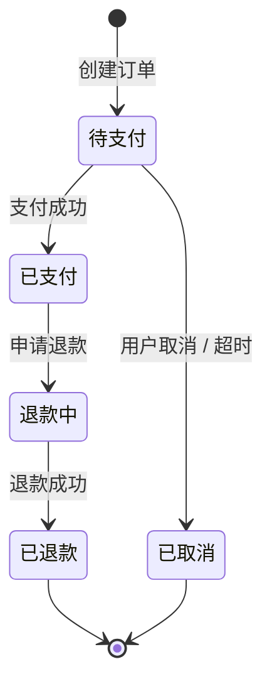

# PRD 文档规范

面向 **Vue + Java Spring Boot** 项目的产品需求文档（PRD）规范。整合用户基础规范 + 大厂做法。

## 0. 用户速查

| 你想 | 入口 |
|---|---|
| 从零写 PRD | 场景一：新建 |
| 写某功能模块 | 场景二：功能详述模板 |
| 修改 / 变更 PRD | 场景三：变更管理（CCB） |
| 校验 PRD 合规 | 场景四：P0 必查 8 项 |
| 画流程图 / 状态机 | 场景五：图表规范 |
| 定义字段 / 接口契约 | 场景六：字段表 + 契约 |
| 设计埋点 / 指标 | 场景七：数据驱动 |
| 评审 PRD | 场景八：评审流程 |
| 退出本规范 | 「退出 mc-doc-prd」 |

## 1. 元信息

| 项 | 说明 |
|---|---|
| **适用** | Vue + Java Spring Boot 前后端分离项目的产品需求文档 |
| **不适用** | 商业 BRD / 市场 MRD、技术方案（→ mc-java-spec）、API 契约（→ mc-api-spec） |
| 推荐工具 | 飞书 / Notion / Confluence（在线协作）；Figma / 即时设计（原型）；Apifox / YApi（接口契约） |
| 核心原则 | **结构化 + 可测试 + 可变更 + 可校验** |
| 退出 | 「退出 mc-doc-prd」 |

## 2. 全局铁律

1. **首页必有基础信息表 + 修订历史**（倒序，最新在上）
2. **角色权限必先定义**（含 Code、菜单范围、敏感操作）— Vue 动态菜单 + SB 接口权限的基础
3. **核心业务必画状态机图**（订单 / 审批 / 支付等状态流转）
4. **全局流程必画泳道图**（用户 / 前端 / 后端 / 第三方）
5. **每个功能点必有字段校验表**（前端校验 + 后端字段 + 字典 Code）
6. **写操作必有防重描述**（前端置灰 + 后端幂等 Token）
7. **接口契约不在 Word 里**：PM 列接口需求 + 字段，研发录入 Apifox / YApi
8. **变更必走 CCB 流程**：禁口头变更，必须更新《修订历史》
9. **验收标准必达标（DoD）**：前端无 console / 后端覆盖率 > 60% / QA 冒烟 100% 通过
10. **数据埋点先行**：每个功能定义北极星指标 + 二级指标 + 埋点方案

## 3. 场景判定

```
当前任务？
├── 从零写 PRD                          → 场景一：新建
├── 写某个功能模块详述                   → 场景二：功能模板
├── 修改 / 变更已有 PRD                 → 场景三：变更管理
├── 校验 PRD 是否合规                   → 场景四：P0 必查
├── 画流程图 / 状态机                    → 场景五：图表
├── 定义字段 / 接口契约                  → 场景六：字段表 + 契约
├── 设计埋点 / 数据指标                  → 场景七：数据驱动
└── 评审 PRD                            → 场景八：评审
```

### 场景一：新建 PRD

**6 大章节**：① 基础信息 + 修订历史 → ② 导言（背景 / 角色 / 流程图）→ ③ 功能详述（F-XXX-NNN 模板）→ ④ NFR（安全 / 性能 / 兼容 / 埋点）→ ⑤ 简化与敏捷 → ⑥ 变更与验收（CCB + DoD + 评审）。

**基础信息表**：项目名 / 代号 / 状态 / 创建日期 / PM / Tech Lead / 前后端 Lead / QA / 设计。

**修订类型**：`新建` / `变更` / `补充` / `删除` / `废弃`；版本号语义化 `V<major>.<minor>.<patch>`。

**文档状态机**：`草稿 → 评审中 → 已定稿 → 变更中 → 已定稿`。

**大厂做法**：字节三层 BRD/MRD/PRD + 30 页上限；阿里数据驱动（北极星 + 二级）；腾讯交互稿与视觉稿分离；美团 DDD 风格按领域聚合。

**完整目录与模板**：见 `./PRD 编写规范 v1.0.md` §1、§8.1。

### 场景二：功能详述模板

**命名**：`F-[MODULE]-[NNN]`（如 F-USER-001）。**6 子项**：入口 + 路由 / 原型参考 / 交互要素（加载 + 组件拆分）/ 字段校验表 / 边界逻辑 / 接口需求。

**字段校验表**（核心）：

| 字段名 | 元素 | 必填 | 前端校验 | 异常提示 | 后端字段 | 字典 |
|---|---|---|---|---|---|---|
| 手机号 | Input | 是 | 11 位 + 正则 | "请输入正确手机号" | phone VARCHAR(20) | - |
| 角色 | Select | 是 | 必选 | "请选择角色" | role_id BIGINT | ROLE_* |

**校验规则速查**：长度（8-20 位）/ 格式（手机正则 / 邮箱）/ 范围（1-999）/ 必填（必填 / 选填 / 条件必填）/ 自定义（含大小写 + 数字）。

**详细模板 + 完整字段表规范**：见主规范 §3.2、§3.3。

### 场景三：变更管理（CCB）

**流程**：`提出变更 → 评估影响（PM/研发/QA）→ 判定优先级 → 填修订历史 → 通知群组`。

**修订类型**：新建 / 变更 / 补充 / 删除（必含数据迁移）/ 废弃。

**严禁**：口头变更 / 跳过评审 / 删除修订历史（仅追加）。

**影响评估**：业务影响 / 技术影响 / 测试影响 / 上线影响（灰度 / 迁移 / 停机）。

**详细规则 + 修订历史模板**：见主规范 §6.1。

### 场景四：校验（P0 必查 8 项）

| # | 检查项 |
|---|---|
| 1 | 首页有完整基础信息表 + 修订历史 |
| 2 | 角色权限表完整（Code + 菜单 + 敏感操作） |
| 3 | 核心业务有状态机图（订单 / 审批 / 支付） |
| 4 | 全局流程有泳道图（用户 / 前端 / 后端 / 第三方） |
| 5 | 每功能有字段校验表（前端校验 + 后端字段 + 字典） |
| 6 | 写操作描述防重提交（前端置灰 + 后端幂等） |
| 7 | 接口契约不写 Word（指明 Apifox / YApi 链接） |
| 8 | DoD 验收标准明确（前端 / 后端 / QA 三方） |

**P1**：异常路径覆盖 / 边界条件 / 兼容性 / 灰度 / 回滚预案 / 埋点定义 / 数据指标 / 字典一致性。
**P2**：多语言 / SEO / 无障碍 / 数据迁移 / 性能指标 / 安全需求 / 监控告警。
**P3**：排版 / 命名规范 / 引用文档有效 / 图表清晰 / 错别字。

**完整 P0~P3 checklist**：见主规范 §7。

### 场景五：图表规范

**3 类必画**：泳道图（跨角色全局流程，draw.io / Mermaid）/ 状态机图（核心实体流转，PlantUML / Mermaid）/ 时序图（跨服务调用，PlantUML）。

**画图原则**：泳道角色 ≤ 5；节点带动词；决策点双出口；异常路径必画；节点 ≤ 20（超量拆子流程）；状态机必含初始态 + 终态 + 异常分支。

**Mermaid 速查**：



**详细模板 + Mermaid 示例**：见主规范 §3.4。

### 场景六：字段表 + 接口契约

**字段校验表**：见场景二 + 主规范 §3.3。

**接口契约严禁在 Word 手写**。正确流程：
1. PM 在 PRD 列出接口需求（URL + Method + 关键字段，不写完整 schema）
2. 后端 Lead 架构评审后在 Apifox / YApi 录入
3. 前后端基于在线契约同步开发（前端 Mock 联调 + 后端实现）

**Apifox 契约必含**：URL（对齐 mc-api-spec §3.2，如 `/v1/orders`）/ Method / 请求字段（含校验）/ 6 字段响应信封 / 错误码（10xxx 系列）/ Mock。

**PRD 接口需求模板**（在 PRD 中只列简表）：

| # | URL | Method | 用途 | 关键字段 |
|---|---|---|---|---|
| 1 | /v1/users | GET | 列表 | page, page_size, status, keyword |

**详细规则**：见主规范 §3.5 + mc-api-spec v1.6。

### 场景七：数据驱动（埋点先行）

**指标层级**：北极星（1 个，核心）→ 二级（3-5 个）→ 过程（用户行为埋点）。

**埋点表模板**：

| 事件名 | 触发时机 | 关键属性 | 上报方式 | 目标值 |
|---|---|---|---|---|
| `order_create_click` | 点击提交订单 | sku_id / quantity / amount | Sentry / GA | 转化 30% |
| `order_create_success` | 创建成功 | order_id / amount | 同上 | 转化 28% |

**关键约束**：事件名 snake_case / 属性必含 trace_id（对齐 mc-monitor）/ 目标值可量化有时间窗口。

**详细规则**：见主规范 §4.4。

### 场景八：评审流程

**4 轮评审**：
1. **PM 内审**（PM Leader + 同组 PM）：业务逻辑 / 价值 / 完整性
2. **设计评审**（UI/UX + PM）：原型可行性 / 视觉一致性
3. **技术评审**（Tech Lead + 前后端 Lead + QA）：可行性 / 工作量 / 风险
4. **QA 评审**（QA + PM）：可测试性 / DoD / 边界覆盖

**评审前必交**：完整 PRD + 原型 + 字段表 + 状态机。
**评审后必出**：评审纪要 + 待办项（负责人 + 截止日期）+ 修订历史更新（V1.0.X）+ 文档状态 → `已定稿`。

**禁**：边评审边改 PRD / 评审完不更新版本号。

**详细规则**：见主规范 §6.3。

## 4. 关键文件索引

| 文档 | 用途 | 活跃版本 |
|---|---|---|
| `./PRD 编写规范 v1.0.md` | 详细规则 + 完整模板 + 校验 checklist | v1.0 |
| `../mc-api-spec/SKILL.md` | API 契约（响应信封 / 错误码 / 分页 / Header） | v1.7 |
| `../mc-java-spec/SKILL.md` | Java 后端规范（DTO / 异常 / 校验） | v1.3 |
| `../mc-webui-spec/SKILL.md` | Vue 前端规范（组件 / 路由 / 国际化） | v1.1 |
| `../mc-test/SKILL.md` | 测试规范（DoD 覆盖度门槛） | v1.0 |

## 5. 与其他 SKILL 协作

| 涉及 | 同时参考 |
|---|---|
| API 契约（响应信封 / 错误码 / 分页） | mc-api-spec v1.6 |
| Java 后端实现规范（DTO / 异常 / 字段校验） | mc-java-spec §4.2、§4.4 |
| Vue 前端规范（路由 / 组件 / 字典） | mc-webui-spec |
| 测试覆盖度（DoD 验收） | mc-test 场景八 |
| 安全需求（脱敏 / Token / 权限） | mc-java-security + mc-web-security |
| 性能需求（首屏 / 慢 SQL） | mc-perf |

**PRD 与规范的关系**：

| PRD 章节 | 对应工程规范 |
|---|---|
| §3.2 字段校验表 | mc-java-spec §4.4 Bean Validation + mc-webui-spec 表单校验 |
| §3.5 接口需求 | mc-api-spec（契约由后端 Lead 录入 Apifox） |
| §4 NFR（安全） | mc-java-security + mc-web-security |
| §4 NFR（性能） | mc-perf SLA |
| §6.2 DoD | mc-test 覆盖度门槛 |

> **关键**：PRD 描述「**做什么**」，工程规范描述「**怎么做**」。两者互补不重叠。
