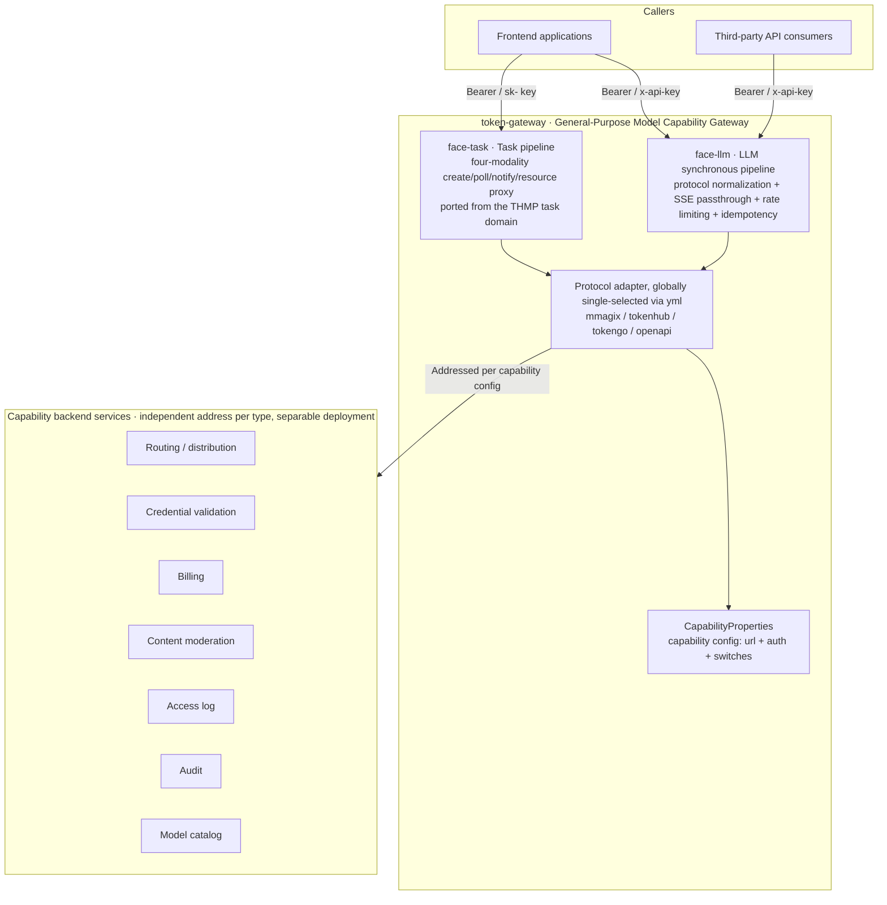
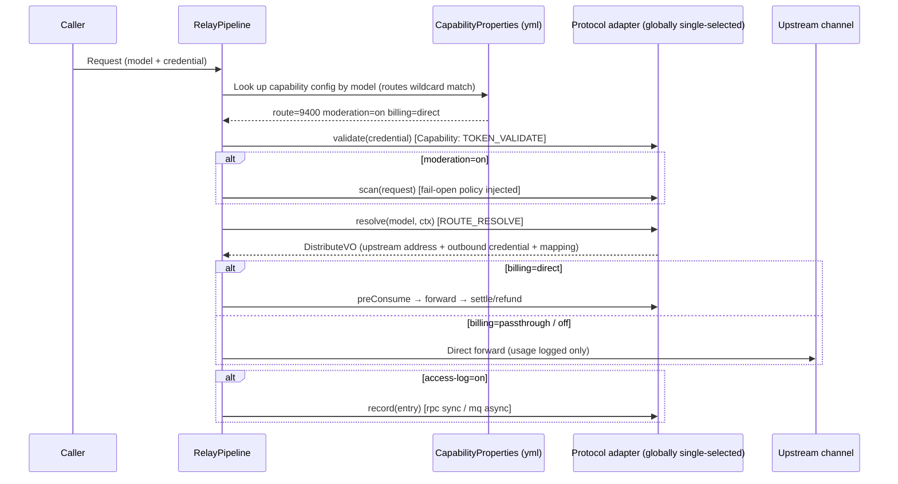

# token-gateway (General-Purpose Model Capability Gateway) Design

## 1. Basic Information

| Item | Content |
|---|---|
| Project | token-gateway (General-purpose model capability gateway · LLM + Task dual faces) |
| Code name | tgw |
| Document status | Draft (pending review) |
| Created | 2026-08-31 |
| Author | justin |
| Prerequisite documents | MMagiX repo documents/: No. 12 microservice split plan (inference-gateway slot), No. 11 access log, moderation-fail-open-behavior; MMagiX repo procurement/documents/: No. 18 contract (incl. §3.7 authoritative task protocol definition), No. 23 gateway design, No. 17 DDL |
| Code base | `backend/gateway-webflux` (full relay/upstream/rpc/thmp stack already implemented) + THMP task domain (TaskService / polling state machine / resource proxy / notify, 88% coverage) |

### Revision History

| Version | Date | Notes |
|---|---|---|
| V1.1 | 2026-08-31 | **Task domain merged in + renamed token-gateway** (decision: no separate task-gateway; code merged, deployment not merged); modular plan (face-llm / face-task / adapter-*); dual-channel log MQ; docs migrated to a standalone repo |
| V1.0 | 2026-08-31 | Initial version: capability SPI + registration model + adapter matrix + phased roadmap |

---

## 2. Background and Goals

### 2.1 As-Is (Current State)

`gateway-webflux` is already a feature-complete inference gateway (protocol conversion / SSE passthrough / rate limiting / idempotency / moderation integration / saga billing), but **capability calls are hard-coupled to the MMagiX main application**: the 7 HTTP clients in the `rpc/` package point directly at the MMagiX internal surface (token validation, distribute, the billing trio, moderation, access log, model catalog). The THMP canary cutover (S2) was the first "backend swap" attempt, implemented as a standalone `thmp/` package — it proved that swapping backends on the gateway is feasible, but also exposed the problem: **every new backend requires changing `RelayOrchestrator`**.

| Backend system | Current integration | Stack |
|---|---|---|
| MMagiX main application | `rpc/*` internal-token HTTP (native to this gateway) | Java/SB |
| TokenHub (thmp-app) | `thmp/*` HMAC contract surface (S2 canary artifact) | Java/SB |
| TokenGo (new-api fork) | None (heterogeneous Go stack, offsite, consumed by THMP via HMAC) | Go |
| Third-party applications | None | Any |

**Task domain current state**: The authoritative definition of the four-modality task protocol (videos/images/audios/tts, create→poll→notify→resource proxy) lives in THMP No. 18 §3.7, and the THMP gateway surface has already implemented the full chain in a single project (No. 23 §5/§6). MMagiX main-app creation-domain tasks do not pass through the gateway. The task face of token-gateway = **a port of the THMP task domain** (no rewrite), enabling TokenGo/third parties to consume task modalities through the gateway.

### 2.2 Goals (To-Be)

1. **Configuration as integration** (decision 2026-08-31): **no multi-backend registration** — backends are configured per capability surface in the project yml (address + auth + switches), effective at startup; logging / billing / audit services **each have independent addresses and can be deployed separately**, or all pointed at a single monolith.
2. **Third-party pluggability**: Non-built-in systems can be integrated by writing one adapter (one Java module) against the SPI, with zero changes to the gateway core; the generic protocol goes through the `openapi` adapter and is **language-agnostic**.
3. **Configurable capability switches**: Content moderation scanning, access-log persistence (rpc/mq), billing, audit export, etc. can be toggled per capability surface.
4. **Interfaces first**: Freeze the SPI contract and the capability configuration model first (§4/§5 of this document); implementations land in phases.
5. **Zero behavior change for MMagiX**: In M1, the existing `rpc/*` is migrated as-is into `MmagixAdapter`; existing callers are unaffected.
6. **Task domain merged in + renamed token-gateway** (decision 2026-08-31): The LLM synchronous face and the four task modalities live in the same repository, split into modules, and are isolated by deployment grouping (`face: llm | task | all`) — no separate task-gateway. Rationale: ~70% of the infrastructure is shared (credentials/billing/moderation/logging/audit/envelope); THMP has already validated the single-project dual-face form and the task protocol authority is No. 18 §3.7; splitting into two projects = infrastructure duplication + double integration of the same backend; load isolation is achieved via deployment grouping.

### 2.3 Non-Goals

- No gateway-local billing (to avoid a third billing source of truth — billing is always delegated to the backend; see S2 for dual-track reconciliation experience).
- No backend registry and no runtime registration API (configuration change = edit yml + restart; hot reload is open, see §11).
- No changes to OpenAI/Anthropic protocol conversion or SSE passthrough logic (already stable, migrated as-is).
- No service registry / gRPC introduction (aligned with MMagiX repo No. 12 ADR-0002/0003: REST + ApiResponse envelope).

---

## 3. Overall Architecture



Core idea: **keep the pipelines untouched, and extract the "outbound capability call points" into an SPI**. Whenever either pipeline (face-llm synchronous / face-task asynchronous task) reaches a call point, it reads the corresponding capability config from §5 (address/auth/switch) and issues the call through the global adapter (single protocol shape). If an enabled switch has no corresponding capability implementation → fail-fast configuration error at startup, never a runtime gap. **An independent address per service type = the landing point for microservice separation** (billing, logging, audit can each become standalone services); pointing everything at one address = monolith mode, with zero code branches.

---

## 4. Capability SPI (Interfaces First · Frozen Contract)

> Fully reactive (WebFlux `Mono`); DTOs reuse the existing `gateway/contract/*` (`DistributeVO` / `PreConsumeVO` / `SettleVO` / `RefundRequest` / `ModerationAuditRequest` / `AccessLogRequest` are already de-facto contracts). New interfaces go into a standalone module `token-gateway-spi`; adapters depend only on the SPI, not on the gateway core.

### 4.1 Adapter Entry Point

```java
public interface BackendAdapter {

    /** Backend configuration key (used for capability-surface addressing in yml) */
    String backendId();

    /** Capability declaration: the adapter self-reports which capability surfaces it supports; startup validates the intersection of switches and capabilities */
    Set<Capability> capabilities();
}
```

```java
public enum Capability {
    TOKEN_VALIDATE,      // Caller credential validation
    ROUTE_RESOLVE,       // Model → channel route resolution (distribute)
    MODERATION_SCAN,     // Content moderation scanning
    BILLING,             // Billing trio (pre-consume / settle / refund)
    ACCESS_LOG,          // Access log delivery (two channel types: RPC / MQ)
    AUDIT,               // Audit event export (security/admin events, incl. moderation audit reporting)
    MODEL_CATALOG,       // Frontend model catalog
    TASK_CREATE,         // Task creation delegation (optional, when the backend owns task state)
    TASK_POLL            // Task polling delegation (paired with TASK_CREATE, optional)
}
```

### 4.2 Capability Interfaces (Seven Shared Surfaces + Optional Task Delegation Surface)

```java
public interface TokenValidator extends CapabilityFacade {
    /** credential = Authorization credential (token / sk- key); on failure throw/return 10202 semantics */
    Mono<TokenContext> validate(String credential);
}

public interface RouteResolver extends CapabilityFacade {
    /** Equivalent to the legacy distribute: returns upstream baseUrl + outbound credential + modelMapping (isomorphic to THMP candidate resolution) */
    Mono<DistributeVO> resolve(String model, TokenContext ctx, String requestId);
}

public interface ModerationScanner extends CapabilityFacade {
    /** fail-open/fail-close policy injected from yml configuration (aligned with moderation-fail-open-behavior) */
    Mono<ScanResult> scan(ModerationRequest request);
}

public interface BillingClient extends CapabilityFacade {
    Mono<PreConsumeVO> preConsume(PreConsumeRequest request);
    Mono<SettleVO> settle(SettleRequest request);
    Mono<Void> refund(RefundRequest request);          // saga compensation
}

public interface AccessLogSink extends CapabilityFacade {
    /** transport = RPC (synchronous HTTP call to the log service) | MQ (Kafka / RocketMQ async delivery);
     *  when the switch is off the pipeline does not call it; MQ semantics are at-least-once, consumers deduplicate by (trace_id, ts) */
    Mono<Void> record(AccessLogEntry entry);
}

public interface AuditSink extends CapabilityFacade {
    /** Security/admin event export (incl. moderation audit reporting); failures must not block the main path (quiet + alert) */
    Mono<Void> record(AuditEvent event);
}

public interface ModelCatalog extends CapabilityFacade {
    Mono<List<ChatModelVO>> list();
}

public interface TaskClient extends CapabilityFacade {
    /** Task delegation surface (optional, enabled when the backend owns task state): the gateway runs no local state machine, create/poll are delegated directly to the backend.
     *  The default form is a gateway-local state machine (face-task, ported from THMP): after resolving the upstream via the route surface,
     *  the gateway drives create/poll/notify/resource proxy, with the task table and scheduling fallback on the gateway side */
    Mono<TaskCreateVO> create(TaskCreateRequest request);
    Mono<TaskPollVO> poll(String taskNo, TokenContext ctx);
}
```

> **Integration path without Java**: the SPI is only the gateway's internal implementation interface. Third-party backends can **write no Java at all** — they simply implement the capability-surface OpenAPI contract (HTTP endpoints / MQ messages) per the [Backend Onboarding Guide](./backend-onboarding.md), invoked by the gateway's built-in `openapi` generic adapter (§6.1).

### 4.3 SPI Iron Rules

1. **Adapters are stateless**: all state (caches/connection pools) is managed inside the adapter and rebuilt with the adapter on configuration reload.
2. **Unified error semantics**: capability call failures return envelope error codes (10202 credential / 10004 upstream / 10617 balance, etc.); the pipeline handles them per existing saga semantics, and adapters must not swallow errors or alter semantics.
3. **Cohesive timeout budgets**: each capability surface carries its own timeout in yml (defaults aligned with current values: route 3s / moderation sync window 2s / settle 5s); adapter implementations must not bring their own timeout overrides.
4. **No credentials in logs**: the SPI layer mandates masked `toString` on `TokenContext` (inheriting vector-② discipline); plaintext credentials only appear as `validate` input parameters.

---

## 5. Capability Service Configuration (yml · No Registration Concept)

> Decision (2026-08-31): no multi-backend registration — **backends are configured per capability surface in the project yml**, one address per service type;
> logging / billing / moderation services can be deployed separately, or all pointed at a single monolith. Change procedure = edit yml + restart (hot reload is open, see §11).

### 5.1 Configuration Model: Seven Capability Surfaces × (url + auth + switch)

```yaml
token-gateway:
  face: all                              # Assembly face (deployment grouping): llm | task | all
                                         # llm = pure synchronous face (no local disk dependency, elastic scaling)
                                         # task = task face (mounts a resource cache disk, scales independently)
                                         # all = single combined deployment (small scale)
  adapter: mmagix                        # Protocol-shape adapter (globally single-selected): mmagix | tokenhub | tokengo | openapi | custom:<spiName>

  route:                                 # Routing / distribution service (distribute / candidate resolution)
    url: http://localhost:9400
    auth: jwt                            # none | key | jwt (three modes; token mode removed)
    jwt-secret: ${GW_JWT_SECRET}
    timeout: 3s
    routes:                              # Model bindings: first match wins, wildcards supported
      - models: ["gpt-*", "claude-*", "*"]

  token-validate:                        # Credential validation service
    url: http://localhost:9400
    auth: jwt
    jwt-secret: ${GW_JWT_SECRET}         # The same service may reuse the same credential

  billing:                               # Billing service (pre-consume / settle / refund)
    url: http://billing-svc:9410         # A different host from the route service = service separation
    auth: jwt
    jwt-secret: ${GW_BILLING_JWT_SECRET}
    timeout: 5s

  moderation:                            # Content moderation service
    enabled: true                        # Whether to scan content for moderation
    fail-open: true                      # Allow requests through when the moderation dependency fails (fail-open document semantics)
    url: http://moderation-svc:9420
    auth: key
    key: ${GW_MODERATION_KEY}
    timeout: 2s

  access-log:                            # Log service (two delivery channel types)
    enabled: true                        # Whether logs are persisted (off = in-memory counters only)
    transport: rpc                       # rpc | mq
    url: http://log-svc:9430             # Effective when transport=rpc
    auth: none
    # When transport=mq, configure MQ instead (choose one of the two):
    # mq:
    #   type: kafka                      # kafka | rocketmq
    #   bootstrap: kafka-1:9092          # for rocketmq this is the name-server address
    #   topic: token-gateway-access-log
    #   # at-least-once semantics; consumers deduplicate by (trace_id, ts)

  audit:                                 # Audit service (security/admin events, incl. moderation audit reporting)
    url: http://audit-svc:9440
    auth: jwt
    jwt-secret: ${GW_AUDIT_JWT_SECRET}

  model-catalog:                         # Model catalog service
    url: http://localhost:9400
    auth: jwt
    jwt-secret: ${GW_JWT_SECRET}

  task:                                  # Task-face parameters (effective when face=task/all; defaults = THMP port semantics)
    expire-scan: 24h                     # Task expiry window (timeout → EXPIRED + full refund)
    resource-cache-dir: /data/tgw-cache  # Resource proxy cache directory (mounted on face=task instances)
    resource-sign-key: ${TGW_RESOURCE_SIGN_KEY}
    notify-retry: 1m,10m,1h              # Notify redelivery backoff tiers
```

**Monolith mode**: all seven surfaces point at the same address (as in the example above where route/token-validate/model-catalog all point at 9400) — from the gateway's perspective these are still seven capability calls, with zero code branches.
**Separated mode**: billing/logging/moderation/audit each become independent services with independent credentials — deployment topology changes require no code changes, only yml edits (naturally aligned with the billing-svc / audit-svc slots split out in MMagiX repo No. 12 ms-split).

### 5.2 Three Backend Auth Modes

> The authoritative security specification is 《Backend Integration Security Contract》(04 doc): scenario tiers / per-request signing / credential lifecycle / acceptance checklist. This section is the configuration summary.

| type | How it is sent | Recommendation | Applies to |
|---|---|---|---|
| `jwt` | HS256-signed JWT (`Authorization: Bearer`, claims include iss/caller/tenant_id) — **the production internal-token is exactly this form** (if the backend rotates its secret, the gateway must re-mint in sync) | **Recommended (default)** | Service-to-service calls needing identity semantics (caller/tenant); intranet: fixed JWT + short exp + rotation discipline; **cross-segment/public: upgrade to per-request signing** (timestamp+nonce+body signature, i.e. the tokenhub adapter's HMAC four-header shape, replay-proof) |
| `key` | Static key header `X-API-Key: <key>` (constant-time comparison + env injection) | Acceptable (intranet only) | Simple shared-secret service-to-service calls; no identity semantics, no expiry — not for cross-segment/cross-team use |
| `none` | No auth header sent | Restricted | **localhost/sidecar same-host isolation only** (port unexposed + network policy as backstop); IP whitelisting is defense-in-depth, not a substitute — it cannot stop lateral movement within the segment |

- Credentials are always injected via environment variables and must never be committed to the repo; only masked forms appear in logs/admin surfaces.
- **Startup check**: `auth=none` with a non-localhost url → startup warning (CapabilityValidator).
- ~~The `token` static-token mode was removed (2026-08-31 decision)~~: existing systems re-mint as `jwt` during migration.
- The TokenHub contract-surface HMAC four-header scheme (X-Access-Key/Timestamp/Nonce/Signature) does not use these three modes — it is **the protocol shape of adapter=tokenhub** (§6), configured under the `route:` surface.

### 5.3 Switch Semantics Matrix

| Switch | Behavior when off | Constraints |
|---|---|---|
| `moderation.enabled` | Pipeline skips the moderation step and does not call the moderation service | — |
| `moderation.fail-open` | — | Meaningful only when enabled=true; aligned with the fail-open document's three branches (allow/block/degrade) |
| `access-log.enabled` | No persistence, in-memory counters only (self-hosted QPS/error rate) | With transport=mq delivery is asynchronous, with a seconds-level window |
| `billing` | `off`: no pre-consume and no settle (BYOK/intranet passthrough scenarios); `passthrough`: upstream bills itself (THMP mode), the gateway only passes usage through to the log; `direct`: current saga | Three-valued enum, not boolean |
| `audit` | Security/admin events logged locally only, not exported | Moderation audit reporting is disabled together with moderation |
| `health-report` | record-success/failure not reported back | Missing channel health signals must be compensated on the monitoring side |

---

## 6. Built-in Adapters

### 6.1 Adapter Matrix

| Adapter | Source of capability implementations | Protocol shape | Notes |
|---|---|---|---|
| `MmagixAdapter` | The 7 existing `rpc/*` clients migrated as-is (HttpTokenApi/HttpChannelApi/HttpBillingApi/HttpModerationApi/HttpAccessLogApi/HttpChatModelApi), with log/audit call points split to their capability surfaces | §5.2 three modes (jwt = production internal-token) | Full set of seven capabilities; zero behavior change in M1 |
| `TokenHubAdapter` | `thmp/*` migration: ThmpContractClient (candidate resolution) + ThmpSignature + ThmpKeyCipher + ThmpCandidateCache(SWR)/negative cache | route surface HMAC four headers (fwk4j-signature semantics) | Two working modes, see §6.2 |
| `TokenGoAdapter` | New: OpenAI-compatible passthrough + TokenGo-side credential validation / billing APIs | To be aligned (`~/codes/fork/new-api` API surface) | Heterogeneous Go stack; endpoint mapping to be aligned before M3, then coded |
| `openapi` (generic) | **Built-in**; calls any backend per the Capability Interface Contract — **language-agnostic for third parties** (implement HTTP endpoints or MQ consumers in Go/Python/Node to integrate) | Capability Interface Contract (envelope + four auth modes) | Preferred path for third-party integration; no Java required |
| Third-party `custom:<spiName>` | The integrator implements the §4 SPI capability interfaces (assembled via `ServiceLoader` or Spring bean, either one) | Any (adapter-autonomous) | The Java path for special protocols the openapi contract cannot express |

The adapter is **globally single-selected** (one protocol shape per deployment); address/auth/switches all come from the §5 capability configuration — multiple backends are never mixed within a single deployment.

### 6.2 TokenHubAdapter Dual Modes

| Mode | Routing | Billing | Applies to |
|---|---|---|---|
| **Passthrough mode** (recommended M2 launch path) | No resolution needed — caller `sk-thmp-*` keys are forwarded as-is to THMP gateway-surface endpoints such as `/v1/chat/completions` | passthrough: the THMP gateway surface has its own reserve/commit closed loop (No. 24 diagram ①); the gateway only logs | THMP integrated as a pure upstream, zero billing coupling at the gateway |
| **Contract mode** (validated in S2) | `POST /v1/candidates/resolve` (HMAC) → decrypt key_cipher_tenant → gateway connects directly to the upstream | direct: billing goes through MMagiX (dual-track reconciliation) | MMagiX frontend sharing THMP supply during canary cutover |

The same adapter selects its mode from the §5 configuration (`billing` three-value + route declaration); cutover/shadow comparison assets (ThmpCutover bucketing / ThmpShadow instrumentation) migrate into the adapter as the "inter-backend canary" capability (§7, configured in the yml form of the production `gateway.thmp.*`).

### 6.3 TokenGoAdapter Key Points

- TokenGo is itself a gateway (new-api fork) with an OpenAI-compatible protocol surface: the adapter is mainly **credential bridging** (caller MMagiX/gateway credentials → TokenGo-side tokens) and usage collection.
- It is simultaneously a consumer of THMP (HMAC wholesale). When connecting directly to TokenGo, beware the billing-semantics risk of **the cost chain bypassing THMP catalog pricing** → to be decided at M3 review: direct connection is allowed only for personal-token scenarios; wholesale traffic must go through TokenHub.

### 6.4 Two Task-Domain Forms (face=task)

| Form | Routing | State machine location | Applies to |
|---|---|---|---|
| **Local state machine** (default) | route surface resolve → upstream base_url + outbound credential | Gateway face-task (THMP port): full pre-consume on creation → outbound → polling state machine (SUCCEEDED/FAILED/EXPIRED) → notify (HMAC signature + backoff redelivery) → resource proxy (sig capability credential, upstream URL never passed through) | The upstream is a "dumb" task API (create/poll); the gateway unifies the task experience and terminal-state guarantees |
| **Delegation surface** | TASK_CREATE/TASK_POLL (task delegation surface) | Backend-owned (the backend is itself a task platform) | The backend has its own task state machine; the gateway only proxies and bills |

Resource proxy and notify are gateway-inherent (sig signing, 24h expiry, upstream URL never passed through) and identical across both forms; task billing = full pre-consume at creation → refund on terminal state (full RELEASE on FAILED/EXPIRED), reusing the billing surface with no usage-settlement step.

---

## 7. Request Pipeline and Inter-Backend Canary

Pipeline steps are unchanged (validate → [moderation] → resolve → [preConsume] → forward → settle/refund → [accessLog/audit] → health); each step reads the §5 configuration of its capability surface (url/auth/switch):



**Inter-backend canary** (the generalization of S2's THMP cutover): the route capability config gains `shadow-to` and `cutover-percent` (the production `gateway.thmp.cutover-models/percent` is the yml landing of this form) — the primary path serves traffic while a shadow performs parallel resolution for comparison instrumentation (`[THMP-SHADOW]` single-line logs + `shadow-report.py` reused directly, markers unchanged from production); after the shadow converges to zero, traffic is cut over by bucket percentage, with a whitelist enabling second-level rollback.

**Task-face pipeline** (face=task, local state machine form): create (metering → full billing pre-consume → route resolve → outbound POST tasks) → caller polling (driven at 3~5s, terminal states are idempotent and never touch the upstream) → notify callback (HMAC + backoff redelivery) → resource proxy (GET signed URL, streaming origin fetch + local cache). Reuses the route/billing/moderation/log/audit surfaces; scheduling fallback = orphan pre-consume release / expiry scan / notify redelivery (same as THMP MaintenanceScheduler).

---

## 8. Security Design

1. **Caller authentication**: keep the principle that "credential semantics are defined by the backend" — `TokenValidator` belongs to the adapter of the currently matched backend; M4 may optionally add a gateway-local key table (`tgw_api_key`, SHA-256 hash + masking, modeled directly on THMP ApiKeyService).
2. **Backend credentials**: internal-token / HMAC secrets are stored via AES-GCM cipher (`cipher_by_biz` isomorphic), the admin surface only returns masked values; logs/audits contain no plaintext (vector-② discipline).
3. **THMP candidate key decryption**: keep starting with a single fallback passphrase (`ThmpKeyCipher`); BYOK per-tenant passphrases follow the pending #12 decision.
4. **Gateway admin surface**: public-network 403, intranet only (compose nginx precedent); admin APIs use the JWT policy.

---

## 9. Reuse and Migration Checklist

| Existing asset | Disposition |
|---|---|
| `relay/RelayOrchestrator` + saga chain (gateway-webflux) | **Kept** as the face-llm pipeline skeleton; capability call points become SPI lookups |
| `upstream/SsePassthroughInvoker` + protocol conversion + `format/` | Migrated as-is into face-llm (the protocol layer is backend-agnostic) |
| `rpc/*` 7 clients + `RpcInternalAuth` | Migrated into `MmagixAdapter` |
| `thmp/*` (Signature/ContractClient/Cache/Shadow/Cutover/KeyCipher) | Migrated into `TokenHubAdapter` (already hardened with singleflight/negative cache/LRU) |
| **THMP task domain** (TaskService / polling state machine / ResourceService / ResourceSigner / NotifySender / MaintenanceScheduler) | Migrated into **face-task** (a validated implementation with 88% coverage, no rewrite); No. 17 DDL task tables + partitions come along |
| `moderation/` `ratelimit/` `idempotency/` `trace/` | Kept as-is (cross-cutting layers, not part of the SPI) |
| `contract/*` DTOs | Promoted to the contract package of `gateway-spi` |
| `shadow-report.py` + dashboard | Reused directly (markers unchanged) |
| framework4j 1.5.1 (envelope/signature/lock/trace) | Foundation unchanged (reuse-first iron rule) |

**Modular plan** (Maven single-repo multi-module, at this repository root):

```
token-gateway/
  gateway-spi        # Capability interfaces (seven surfaces + task delegation) + Capability + contract DTOs (interfaces first, frozen early)
  gateway-core       # Pipeline skeleton + rate limiting/idempotency/trace/envelope + capability config assembly (CapabilityProperties)
  face-llm           # LLM face: chat/messages/embeddings/images-generations/models (protocol layer migrated from gateway-webflux)
  face-task          # Task face: four-modality create/poll/notify/resource proxy + scheduling fallback (THMP task domain port)
  adapter-mmagix     # rpc migration
  adapter-tokenhub   # thmp migration
  adapter-openapi    # Generic adapter (Capability Interface Contract, language-agnostic third-party integration) M3
  adapter-tokengo    # New in M3
  app                # Assembly: gateway.face = llm | task | all (same jar, different profiles, deployment grouping)
```

**Deployment grouping**: face=llm instances have no local disk dependency and scale elastically by connection count; face=task instances mount a resource cache disk and scale by bandwidth/disk — load characteristics are isolated at the deployment layer, with a single code repo and no duplication.

---

## 10. Phased Roadmap

| Phase | Content | Exit criteria |
|---|---|---|
| **M0 Interfaces first** (this document is the contract) | `gateway-spi` module: all capability interfaces + Capability + capability configuration model + startup-time switch∩capability validation | SPI + configuration model freeze review passed; compiles without any implementation |
| **M1 MMagiX migration** | `MmagixAdapter` (rpc migration) + face-llm wired to SPI + yml capability configuration | Zero change to existing behavior: production test suite all green + compose smoke re-verification of all 11 groups |
| **M2 Log MQ channel + TokenHub** | access-log `transport=mq` (dual implementations: Kafka / RocketMQ); `TokenHubAdapter` passthrough mode first, contract mode after | MQ log at-least-once consumption idempotency verified; LLM chain works end-to-end against the THMP backend; dual modes switchable via yml |
| **M2.5 Task face merged in** | face-task (THMP task domain port: state machine/notify/resource proxy/scheduling fallback + task table migration) + caller four-modality endpoints + task delegation surface | Smoke: four-modality create→poll→resource proxy works end-to-end; face=task group independently deployed and verified; task billing (full pre-consume / terminal refund) reconciles with zero discrepancy |
| **M3 Third-party integration** | `openapi` generic adapter + [Backend Onboarding Guide](./backend-onboarding.md) (incl. capability contract) + examples in multiple languages; `TokenGoAdapter`; Java SPI path documentation | Go example backend passes smoke (minimal surfaces: token-validate + route + models) |
| **M4 Optional evolution** | Capability configuration hot reload (config center), gateway-local key table, rate-limit policy center | Aligned with MMagiX repo No. 12 ms-split milestones |

---

## 11. Risks and Open Questions

| # | Risk / open question | Level | Disposition |
|---|---|---|---|
| 1 | SPI abstraction leakage: THMP dual modes and the MMagiX saga shape are not fully isomorphic (passthrough has no preConsume/refund compensation points) | Medium | Covered by Capability absence + billing three-value enum; M1 review focuses on pipeline branches |
| 2 | TokenGo API surface not yet aligned (the Go repo is not in this workspace) | Medium | Align endpoint mapping before M3; until then the adapter ships only an interface skeleton |
| 3 | Three coexisting billing semantics (MMagiX direct / THMP closed loop / TokenGo wholesale) | High | billing three-value enum + direct TokenGo connection restriction (§6.3); dual-track reconciliation continues during canary |
| 4 | yml changes require a restart to take effect (no hot reload) | Low | Accepted (configuration changes are infrequent); config centralization listed for M4 |
| 5 | Broader failure surface after service separation (billing/log/audit services fail independently) | Medium | Degradation semantics aligned with existing conventions: **billing failure rejects the request; log/audit failures do not block the main path** (quiet + alert) |
| 6 | MQ log channel semantics (dual Kafka/RocketMQ implementations): at-least-once has duplicates; broker failure has a loss window | Medium | Consumers deduplicate by (trace_id, ts); failed deliveries are buffered locally and retried, falling back to local files beyond the limit |
| 7 | Switch combination explosion (e.g., billing=off + access-log=off bare passthrough lacks audit) | Low | Startup validation emits a warning list; bare passthrough allowed only on intranet routes |
| 8 | ~~gateway-webflux migration rename and unification with No. 12 service slot naming~~ **Resolved (2026-08-31): renamed to token-gateway** | — | No. 12 slot annotations synced on the MMagiX side; artifactId set once and for all |
| 9 | Secret/passphrase distribution (THMP BYOK) depends on procurement-side open item #12 | Medium | Passthrough mode does not depend on decryption; land it first to bypass the dependency |
| 10 | Task domain port is large (state machine / resource cache / scheduling fallback + task table migration) | Medium | Entirely a port of validated THMP implementations (88% coverage); No. 17 DDL + No. 23 design come along, no rewrite; the resource cache disk is mounted only on the face=task group |

---

## 12. Relationship to Existing Documents

- **MMagiX repo No. 12 ms-split**: this gateway is the concretization and generalization of its `inference-gateway` slot (upgraded from "MMagiX-dedicated gateway" to "multi-backend general gateway", renamed token-gateway); database-split/private-deployment trimming criteria are all inherited from No. 12. **Capability service separation (§5) aligns naturally with the billing-svc / audit-svc / log-surface slots it splits out** — the url of each capability surface in yml is the landing point after service splitting.
- **THMP Nos. 18/23/24** (MMagiX repo procurement/documents): the contract source for TokenHubAdapter + **the port source for the task face** (task protocol authority = No. 18 §3.7; face-task implementation = a migration of the THMP gateway surface from No. 23 §5/§6); passthrough mode = the gateway perspective of No. 24 diagram ①, contract mode = the generalization of No. 24 diagram ③.
- **moderation-fail-open-behavior / MMagiX repo No. 11 access log**: the semantic baselines for the two switches; implementations must reference their policy branches and must not invent new semantics.
- **This repo's document family**: user docs ([LLM Face Onboarding Guide](../user/llm-guide.md), [Task Face Onboarding Guide](../user/task-guide.md) (planned, M2.5), `03_LLM Face API Contract`, `04_Task Face API Contract` (planned, M2.5)) and dev docs (`01_Design` (this document), [Backend Onboarding Guide](./backend-onboarding.md), [Capability Interface Contract yaml](https://github.com/funcommons/token-gateway/blob/main/docs/开发文档/03_能力面接口契约.yaml)) — mutually referenced with the frozen contracts in §4/§5 of this document.
