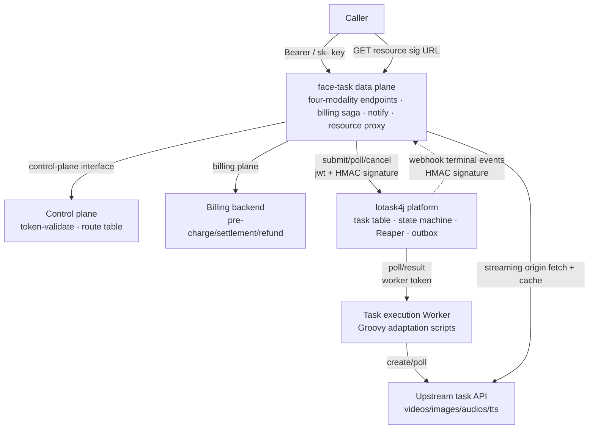

# Task Surface lotask4j Hosting Plan

| Item | Content |
|---|---|
| Document | Task surface task-state hosting plan (lotask4j hosting + platform-mediated execution + lotask4j modification checklist) |
| Status | **Authoritative document** for task surface implementation; supersedes the original design doc's M2.5 "THMP task domain porting" approach (2026-09-01 decision) |
| Companion | Design doc `01_设计方案.md` → `./design.md` §6.4/§7; task surface onboarding manual `../user/task-guide.md`; security contract `./backend-security-contract.md` |
| Version | V1.0 (2026-09-01, decision: lotask4j hosts task state) |

---

## 1. Decision

| Decision | Content |
|---|---|
| Task state hosting | **Hosted by lotask4j (ASTS async slow-task platform)**: task records, state machine, retries, zombie reaping, and scheduling fallback all reuse platform capabilities |
| Upstream integration form | **Platform mediation**: lotask4j Worker executes upstream calls (create/poll/result); the gateway **does not directly call upstream to execute tasks** |
| What the gateway keeps | caller four-modality endpoints, billing saga (route pricing first → full pre-charge → refund on terminal state), notify (HMAC + backoff), resource proxy (sig capability credential) |
| Upstream adaptation method | **Groovy scripts** (one adaptation script per task type, three hooks); onboarding a new upstream requires zero releases (§9) |
| Data consistency | Task state is **written solely to lotask4j**; billing state lives in the backend billing surface; linked via `task_no + pre_consume_id`; **no dual writes, no shared database** |
| Alternative form | For private-deployment/no-platform scenarios, keep the self-owned DB delegation surface as an alternative (TaskClient SPI is frozen; switching is an adapter decision, not an architectural fork) |

## 2. Overall Architecture



**Control-plane decision unchanged** (2026-09-01 decision): key validation and the route table belong to the control plane; at create time the gateway first resolves route pricing, and the **route snapshot (base_url + outbound credentials + model_mapping) is delivered to the Worker with the submit payload** — pricing-time and execution-time routes are consistent, and the Worker performs no secondary routing resolution.

## 3. Direct Connection vs Mediation Ruling

| Dimension | Gateway direct connection (lotask4j as state table only) | **Platform mediation (Worker executes)** ✅ |
|---|---|---|
| State writer | **Dual-writer problem**: gateway-driven state transitions coexist with the lotask4j state machine CAS, breaking lease/fencing semantics | Single writer: state transitions happen only in the lotask4j state machine (version + execution_token CAS) |
| Execution guarantee | The gateway would have to build its own polling loop/retry/zombie reaping = redoing what lotask4j already solved | Reaper (lease reclaim / expired → FAILED), retry backoff, and attempt caps all reused |
| Gateway deployment | face-task instances must maintain long-polling scheduling; scaling affects in-flight tasks | The gateway has no execution loop and is purely request-driven; execution elasticity scales independently in the Worker pool |
| Verdict | Rejected | **Adopted** |

## 4. Responsibility Matrix

| Responsibility | Owner | Notes |
|---|---|---|
| caller four-modality endpoints (create/poll/resource proxy) | Gateway face-task | API contract unchanged (task surface manual) |
| key validation / route table / pricing | Control plane (token-validate / route plane) | Decided and snapshotted at create time |
| Billing saga (full pre-charge / terminal-state refund) | Gateway → billing plane | Route pricing first, then pre-charge; full refund on FAILED/EXPIRED |
| Task records / state machine / retry / zombie reaping | **lotask4j** | asts_task + TaskStateMachine + TaskReaper |
| Upstream call execution | **lotask4j Worker (Groovy scripts)** | create/poll/resultMapping three hooks (§9) |
| Terminal events → trigger notify/refund | lotask4j webhook → gateway | outbox delivery + HMAC signature (modification R4) |
| notify caller callback (X-THMP-Signature + backoff) | Gateway face-task | Semantics unchanged |
| Resource proxy (sig 24h + streaming origin fetch + cache disk) | Gateway face-task | Worker reports raw resource URLs; the gateway converts them to signed proxy URLs; upstream URLs are never passed through |
| Non-standard operations features (tags/manual success/manual retry/refund entry) | **lotask4j admin plane** (modification R5) | The refund entry triggers gateway → billing plane refund (idempotent); all actions leave audit events |

## 5. End-to-End Flows

### 5.1 create (synchronous response)

```
Caller POST /v1/videos {model, params, notify_url}
  → Gateway: control-plane key validation
  → Gateway: control-plane route resolve (route pricing first: different models have different prices)
  → Gateway: generate task_no, full pre-charge for the matched model (billing plane; insufficient balance → 10617, no task created)
  → Gateway: lotask4j submit {task_type: video, idempotency_key: task_no,
                           payload: {params, notify_url, route snapshot (encrypted)}}
       ‑ Idempotency: resubmission with idempotency_key=task_no returns the first task (modification R2)
  → Caller ← {task_no, PENDING, poll_url}   (submit failure → full refund + 10004)
```

### 5.2 Execution and terminal state (async)

```
lotask4j Worker polls a task → RUNNING (lease + fencing)
  → Groovy create hook: call upstream create per the route snapshot → upstream task ID written into progress
  → Groovy poll hook: poll upstream until terminal state (in-Worker loop, interval configured per task_type)
  → Groovy resultMapping hook: upstream result → {resources[], usage} contract
  → Worker reportResult → lotask4j persists terminal state + outbox
  → webhook (HMAC signature) → Gateway:
       SUCCESS   → convert result.resources to sig proxy URLs and store the cache index; pre-charge converts to consumption (no refund)
       FAILED    → billing plane full refund (idempotent) → notify
       Timeout   → lotask4j FAILED(error_code=TIMEOUT) → gateway maps to EXPIRED → full refund → notify
       CANCELLED → mapped to FAILED (operations cancellation, full refund) → notify
  → notify_url callback (X-THMP-Signature; backoff on failure 1m/10m/1h)
```

### 5.3 poll (caller polling)

```
GET /v1/videos/{task_no}
  → Gateway: key validation (consumers can only query their own tasks — tenant isolation, modification R1)
  → Gateway → lotask4j GET /api/v1/client/tasks/{id}
  → Return after state mapping (§6); terminal states return the stored result (sig proxy URLs) without touching upstream
```

### 5.4 Resource proxy

Consistent with the existing contract: `GET /v1/resources/{task_no}/{index}?exp=&sig=`; validate sig → streaming origin fetch + local cache disk; raw upstream URLs are never passed through.

## 6. State Machine Mapping

| Gateway (caller-visible) | lotask4j | Notes |
|---|---|---|
| PENDING | PENDING | Waiting for Worker pickup |
| RUNNING | RUNNING | Executing (including in-Worker upstream polling) |
| SUCCEEDED | SUCCESS | Terminal |
| FAILED | FAILED / CANCELLED | Terminal (operations cancellation merged into FAILED, full refund) |
| EXPIRED | FAILED(last_error_code=TIMEOUT) / expired_at expiry | Terminal; the gateway maps by error_code (modification R6: lotask4j timeout persistence should carry a dedicated error_code) |

Model mapping: `task_no` ↔ `idempotency_key` (external idempotency key); `model+params` ↔ `payload`; `result.resources/usage` ↔ `result` JSONB (contract in §7); the 24h expiry window degrades from the gateway-side `task.expire-scan` semantics to lotask4j task_type timeout configuration (duration configured per modality).

## 7. Billing and Consistency

- **Correlation keys**: `task_no` (= lotask4j idempotency_key) + `pre_consume_id` (billing plane); the gateway does not maintain a task table.
- **No dual writes**: task state lives only in lotask4j; billing state lives only in the billing backend. Terminal events (webhook) drive refund/consumption, with redelivery on failure (outbox exponential backoff) + a gateway reconciliation task as fallback (find unclosed pre-charges by pre_consume_id → look up the lotask4j terminal state and compensate).
- **webhook loss window**: after the outbox redelivery cap is exceeded → FAILED → the gateway reconciliation fallback task (a simplified version of the original MaintenanceScheduler orphan pre-charge release semantics — only "pre-charge–terminal state" reconciliation remains; the state machine no longer has a fallback).
- **notify vs refund ordering**: refund succeeds first (idempotent), then notify, so the caller never receives FAILED before the refund has landed.

## 8. Security

| Point | Approach |
|---|---|
| Gateway → lotask4j | `jwt` (recommended style) + HMAC four-header signature on write operations (lotask4j's existing framework4j-signature capability; contract same as security contract §4) |
| Outbound credentials in the route snapshot | **Field-level payload encryption** (modification R7: AES-GCM, key injected from the environment; never in logs or in plaintext in admin) |
| lotask4j → gateway webhook | Add HMAC signature headers (modification R4; current webhooks are unsigned, so receivers cannot verify authenticity) |
| Consumer query isolation | Add `application_id/tenant_id` to lotask4j task rows (modification R1; currently any client token can query all platform tasks and GET details is fully open — **must be locked down**) |
| Caller side | Unchanged (Bearer/x-api-key, credentials never logged) |

## 9. Groovy Script Adaptation Plan

### 9.1 Why scripting

Upstream task APIs vary widely (each provider's create parameters/poll responses/resource fields differ), while the Worker skeleton (lease/fencing/retry/reporting) is agnostic to the upstream protocol. **Hardcoding in Java = one release per new upstream; Groovy scripts = zero releases for new upstreams**.

### 9.2 Script contract (one script per task type, three hooks)

```groovy
// task_type: video —— example hook signatures (Binding injects: ctx, http, log, json)
// ctx exposes: payload(Map), routeSnapshot(Map), upstreamTaskId(String), progress(Map)

def create(Map ctx) {
    // Call upstream create; return [upstreamTaskId: "...", progressHint: 0]
}

def poll(Map ctx) {
    // Call upstream query; return [state: "RUNNING"|"SUCCEEDED"|"FAILED", raw: raw upstream response]
}

def resultMapping(Map ctx) {
    // Map upstream terminal raw → gateway contract
    // Return [resources: ["https://upstream/..."], usage: [seconds: 5, resolution: "720p"]]
}
```

### 9.3 Where scripts live

| Location | Purpose |
|---|---|
| **Git repository** (lotask4j `scripts/` directory, e.g. `scripts/video/kling-v1.groovy`) | **Single source of truth**: reviewed, versioned, diff-able; shipped with lotask4j releases or flushed in via a sync task |
| `asts_task_type_config` adds `script_source` (TEXT) + `script_version` columns | Runtime loading (Worker fetches the script by task_type, compiles and caches it via GroovyClassLoader, auto-invalidates on version change) |
| Admin UI script editing page | Read-only viewing + emergency hotfix (hotfixes must be written back to the repository, otherwise the next sync overwrites them) |

### 9.4 How scripts are tested

| Layer | Form |
|---|---|
| Unit tests (in-repo, with lotask4j CI) | `GroovyScriptTestHarness`: GroovyShell loads the script + fixtures (`scripts/video/fixtures/create-ok.json` and other upstream response samples) assert the three hooks' outputs; mock the `http` binding so no real network is touched |
| Integration (Admin UI / test endpoint) | `POST /api/v1/admin/script-test/dry-run`: specify task_type + fixture or a real upstream sandbox; returns hook outputs and latency without persisting a task |
| Canary | `script_version` dual-version coexistence: bind the new script to a test task_type (e.g. `video-canary`) for low-traffic validation first, then cut over to production |

### 9.5 Script security constraints

Groovy sandbox inside the Worker: blacklist (direct access to `System/Runtime/Thread/File/socket`), only allow the `http` binding (with timeouts/outbound whitelist) and the `json` utility; hard cap on script execution time; compile failure/runtime exception → task FAILED + error_code=SCRIPT_ERROR + audit event.

## 10. lotask4j Modification Checklist

| # | Modification | Content | Priority |
|---|---|---|---|
| R1 | **Tenant/caller isolation** | Add `application_id` (+ `tenant_id`) columns to `asts_task`, written from token claims at submit; query/cancel/list forcibly filter by application; lock down `GET /{id}` authorization (currently fully open) | **P0** (hard security requirement) |
| R2 | **Globally unique external idempotency key** | `idempotency_key` unique across partitions (currently unique within a partition + application-layer fallback); accept `task_no` as the idempotency key and return it verbatim to the caller | **P0** (task surface idempotency semantics) |
| R3 | **Result resource contract** | `result` JSONB conforms to the `{resources: [...], usage: {...}}` shape (the gateway resource proxy depends on the resources array) | **P0** |
| R4 | **webhook signing + event extension** | Add HMAC signature headers to outbox delivery (X-Access-Key/Timestamp/Nonce/Signature); event types broken down by terminal state (SUCCESS/FAILED/TIMEOUT/CANCELLED) | **P0** (gateway authenticity verification + EXPIRED mapping) |
| R5 | **Admin-plane non-standard features** | Manual state changes (including manual success) / manual retry / task tags (`tags` column + filtering); all written to the asts_task_execution_event audit | P1 (operations entry; refunds are triggered by the admin plane via gateway → billing plane, the platform itself has no billing concept) |
| R6 | **Independent timeout semantics** | Timeout failures persisted with `last_error_code=TIMEOUT` (currently mixed into FAILED; the event enum has TASK_TIMED_OUT but persistence does not distinguish) | P1 (EXPIRED mapping depends on it) |
| R7 | **Field-level payload encryption** | Route snapshot outbound credentials persisted with AES-GCM; admin/logs see only masked values | **P0** (credential security) |
| R8 | **Groovy script executor** | Worker gains script execution mode (§9): task_type_config.script_source loading + sandbox + test endpoint | **P0** (main path for upstream adaptation) |
| R9 | RocketMQ events (optional) | Introduce when intermediate/progress events or multi-consumer scenarios are needed; webhooks suffice for now | P2 |

## 11. Degradation and Availability

| Failure | Behavior |
|---|---|
| lotask4j unreachable (create) | Reject the request + full refund (failures other than 10617 → 10004); never produces "charged but no task" |
| lotask4j unreachable (poll) | Return the last cached state + a backoff hint (state unchanged, caller retries); does not touch billing |
| webhook delayed/lost | outbox backoff redelivery; after the cap, the gateway reconciliation fallback task compensates by looking up pre_consume_id |
| All Workers unavailable | Tasks pile up as PENDING (platform monitoring alert); beyond the task_type timeout → FAILED(TIMEOUT) → refund |
| lotask4j down long-term | Task surface fully unavailable (read degradation); the LLM surface is unaffected (the point of the independent deployment group) |

## 12. M2.5 Revision (replacing design doc §10)

| Item | Original approach (THMP porting) | New approach (lotask4j hosting) |
|---|---|---|
| State machine / task table / scheduling fallback | THMP porting + DDL #17 | **Not built** — hosted by lotask4j (R1~R8 modifications first) |
| face-task module contents | TaskService/state machine/resource proxy/notify/MaintenanceScheduler | caller endpoints + billing saga + notify + resource proxy + LotaskTaskClient + reconciliation fallback |
| face-task database | Dedicated task-table database | **No DB** (state in lotask4j); only the resource cache disk remains |
| Exit criteria | Four-modality create→poll→resource proxy smoke test; face=task independently deployed; billing reconciliation with zero discrepancies | Same as above + lotask4j R1/R2/R3/R4/R7/R8 acceptance + webhook signature verification + item-by-item drills of the degradation matrix |
