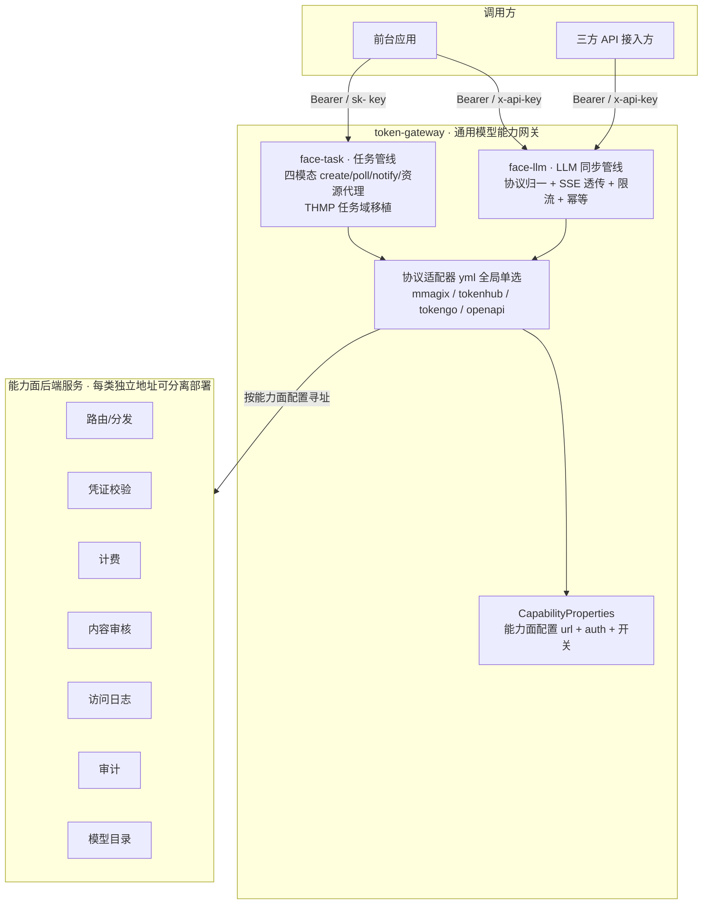
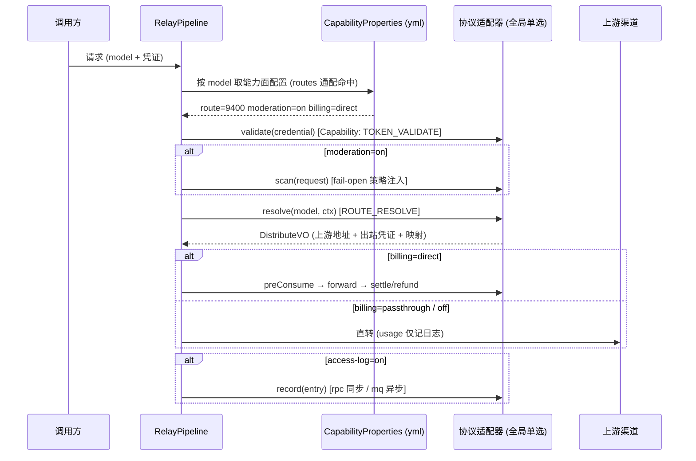

# 通用模型能力网关（token-gateway）设计方案

## 1. 基础信息

| 项 | 内容 |
|---|---|
| 项目 | token-gateway（通用模型能力网关 · LLM + 任务双面） |
| 方案代号 | tgw |
| 文档状态 | 草稿（待评审） |
| 创建日期 | 2026-08-31 |
| 作者 | justin |
| 前置文档 | MMagiX 仓 documents/：12 号微服务化方案（inference-gateway 槽位）、11 号访问日志、moderation-fail-open-behavior；MMagiX 仓 procurement/documents/：18 号契约（含 §3.7 任务协议权威定义）、23 号网关设计、17 号 DDL |
| 代码基底 | `backend/gateway-webflux`（relay/upstream/rpc/thmp 全套已实现）+ THMP 任务域（TaskService/轮询状态机/资源代理/notify，88% 覆盖） |

### 修订历史

| 版本 | 日期 | 说明 |
|---|---|---|
| V1.1 | 2026-08-31 | **任务域并入 + 改名 token-gateway**（决议：不另起 task-gateway，并代码不并部署）；分模块方案（face-llm / face-task / adapter-*）；日志 MQ 双通道；文档迁入独立仓 |
| V1.0 | 2026-08-31 | 初版：能力面 SPI + 注册模型 + 适配器矩阵 + 分期路线 |

---

## 2. 背景与目标

### 2.1 As-Is（现状）

`gateway-webflux` 已是功能完整的推理网关（协议转换 / SSE 透传 / 限流 / 幂等 / 审核接入 / saga 计费），但**能力调用与 MMagiX 主应用硬耦合**：`rpc/` 包 7 个 HTTP 客户端直接指向 MMagiX internal 面（token 校验、distribute、计费三件套、审核、访问日志、模型目录）。THMP 灰度切流（S2）是第一次"换后端"尝试，以独立 `thmp/` 包实现——证明了网关换后端可行，但也暴露了问题：**每接一个新后端都要改 `RelayOrchestrator`**。

| 后端系统 | 现有对接方式 | 栈 |
|---|---|---|
| MMagiX 主应用 | `rpc/*` internal-token HTTP（本网关原生） | Java/SB |
| TokenHub（thmp-app） | `thmp/*` HMAC 契约面（S2 灰度件） | Java/SB |
| TokenGo（new-api fork） | 无（异构 Go 栈，异地，THMP 侧经 HMAC 消费） | Go |
| 三方应用 | 无 | 任意 |

**任务域现状**：四模态任务协议（videos/images/audios/tts，create→poll→notify→资源代理）的权威定义在 THMP 18 号 §3.7，且 THMP 网关面已单工程实现全链（23 号 §5/§6）。MMagiX 主应用创作域任务不经网关。token-gateway 的任务面 = **THMP 任务域移植**（不新写），承接 TokenGo/三方经网关消费任务模态。

### 2.2 目标（To-Be）

1. **配置即接入**（决议 2026-08-31）：**不做多后端注册**——后端在项目 yml 中按能力面配置（地址 + 鉴权 + 开关），启动即生效；日志 / 计费 / 审计等服务**每类独立地址、可分离部署**，也可全部指向同一单体。
2. **三方可插拔**：未内置的系统按 SPI 写一个适配器（一个 Java 模块）即可接入，网关核心零改动；通用协议走 `openapi` 适配器**不限语言**。
3. **能力开关可配**：内容审核扫描、访问日志落库（rpc/mq）、计费、审计外发等按能力面开关。
4. **接口先行**：先冻结 SPI 契约与能力面配置模型（本文 §4/§5），实现分期落地。
5. **MMagiX 行为零变化**：M1 由现有 `rpc/*` 平移为 `MmagixAdapter`，存量调用方无感。
6. **任务域并入 + 改名 token-gateway**（决议 2026-08-31）：LLM 同步面与任务四模态同仓库、分模块、按部署分组隔离（`face: llm | task | all`）——不另起 task-gateway。理由：~70% 基建同源（凭证/计费/审核/日志/审计/信封）；THMP 已验证单工程双面形态且任务协议权威在 18 号 §3.7；拆两项目 = 基建复制 + 同一后端双重接入；负载隔离用部署分组即可拿到。

### 2.3 非目标

- 不做网关本地计费（避免出现第三套计费口径——计费始终委托后端；双轨对账经验见 S2）。
- 不建后端注册中心与运行时注册 API（配置变更 = 改 yml + 重启；热更新见 §11 未决）。
- 不改 OpenAI/Anthropic 协议转换与 SSE 透传逻辑（已稳定，仅平移）。
- 不引入注册中心/gRPC（对齐 MMagiX 仓 12 号 ADR-0002/0003：REST + ApiResponse 信封）。

---

## 3. 总体架构



核心思想：**管线不动，把"对外能力调用点"抽成 SPI**。两条管线（face-llm 同步 / face-task 异步任务）每到一个调用点，取 §5 对应能力面的配置（地址/鉴权/开关），经全局适配器（协议形状单选）发出调用；开启的开关没有对应能力实现 → 启动期 fail-fast 报配置错误，运行期不踩空。**每类服务各自配地址 = 微服务分离部署的落点**（计费、日志、审计可独立成服务），同指一个地址 = 单体模式，代码零分支。

---

## 4. 能力面 SPI（接口先行 · 冻结契约）

> 全部响应式（WebFlux `Mono`），DTO 复用现有 `gateway/contract/*`（`DistributeVO` / `PreConsumeVO` / `SettleVO` / `RefundRequest` / `ModerationAuditRequest` / `AccessLogRequest` 已是事实契约）。新增接口放独立模块 `token-gateway-spi`，适配器只依赖 SPI，不依赖网关核心。

### 4.1 适配器总入口

```java
public interface BackendAdapter {

    /** 后端配置键（yml 能力面寻址用） */
    String backendId();

    /** 能力声明：适配器自述支持哪些能力面，启动期校验开关与能力的交集 */
    Set<Capability> capabilities();
}
```

```java
public enum Capability {
    TOKEN_VALIDATE,      // 调用方凭证校验
    ROUTE_RESOLVE,       // 模型 → 渠道路由解析（distribute）
    MODERATION_SCAN,     // 内容审核扫描
    BILLING,             // 计费三件套（预扣/结算/退款）
    ACCESS_LOG,          // 访问日志投递（RPC / MQ 两类通道）
    AUDIT,               // 审计事件外发（安全/管理事件，含审核审计上报）
    MODEL_CATALOG,       // 前台模型目录
    TASK_CREATE,         // 任务创建委托（后端自持任务状态时，可选）
    TASK_POLL            // 任务轮询委托（与 TASK_CREATE 成对，可选）
}
```

### 4.2 能力面接口（七面共用 + 任务委托面可选）

```java
public interface TokenValidator extends CapabilityFacade {
    /** credential = Authorization 凭证（token / sk- key）；失败抛/返回 10202 语义 */
    Mono<TokenContext> validate(String credential);
}

public interface RouteResolver extends CapabilityFacade {
    /** 等价旧 distribute：返回上游 baseUrl + 出站凭证 + modelMapping（THMP 候选解析同构） */
    Mono<DistributeVO> resolve(String model, TokenContext ctx, String requestId);
}

public interface ModerationScanner extends CapabilityFacade {
    /** fail-open/fail-close 策略由 yml 配置注入（对齐 moderation-fail-open-behavior） */
    Mono<ScanResult> scan(ModerationRequest request);
}

public interface BillingClient extends CapabilityFacade {
    Mono<PreConsumeVO> preConsume(PreConsumeRequest request);
    Mono<SettleVO> settle(SettleRequest request);
    Mono<Void> refund(RefundRequest request);          // saga 补偿
}

public interface AccessLogSink extends CapabilityFacade {
    /** transport = RPC（同步 HTTP 调日志服务）| MQ（Kafka / RocketMQ 异步投递）；
     *  开关关闭时管线不调用；MQ 语义 at-least-once，消费端按 (trace_id, ts) 幂等 */
    Mono<Void> record(AccessLogEntry entry);
}

public interface AuditSink extends CapabilityFacade {
    /** 安全/管理事件外发（含审核审计上报）；失败不阻塞主链路（quiet + 告警） */
    Mono<Void> record(AuditEvent event);
}

public interface ModelCatalog extends CapabilityFacade {
    Mono<List<ChatModelVO>> list();
}

public interface TaskClient extends CapabilityFacade {
    /** 任务委托面（可选，后端自持任务状态时启用）：网关不做本地状态机，create/poll 直委后端。
     *  默认形态是网关本地状态机（face-task，THMP 移植）：走 route 面解析上游后，
     *  由网关驱动 create/poll/notify/资源代理，任务表与调度兜底在网关侧 */
    Mono<TaskCreateVO> create(TaskCreateRequest request);
    Mono<TaskPollVO> poll(String taskNo, TokenContext ctx);
}
```

> **不限 Java 的接入路径**：SPI 只是网关内部的实现接口。三方后端可以**不写任何 Java**——直接按 《后端接入开发手册》实现能力面 OpenAPI 契约（HTTP 端点 / MQ 消息），由网关内置 `openapi` 通用适配器调用（§6.1）。

### 4.3 SPI 铁律

1. **适配器无状态**：所有状态（缓存/连接池）在适配器内部自管，配置重载时随适配器重建。
2. **错误语义统一**：能力调用失败返回信封错误码（10202 凭证 / 10004 上游 / 10617 余额等），管线按现有 saga 语义处理，适配器不得吞错改语义。
3. **超时预算内聚**：每个能力面在 yml 配置中带独立超时（默认对齐现值：route 3s / 审核同步窗 2s / 结算 5s），适配器实现不得自带超时覆盖配置。
4. **凭证不落日志**：SPI 层约定 `TokenContext` 的 toString 脱敏（继承向量② 纪律），明文凭证只进 `validate` 入参。

---

## 5. 能力面服务配置（yml · 无注册概念）

> 决议（2026-08-31）：不做多后端注册——**后端在项目 yml 中按能力面配置**，每类服务一个地址，
> 日志 / 计费 / 审核等服务可分离部署，也可全部指向同一单体。变更方式 = 改 yml + 重启（热更新见 §11 未决）。

### 5.1 配置模型：七类能力面 × (url + auth + 开关)

```yaml
token-gateway:
  face: all                              # 装配面（部署分组）：llm | task | all
                                         # llm=纯同步面（无本地盘依赖，弹性扩）
                                         # task=任务面（挂资源缓存盘，独立扩缩）
                                         # all=单组合跑（小规模）
  adapter: mmagix                        # 协议形状适配器（全局单选）：mmagix | tokenhub | tokengo | openapi | custom:<spiName>

  route:                                 # 路由/分发服务（distribute / 候选解析）
    url: http://localhost:9400
    auth: jwt                            # none | key | jwt（三式，token 式已移除）
    jwt-secret: ${GW_JWT_SECRET}
    timeout: 3s
    routes:                              # 模型绑定：先命中先得，支持通配
      - models: ["gpt-*", "claude-*", "*"]

  token-validate:                        # 凭证校验服务
    url: http://localhost:9400
    auth: jwt
    jwt-secret: ${GW_JWT_SECRET}         # 同一服务可复用同一凭证

  billing:                               # 计费服务（预扣/结算/退款）
    url: http://billing-svc:9410         # 与路由服务不同 host = 服务分离
    auth: jwt
    jwt-secret: ${GW_BILLING_JWT_SECRET}
    timeout: 5s

  moderation:                            # 内容审核服务
    enabled: true                        # 是否内容审核扫描
    fail-open: true                      # 审核依赖故障时放行（fail-open 文档口径）
    url: http://moderation-svc:9420
    auth: key
    key: ${GW_MODERATION_KEY}
    timeout: 2s

  access-log:                            # 日志服务（两类投递通道）
    enabled: true                        # 是否日志落库（off = 仅内存计数）
    transport: rpc                       # rpc | mq
    url: http://log-svc:9430             # transport=rpc 时生效
    auth: none
    # transport=mq 时改配 MQ（二选一）：
    # mq:
    #   type: kafka                      # kafka | rocketmq
    #   bootstrap: kafka-1:9092          # rocketmq 为 name-server 地址
    #   topic: token-gateway-access-log
    #   # 语义 at-least-once，消费端按 (trace_id, ts) 幂等去重

  audit:                                 # 审计服务（安全/管理事件，含审核审计上报）
    url: http://audit-svc:9440
    auth: jwt
    jwt-secret: ${GW_AUDIT_JWT_SECRET}

  model-catalog:                         # 模型目录服务
    url: http://localhost:9400
    auth: jwt
    jwt-secret: ${GW_JWT_SECRET}

  task:                                  # 任务面参数（face=task/all 时生效；默认值 = THMP 移植口径）
    expire-scan: 24h                     # 任务过期窗口（超时 EXPIRED + 全额退款）
    resource-cache-dir: /data/tgw-cache  # 资源代理缓存目录（face=task 实例挂盘）
    resource-sign-key: ${TGW_RESOURCE_SIGN_KEY}
    notify-retry: 1m,10m,1h              # notify 重发退避档位
```

**单体模式**：七类全部指向同一地址（如上例 route/token-validate/model-catalog 同指 9400）——网关视角仍是七次能力调用，代码零分支。
**分离模式**：计费/日志/审核/审计各自独立服务与凭证——部署拓扑变化不改代码，只改 yml（与 MMagiX 仓 12 号 ms-split 拆出的 billing-svc / audit-svc 槽位天然对齐）。

### 5.2 后端鉴权三式

> 安全口径权威定义见《04_后端服务对接安全契约方案》（含场景分级 / 逐请求签名 / 凭证生命周期纪律 / 验收清单），本节为配置摘要。

| type | 发送方式 | 推荐级别 | 适用 |
|---|---|---|---|
| `jwt` | HS256 签名 JWT（`Authorization: Bearer`，claims 含 iss/caller/tenant_id）——**现网 internal-token 即此形态**（后端换 secret 须网关同步重铸） | **推荐（默认）** | 需要身份语义（调用方/租户）的服务间调用；跨网段/公网叠加逐请求签名（HMAC 四头，防重放） |
| `key` | 静态 key 头 `X-API-Key: <key>`（恒定时间比较 + env 注入） | 可用（内网限定） | 简单服务间共享密钥；无身份语义、无过期，跨网段不用 |
| `none` | 不发鉴权头 | 受限可用 | **仅 localhost/sidecar 同机隔离**；IP 白名单作纵深防御不作替代 |

- ~~`token` 静态令牌式已移除（2026-08-31 决议）~~：既有系统迁移时按 `jwt` 重铸。
- 凭证一律环境变量注入禁入仓；日志/管理面只出现掩码。
- **启动期检查**：`auth=none` 且 url 非 localhost/127.0.0.1 → 启动告警（CapabilityValidator warning）。
- TokenHub 契约面 HMAC 四头（X-Access-Key/Timestamp/Nonce/Signature）不走此三式——它是 **adapter=tokenhub 的协议形状**（§6），配置在 `route:` 面。

### 5.3 开关语义矩阵

| 开关 | off 时行为 | 约束 |
|---|---|---|
| `moderation.enabled` | 管线跳过审核步骤，不调用审核服务 | — |
| `moderation.fail-open` | — | 仅 enabled=true 时有意义；对齐 fail-open 文档三分支（放行/拦截/降级） |
| `access-log.enabled` | 不落库，仅内存计数器（QPS/错误率自持） | transport=mq 时为异步投递，存在秒级窗口 |
| `billing` | `off`：不预扣不结算（BYOK/内网直通场景）；`passthrough`：上游自计费（THMP 模式），网关只透传 usage 记日志；`direct`：现 saga | 三值枚举，非布尔 |
| `audit` | 安全/管理事件仅本地日志不外发 | 审核审计上报随 moderation 一并关闭 |
| `health-report` | 不回传 record-success/failure | 渠道健康信号缺失需在监控侧补偿 |

---

## 6. 内置适配器

### 6.1 适配器矩阵

| 适配器 | 能力实现来源 | 协议形状 | 说明 |
|---|---|---|---|
| `MmagixAdapter` | 现 `rpc/*` 7 客户端原样平移（HttpTokenApi/HttpChannelApi/HttpBillingApi/HttpModerationApi/HttpAccessLogApi/HttpChatModelApi），日志/审计调用点拆到对应能力面 | §5.2 三式（jwt=现网 internal-token） | 七能力全量；M1 行为零变化 |
| `TokenHubAdapter` | `thmp/*` 平移：ThmpContractClient（候选解析）+ ThmpSignature + ThmpKeyCipher + ThmpCandidateCache(SWR)/负缓存 | route 面 HMAC 四头（fwk4j-signature 语义） | 两种工作模式，见 §6.2 |
| `TokenGoAdapter` | 新写：OpenAI 兼容直通 + TokenGo 侧凭证校验/计费 API | 待对齐（`~/codes/fork/new-api` API 面） | Go 异构栈，端点映射在 M3 前对齐后落码 |
| `openapi`（通用） | **内置**，按 《能力面接口契约》调用任意后端——**三方不限语言**（Go/Python/Node 实现 HTTP 端点或 MQ 消费即可接入） | 《能力面接口契约》（信封 + 鉴权三式） | 三方接入首选；无需写 Java |
| 三方 `custom:<spiName>` | 接入方实现 §4 SPI 能力接口（`ServiceLoader`/Spring bean 二选一装配） | 任意（适配器自治） | 协议特殊、openapi 契约表达不了时的 Java 路径 |

适配器是**全局单选**（一次部署一个协议形状）；地址/鉴权/开关全部来自 §5 能力面配置——同一部署内不混装多后端。

### 6.2 TokenHubAdapter 双模式

| 模式 | 路由 | 计费 | 适用 |
|---|---|---|---|
| **透传模式**（推荐 M2 首发路径） | 无需解析——调用方 `sk-thmp-*` 原样转发 THMP 网关面 `/v1/chat/completions` 等端点 | passthrough：THMP 网关面自带 reserve/commit 闭环（24 号图①），网关只记日志 | THMP 作为纯上游接入，网关零计费耦合 |
| **契约模式**（S2 已验证） | `POST /v1/candidates/resolve`（HMAC）→ 解密 key_cipher_tenant → 网关直连上游 | direct：billing 走 MMagiX（双轨对账） | MMagiX 前台共用 THMP 供给的灰度切流 |

同一适配器按 §5 配置（`billing` 三值 + route 声明）选择模式；切流/影子比对资产（ThmpCutover 分桶 / ThmpShadow 埋点）平移进适配器，作为"后端间灰度"能力（§7，配置即现网 `gateway.thmp.*` 的 yml 形态）。

### 6.3 TokenGoAdapter 要点

- TokenGo 本身是网关（new-api fork），协议面 OpenAI 兼容：适配器主要是**凭证桥接**（调用方 MMagiX/网关凭证 → TokenGo 侧 token）与 usage 回收。
- 它同时是 THMP 的消费方（HMAC 批发），直连 TokenGo 时注意**成本链路绕过 THMP 目录价**的计费口径风险 → M3 评审时定：直连只允许个人 token 场景，批发流量必须经 TokenHub。

### 6.4 任务域两形态（face=task）

| 形态 | 路由 | 状态机位置 | 适用 |
|---|---|---|---|
| **lotask4j 托管**（默认，2026-09-01 决议） | create 时 route 面 resolve，**路由快照随 submit 载荷下发 Worker** | **lotask4j 平台（V4+，零改造接入）**：任务表/状态机/重试/僵尸回收托管，租户隔离 RLS + webhook HMAC 平台内置；**自写 Worker**（本仓，Groovy 适配脚本在 `scripts/`）经 worker API 平台中转执行上游；网关只保留 caller 端点 + 计费 saga + notify 验签接收 + 资源代理（sig 能力凭证，上游 URL 永不透传）。详见《05_任务面lotask4j托管方案》 | 上游是"哑"任务 API，平台统一任务体验与终态保障；新接上游零发版（Groovy 脚本） |
| **委托面** | TASK_CREATE/TASK_POLL（task 委托面） | 后端自持（后端本身是任务平台） | 后端自带任务状态机，网关只代理与计费 |

资源代理与 notify 为网关固有（sig 签名、24h 过期、上游 URL 不透传），两形态一致；任务计费 = 创建全额预扣 → 终态退款（FAILED/EXPIRED 全额 RELEASE），复用 billing 面，无 usage 结算步。

**控制层（control plane，2026-09-01 决议）**：任务面（与 LLM 面一致）的 **key 验证与路由表归属控制层**——token-validate 与 route 两个能力面即控制层接口，控制层决定"凭证是否有效、模型路由到哪个上游、按哪个价格计费"；网关数据面只做执行（预扣/出站/状态机/notify/资源代理），路由表变更不改网关、只改控制层。计费顺序铁律：**先 resolve 路由定价，再全额预扣**——模型不同价格不同，预扣金额必须按路由命中的模型计算（顺序与 LLM 面 validate → resolve → preConsume 一致）。

---

## 7. 请求管线与后端灰度

管线步骤不变（validate → [moderation] → resolve → [preConsume] → forward → settle/refund → [accessLog/audit] → health），每步取 §5 对应能力面的配置（url/auth/开关）：



**后端间灰度**（对应 S2 的 THMP 切流泛化）：route 能力面配置增加 `shadow-to` 与 `cutover-percent`（现网 `gateway.thmp.cutover-models/percent` 即该形态的 yml 落地）——主链路服务流量，影子并行解析做比对埋点（`[THMP-SHADOW]` 单行日志 + `shadow-report.py` 直接复用，marker 沿用现网不变），归零后按分桶百分比切流，清名单秒级回滚。

**任务面管线**（face=task，lotask4j 托管形态；**控制层决策 · 数据面执行**，详《05》）：create（**控制层 key 验证 → 控制层路由表 resolve（先路由定价：模型不同价格不同）→ 按命中模型全额预扣 → lotask4j submit（路由快照网关侧加密后随载荷下发）**）→ 自写 Worker（本仓 `scripts/` Groovy 三钩子）经 worker API 平台中转执行上游（create/poll/resultMapping）→ 终态 webhook（平台内置 HMAC 三头，网关验签 + verify-then-act 回查兜底）回网关 → 终态退款/消费 + notify（HMAC + 退避重发）→ 调用方轮询（终态幂等返回存储结果）→ 资源代理（GET 签名 URL，流式回源 + 本地缓存）。复用 route/billing/moderation/log/audit 面；状态机/重试/僵尸回收由 lotask4j 托管，网关只保留超时钟 + "预扣-终态"对账兜底。

---

## 8. 安全设计

1. **调用方认证**：沿用"凭证语义由后端定义"——`TokenValidator` 归属当前命中后端的适配器；M4 可选网关本地 key 表（`tgw_api_key`，SHA-256 hash + 掩码，照抄 THMP ApiKeyService 模型）。
2. **后端凭证**：internal-token / HMAC secret 入库走 AES-GCM cipher（`cipher_by_biz` 同构），管理面只回掩码；日志/审计不含明文（向量② 纪律）。
3. **THMP 候选 key 解密**：沿用单兜底口令起步（`ThmpKeyCipher`），BYOK 逐租户口令随未决#12 决议。
4. **网关自身管理面**：公网 403 仅内网（compose nginx 先例），管理 API 走 JWT 策略。

---

## 9. 复用与迁移清单

| 现有资产 | 处置 |
|---|---|
| `relay/RelayOrchestrator` + saga 链（gateway-webflux） | **保留**为 face-llm 管线骨架；能力调用点改为 SPI 查询 |
| `upstream/SsePassthroughInvoker` + 协议转换 + `format/` | 原样平移进 face-llm（协议层与后端无关） |
| `rpc/*` 7 客户端 + `RpcInternalAuth` | 平移为 `MmagixAdapter` |
| `thmp/*`（Signature/ContractClient/Cache/Shadow/Cutover/KeyCipher） | 平移为 `TokenHubAdapter`（已含单飞/负缓存/LRU 加固） |
| **THMP 任务域**（任务协议权威 18 号 §3.7） | **协议契约沿用**（caller 端点/状态语义/notify/资源代理形状）；状态机实现**不移植**——lotask4j 托管（2026-09-01 决议，《05》），17 号 DDL 任务表不再随仓 |
| `moderation/` `ratelimit/` `idempotency/` `trace/` | 原样保留（横切层，不进 SPI） |
| `contract/*` DTO | 升格为 `gateway-spi` 的契约包 |
| `shadow-report.py` + 看板 | 直接复用（marker 不变） |
| framework4j 1.5.1（信封/签名/锁/trace） | 底座不变（复用优先铁律） |

**分模块方案**（Maven 单仓多模块，本仓库根）：

```
token-gateway/
  gateway-spi        # 能力面接口（七面 + task 委托）+ Capability + contract DTO（接口先行，先冻结）
  gateway-core       # 管线骨架 + 限流/幂等/trace/信封 + 能力面配置装配（CapabilityProperties）
  face-llm           # LLM 面：chat/messages/embeddings/images-generations/models（gateway-webflux 协议层平移）
  face-task          # 任务面：四模态端点 + 计费 saga + notify + 资源代理 + LotaskTaskClient（lotask4j 托管, 无 DB）
  adapter-mmagix     # rpc 平移
  adapter-tokenhub   # thmp 平移
  adapter-openapi    # 通用适配器（《能力面接口契约》，三方不限语言接入）M3
  adapter-tokengo    # M3 新写
  app                # 装配：gateway.face = llm | task | all（同 jar 异 profile 部署分组）
```

**部署分组**：face=llm 实例无本地盘依赖、按连接数弹性扩缩；face=task 实例挂资源缓存盘、按带宽/磁盘扩缩——负载特征隔离在部署层解决，代码单仓无复制。

---

## 10. 分期路线

| 期 | 内容 | 出口标准 |
|---|---|---|
| **M0 接口先行**（本文即契约） | `gateway-spi` 模块：全部能力面接口 + Capability + 能力面配置模型 + 启动期开关∩能力校验 | SPI + 配置模型冻结评审通过；无实现也能编译 |
| **M1 MMagiX 平移** | `MmagixAdapter`（rpc 平移）+ face-llm 接 SPI + yml 能力面配置 | 存量行为零变化：现网测试全绿 + compose 冒烟 11 组复验 |
| **M2 日志 MQ 通道 + TokenHub** | access-log `transport=mq`（Kafka / RocketMQ 双实现）；`TokenHubAdapter` 透传模式首发，契约模式随后 | MQ 日志 at-least-once 消费幂等验证；THMP 后端走通 LLM 链路；双模式 yml 可切 |
| **M2.5 任务面并入** | lotask4j **零改造接入**（V4+ 平台前提：租户隔离 RLS + webhook HMAC 已内置；R2/R6/R7 网关侧补偿；仅 R5 手动改态为可选增量）+ face-task（caller 端点 + 计费 saga + notify 验签接收 + 资源代理 + LotaskTaskClient + 超时钟/对账兜底）+ 自写 Worker（Groovy 三钩子，脚本真源在本仓 `scripts/`） | 冒烟：四模态 create→poll→资源代理走通；face=task 分组独立部署验证；task 计费（全额预扣/终态退款）对账零差异；webhook 三头验真 + verify-then-act 回查兜底 + 降级矩阵演练 |
| **M3 三方接入** | `openapi` 通用适配器 + 《后端接入开发手册》（含能力面契约）+ 各语言示例；`TokenGoAdapter`；Java SPI 路径文档 | Go 示例后端走通冒烟（token-validate + route + models 最小面） |
| **M4 可选演进** | 能力面配置热更新（配置中心）、网关本地 key 表、限流策略中心 | 按 MMagiX 仓 12 号 ms-split 里程碑对齐 |

---

## 11. 风险与未决

| # | 风险/未决 | 等级 | 处置 |
|---|---|---|---|
| 1 | SPI 抽象泄漏：THMP 双模式与 MMagiX saga 形状不完全同构（passthrough 无 preConsume/refund 补偿点） | 中 | Capability 缺失 + billing 三值枚举已覆盖；M1 评审重点盯管线分支 |
| 2 | TokenGo API 面未对齐（Go 仓不在本工作区） | 中 | M3 前对齐端点映射；此前适配器只出接口骨架 |
| 3 | 计费口径三处并存（MMagiX direct / THMP 闭环 / TokenGo 批发） | 高 | billing 三值枚举 + 直连 TokenGo 限制（§6.3）；灰度期双轨对账沿用 |
| 4 | yml 变更需重启生效（无热更新） | 低 | 接受（配置变更低频）；配置中心化列 M4 |
| 5 | 服务分离部署后故障面变宽（计费/日志/审计服务独立故障） | 中 | 降级语义对齐既有口径：**计费失败拒请求、日志/审计失败不阻塞主链路**（quiet + 告警） |
| 6 | MQ 日志通道语义（Kafka/RocketMQ 双实现）：at-least-once 有重复、broker 故障有丢失窗口 | 中 | 消费端按 (trace_id, ts) 幂等去重；投递失败本地缓冲重试，超限落本地文件兜底 |
| 7 | 开关组合爆炸（如 billing=off + access-log=off 的裸透传缺审计） | 低 | 启动校验出 warning 清单；裸透传仅允许内网路由 |
| 8 | ~~gateway-webflux 平移更名与 12 号服务槽位命名统一~~ **已决议（2026-08-31）：改名 token-gateway** | — | 12 号槽位注释在 MMagiX 侧同步；artifactId 一次到位 |
| 9 | 密钥口令分发（THMP BYOK）依赖采购侧未决#12 | 中 | 透传模式不依赖解密，优先落地绕开 |
| 10 | ~~任务域移植面较大~~ **已化解（2026-09-01 决议）**：lotask4j 托管任务状态，状态机/任务表/调度兜底不移植；新增风险 = 平台可用性耦合 → 降级矩阵（《05》§11）+ 对账兜底 | 低 | lotask4j **零改造接入**（V4+：R1 租户隔离/R4 webhook 签名平台已内置；R2/R6/R7 网关侧补偿；仅 R5 为可选增量，《05》§10）；资源缓存盘仅 face=task 分组挂载 |

---

## 12. 与既有文档的关系

- **MMagiX 仓 12 号 ms-split**：本网关即其 `inference-gateway` 槽位的具象化与泛化（从"MMagiX 专属网关"升格为"多后端通用网关"，改名 token-gateway）；拆库/私有化裁剪口径全部继承 12 号。**能力面服务分离（§5）与其拆出的 billing-svc / audit-svc / 日志面槽位天然对齐**——yml 里每类能力面的 url 即服务拆分后的落点。
- **THMP 18/23/24 号**（MMagiX 仓 procurement/documents）：TokenHubAdapter 契约来源 + **任务协议权威来源**（18 号 §3.7 四模态协议沿用；实现改为 lotask4j 托管，《05_任务面lotask4j托管方案》）；透传模式 = 24 号图① 的网关视角，契约模式 = 24 号图③ 的泛化。
- **moderation-fail-open-behavior / MMagiX 仓 11 号访问日志**：两个开关的语义基准，实现必须引用其策略分支，不自创口径。
- **本仓文档族**：用户文档（`01_LLM面接入手册`、`02_任务面接入手册`（规划中 M2.5）、`03_LLM面API契约`、`04_任务面API契约`（规划中 M2.5））与 开发文档（`01_设计方案`、`02_后端接入开发手册`、`03_能力面接口契约`）——与本文 §4/§5 冻结契约互为引用。
