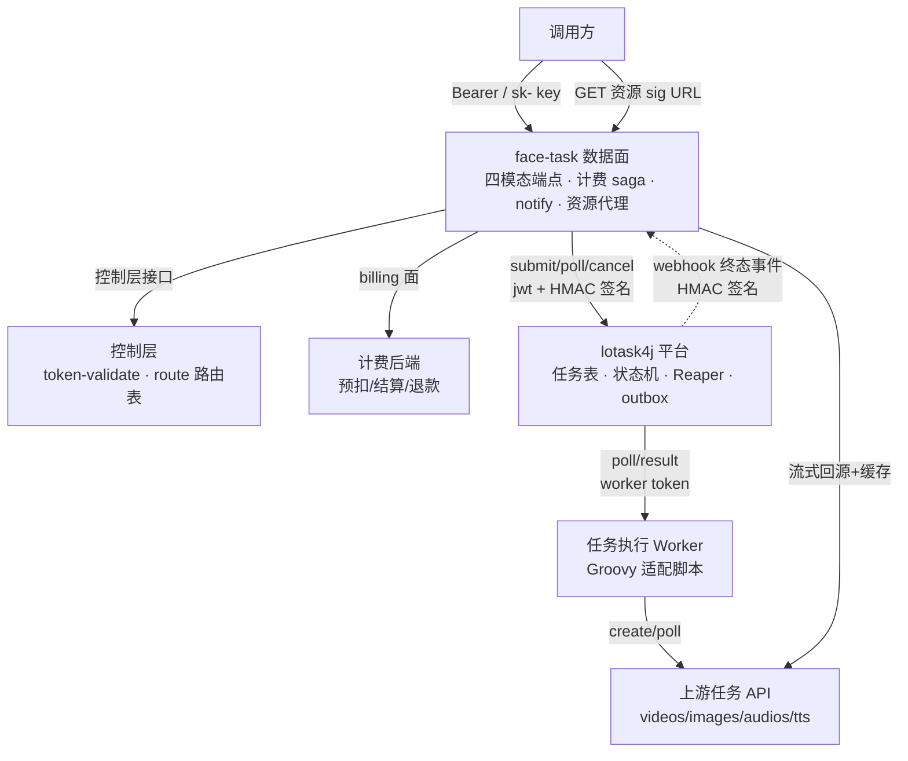

# 任务面 lotask4j 托管方案

| 项 | 内容 |
|---|---|
| 文档 | 任务面任务状态托管方案（lotask4j 托管 + 平台中转执行 + lotask4j 改造清单） |
| 地位 | 任务面实现口径**权威文档**；替代设计方案原 M2.5"THMP 任务域移植"口径（2026-09-01 决议） |
| 配套 | 设计方案 `01_设计方案.md` §6.4/§7；任务面接入手册 `../用户文档/02_任务面接入手册.md`；安全契约 `04_后端服务对接安全契约方案.md` |
| 版本 | V1.0（2026-09-01，决议：lotask4j 托管任务状态） |

---

## 1. 决策

| 决议 | 内容 |
|---|---|
| 任务状态托管 | **lotask4j（ASTS 异步慢任务平台）托管**：任务记录、状态机、重试、僵尸回收、调度兜底全部复用平台能力 |
| 上游对接形态 | **平台中转**：lotask4j Worker 执行上游调用（create/poll/result），网关**不直连上游执行任务** |
| 网关保留 | caller 四模态端点、计费 saga（先路由定价 → 全额预扣 → 终态退款）、notify（HMAC + 退避）、资源代理（sig 能力凭证） |
| 上游适配方式 | **Groovy 脚本**（每任务类型一个适配脚本，三钩子），新接上游零发版（§9） |
| 数据一致性 | 任务状态**单写 lotask4j**，计费状态在后端 billing 面；`task_no + pre_consume_id` 关联，**不做数据双写、不共享数据库** |
| 备选形态 | 私有化/无平台场景保留自有 DB 委托面备选（TaskClient SPI 已冻结，切换是适配器决策非架构分叉） |

## 2. 总体架构



**控制层决策不变**（2026-09-01 决议）：key 验证与路由表归控制层；create 时网关先 resolve 路由定价，**路由快照（base_url + 出站凭证 + model_mapping）随 submit 载荷下发 Worker**——定价时刻与执行用路由一致，Worker 不再二次寻址。

## 3. 直连 vs 中转的裁决

| 维度 | 网关直连（lotask4j 仅当状态表） | **平台中转（Worker 执行）** ✅ |
|---|---|---|
| 状态写者 | **双写者问题**：网关驱动状态迁移 + lotask4j 状态机 CAS 并存，lease/fencing 语义被破坏 | 单写者：状态迁移只有 lotask4j 状态机（version + execution_token CAS） |
| 执行保障 | 网关要自建轮询循环/重试/僵尸回收 = 把 lotask4j 已解决的问题重做一遍 | Reaper（lease 回收/过期 FAILED）、重试退避、attempt 上限全部复用 |
| 网关部署 | face-task 实例要维持长轮询调度，扩缩容影响在途任务 | 网关无执行循环，纯请求驱动；执行弹性在 Worker 池独立扩缩 |
| 结论 | 否决 | **采用** |

## 4. 职责矩阵

| 职责 | 归属 | 说明 |
|---|---|---|
| caller 四模态端点（create/poll/资源代理） | 网关 face-task | API 契约不变（任务面手册） |
| key 验证 / 路由表 / 定价 | 控制层（token-validate / route 面） | create 时刻决策并快照 |
| 计费 saga（全额预扣 / 终态退款） | 网关 → billing 面 | 先路由定价再预扣；FAILED/EXPIRED 全额退款 |
| 任务记录 / 状态机 / 重试 / 僵尸回收 | **lotask4j** | asts_task + TaskStateMachine + TaskReaper |
| 上游调用执行 | **lotask4j Worker（Groovy 脚本）** | create/poll/resultMapping 三钩子（§9） |
| 终态事件 → 触发 notify/退款 | lotask4j webhook → 网关 | outbox 投递 + HMAC 签名（改造项 R4） |
| notify 调用方回调（X-THMP-Signature + 退避） | 网关 face-task | 语义不变 |
| 资源代理（sig 24h + 流式回源 + 缓存盘） | 网关 face-task | Worker 上报原始资源 URL，网关转签名代理 URL，上游 URL 永不透传 |
| 非标运营功能（标签/手动成功/手动重试/退款入口） | **lotask4j 管理面**（改造项 R5） | 退款入口触发网关 → billing 面 refund（幂等）；全部留审计事件 |

## 5. 端到端流程

### 5.1 create（同步返回）

```
调用方 POST /v1/videos {model, params, notify_url}
  → 网关: 控制层 key 验证
  → 网关: 控制层 route resolve（先路由定价：模型不同价格不同）
  → 网关: 生成 task_no，按命中模型全额预扣（billing 面; 余额不足 → 10617, 不产生任务）
  → 网关: lotask4j submit {task_type: video, idempotency_key: task_no,
                           payload: {params, notify_url, route 快照(加密)}}
       ‑ 幂等: idempotency_key=task_no 重复提交返回首次任务（改造项 R2）
  → 调用方 ← {task_no, PENDING, poll_url}   （submit 失败 → 全额退款 + 10004）
```

### 5.2 执行与终态（异步）

```
lotask4j Worker poll 到任务 → RUNNING（lease + fencing）
  → Groovy create 钩子: 按 route 快照调上游创建 → 上游任务 ID 写入 progress
  → Groovy poll 钩子: 轮询上游直至终态（Worker 内循环, 间隔按 task_type 配置）
  → Groovy resultMapping 钩子: 上游结果 → {resources[], usage} 契约
  → Worker reportResult → lotask4j 终态落库 + outbox
  → webhook(HMAC 签名) → 网关:
       SUCCESS   → result.resources 转 sig 代理 URL 落缓存索引; 预扣转消费（不退）
       FAILED    → billing 面全额 refund（幂等）→ notify
       超时      → lotask4j FAILED(error_code=TIMEOUT) → 网关映射 EXPIRED → 全额退款 → notify
       CANCELLED → 映射 FAILED（运营取消, 全额退款）→ notify
  → notify_url 回调（X-THMP-Signature; 失败退避 1m/10m/1h）
```

### 5.3 poll（调用方轮询）

```
GET /v1/videos/{task_no}
  → 网关: key 验证（消费方只查自己的任务 —— 租户隔离, 改造项 R1）
  → 网关 → lotask4j GET /api/v1/client/tasks/{id}
  → 状态映射（§6）后返回; 终态返回存储结果（sig 代理 URL）, 不触上游
```

### 5.4 资源代理

与现契约一致：`GET /v1/resources/{task_no}/{index}?exp=&sig=`，校验 sig → 流式回源 + 本地缓存盘；上游原始 URL 永不透传。

## 6. 状态机映射

| 网关（调用方可见） | lotask4j | 说明 |
|---|---|---|
| PENDING | PENDING | 待 Worker 拉取 |
| RUNNING | RUNNING | 执行中（含 Worker 内上游轮询） |
| SUCCEEDED | SUCCESS | 终态 |
| FAILED | FAILED / CANCELLED | 终态（运营取消并入 FAILED, 全额退款） |
| EXPIRED | FAILED(last_error_code=TIMEOUT) / expired_at 过期 | 终态；网关按 error_code 映射（改造项 R6：lotask4j 超时落库建议带独立 error_code） |

模型映射：`task_no` ↔ `idempotency_key`（外部幂等键）；`model+params` ↔ `payload`；`result.resources/usage` ↔ `result` JSONB（契约见 §7）；24h 过期窗口由网关侧 `task.expire-scan` 语义退化为 lotask4j task_type 超时配置（按模态配置时长）。

## 7. 计费与一致性

- **关联键**：`task_no`（= lotask4j idempotency_key）+ `pre_consume_id`（billing 面）；网关侧不建任务表。
- **无双写**：任务状态只在 lotask4j；计费状态只在 billing 后端。终态事件（webhook）驱动退款/消费，失败重投（outbox 指数退避）+ 网关对账任务兜底（按 pre_consume_id 查未闭环预扣 → 反查 lotask4j 终态补偿）。
- **webhook 丢失窗口**：outbox 重投上限后 FAILED → 网关对账兜底任务（原 MaintenanceScheduler 孤儿预扣释放语义的简化版——只剩"预扣-终态"对账，状态机不再兜底）。
- **notify 与退款顺序**：先退款成功（幂等）再 notify，避免调用方先收到 FAILED 但退款未到账。

## 8. 安全

| 点 | 方案 |
|---|---|
| 网关 → lotask4j | `jwt`（推荐式）+ 写操作 HMAC 四头签名（lotask4j 现有 framework4j-signature 能力，契约同安全契约 §4） |
| route 快照中的出站凭证 | **payload 字段级加密**（改造项 R7：AES-GCM, 密钥环境注入；不落日志不落 admin 明文） |
| lotask4j → 网关 webhook | 增加 HMAC 签名头（改造项 R4；当前 webhook 无签名，接收方无法验真） |
| 消费方查询隔离 | lotask4j 任务行加 `application_id/tenant_id`（改造项 R1；当前任何 client token 可查全平台任务, GET 详情完全开放——**必须收编**） |
| 调用方侧 | 不变（Bearer/x-api-key, 凭证不落日志） |

## 9. Groovy 脚本适配方案

### 9.1 为什么脚本化

上游任务 API 形态各异（每家的 create 入参/poll 响应/资源字段都不同），Worker 骨架（lease/fencing/重试/上报）与上游协议无关。**Java 写死 = 每接一个上游发一次版；Groovy 脚本 = 新接上游零发版**。

### 9.2 脚本契约（每任务类型一个脚本，三钩子）

```groovy
// task_type: video —— 示例钩子签名（Binding 注入: ctx, http, log, json）
// ctx 暴露: payload(Map), routeSnapshot(Map), upstreamTaskId(String), progress(Map)

def create(Map ctx) {
    // 调上游创建; 返回 [upstreamTaskId: "...", progressHint: 0]
}

def poll(Map ctx) {
    // 调上游查询; 返回 [state: "RUNNING"|"SUCCEEDED"|"FAILED", raw: 上游原始响应]
}

def resultMapping(Map ctx) {
    // 上游终态 raw → 网关契约
    // 返回 [resources: ["https://上游/..."], usage: [seconds: 5, resolution: "720p"]]
}
```

### 9.3 脚本写在哪

| 位置 | 用途 |
|---|---|
| **Git 仓库**（lotask4j `scripts/` 目录，如 `scripts/video/kling-v1.groovy`） | **唯一真源**：评审、版本化、diff 可查；随 lotask4j 发版或经同步任务刷入 |
| `asts_task_type_config` 新增 `script_source`（TEXT）+ `script_version` 列 | 运行时加载（Worker 按 task_type 取脚本, GroovyClassLoader 编译缓存, 版本变更自动失效） |
| Admin UI 脚本编辑页 | 只读查看 + 紧急热修（热修必须回写仓库, 否则下次同步被覆盖） |

### 9.4 脚本怎么测

| 层 | 形态 |
|---|---|
| 单测（仓库内，随 lotask4j CI） | `GroovyScriptTestHarness`：GroovyShell 加载脚本 + fixtures（`scripts/video/fixtures/create-ok.json` 等上游响应样本）断言三钩子输出；mock `http` binding 不触真实网络 |
| 联调（Admin UI / 测试端点） | `POST /api/v1/admin/script-test/dry-run`：指定 task_type + fixture 或真实上游沙箱，返回钩子输出与耗时，不落任务 |
| 灰度 | `script_version` 双版本并存：新脚本先绑测试 task_type（如 `video-canary`）小流量验证，再切正式 |

### 9.5 脚本安全约束

Worker 内 Groovy 沙箱：黑名单（`System/Runtime/Thread/File/socket` 直接访问）、只允许经 `http` binding（带超时/出网白名单）与 `json` 工具；脚本执行超时硬上限；编译失败/运行异常 → 任务 FAILED + error_code=SCRIPT_ERROR + 审计事件。

## 10. lotask4j 改造清单

| # | 改造项 | 内容 | 优先级 |
|---|---|---|---|
| R1 | **租户/调用方隔离** | `asts_task` 加 `application_id`（+ `tenant_id`）列, submit 从 token claims 写入; 查询/取消/列表强制按 application 过滤; `GET /{id}` 收编鉴权（当前完全开放） | **P0**（安全硬需求） |
| R2 | **外部幂等键全局唯一** | `idempotency_key` 跨分区唯一（当前分区内唯一 + 应用层兜底）; 接受 `task_no` 作为幂等键并原样返回给调用方 | **P0**（任务面幂等语义） |
| R3 | **结果资源契约** | `result` JSONB 约定 `{resources: [...], usage: {...}}` 形状（网关资源代理依赖 resources 数组） | **P0** |
| R4 | **webhook 签名 + 事件扩展** | outbox 投递加 HMAC 签名头（X-Access-Key/Timestamp/Nonce/Signature）; 事件类型按终态细分（SUCCESS/FAILED/TIMEOUT/CANCELLED） | **P0**（网关验真 + EXPIRED 映射） |
| R5 | **管理面非标功能** | 手动改状态（含手动成功）/ 手动重试 / 任务标签（`tags` 列 + 筛选）; 全部写 asts_task_execution_event 审计 | P1（运营入口; 退款由管理面触发网关 → billing 面, 平台本身无计费概念） |
| R6 | **超时语义独立** | 超时失败落库带 `last_error_code=TIMEOUT`（当前混在 FAILED, 事件枚举有 TASK_TIMED_OUT 但落库不区分） | P1（EXPIRED 映射依赖） |
| R7 | **payload 字段级加密** | route 快照出站凭证 AES-GCM 落库, admin/日志只见掩码 | **P0**（凭证安全） |
| R8 | **Groovy 脚本执行器** | Worker 增加 script 执行模式（§9）: task_type_config.script_source 加载 + 沙箱 + 测试端点 | **P0**（上游适配主路径） |
| R9 | RocketMQ 事件（可选） | 需要中间态/进度事件或多人消费时引入; 当前 webhook 够用 | P2 |

## 11. 降级与可用性

| 故障 | 口径 |
|---|---|
| lotask4j 不可达（create） | 拒请求 + 全额退款（10617 以外的失败 → 10004），不产生"扣了钱没任务" |
| lotask4j 不可达（poll） | 返回上次缓存状态 + 退避提示（状态不变, 调用方重试）；不触 billing |
| webhook 延迟/丢失 | outbox 退避重投; 超限后网关对账兜底任务按 pre_consume_id 反查补偿 |
| Worker 全部不可用 | 任务积压 PENDING（平台监控告警）; 超 task_type 超时 → FAILED(TIMEOUT) → 退款 |
| lotask4j 长期下线 | 任务面整体不可用（读降级）; LLM 面不受影响（独立部署分组的意义） |

## 12. M2.5 修订（对设计方案 §10 的替换）

| 项 | 原口径（THMP 移植） | 新口径（lotask4j 托管） |
|---|---|---|
| 状态机/任务表/调度兜底 | THMP 移植 + 17 号 DDL | **不建**——lotask4j 托管（R1~R8 改造先行） |
| face-task 模块内容 | TaskService/状态机/资源代理/notify/MaintenanceScheduler | caller 端点 + 计费 saga + notify + 资源代理 + LotaskTaskClient + 对账兜底 |
| face-task 数据库 | 独占任务表库 | **无 DB**（状态在 lotask4j）；仅保留资源缓存盘 |
| 出口标准 | 四模态 create→poll→资源代理冒烟；face=task 独立部署；计费对账零差异 | 同上 + lotask4j R1/R2/R3/R4/R7/R8 验收 + webhook 签名验真 + 降级矩阵逐项演练 |
